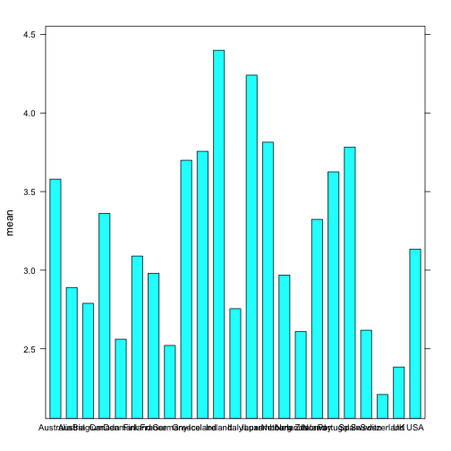
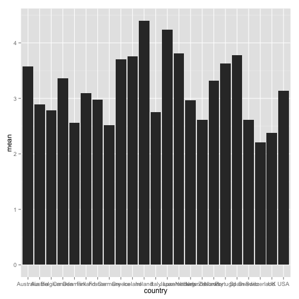
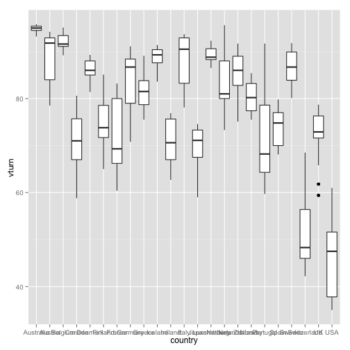
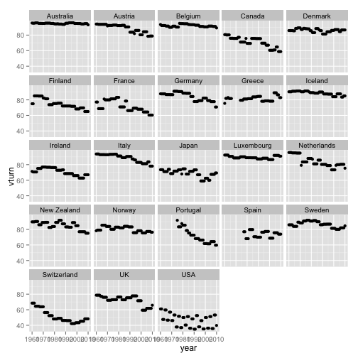
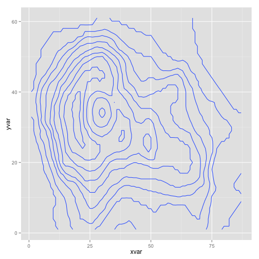
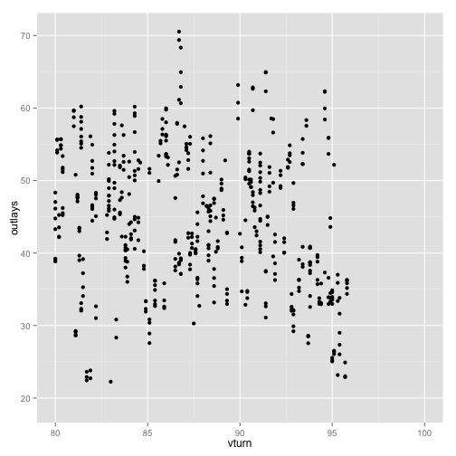
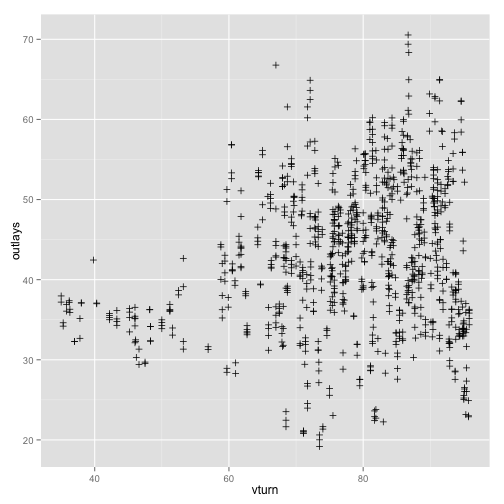

% Introduction to R (Intensive)
% [Chris Krogslund](http://ckro.gs); [Political Science](http://polisci.berkeley.edu) // [D-Lab](http://dlab.berkeley.edu) // [UC Berkeley](http://www.berkeley.edu/)
% [ckrogslund@berkeley.edu](mailto:ckrogslund@berkeley.edu)


# Where we're going...

# Where we're going...
- R as an Object-oriented Programming Language
- The R and R Studio Environments
- Arithmetic and Logical Operations
- Assignment Operators
- Object Classes
- Navigating and Subsetting Objects
- Programming (Functions, Conditional Execution)
- Importing data
- Summarizing data, group-wise operations
- Causal Inference
- Graphics

# R and Object-oriented Programming (OOP)

- A good way to introduce OOP is through a simple example that uses Microsoft Excel


- Here, we see two main components: a) some data (the values in the spreadsheet), and b) a request to compute an average (applied to the data in column B, rows 2 through 6)
- One can think of of these components more generally as, respectively, a) an object, and b) a function
- An **object** is a facility that stores data or information, while a **function** is a prescribed set of actions that will be applied to one or more aspects of an object
    - Note that a function can also be considered an object
- R and other OOPs abstract from environments like those seen in Excel (or Stata, etc.), allowing users to flexibly construct, manipulate, and deploy many, many objects and functions at the same time
- Learning how to use R is all about **learning how to work with different types of R objects and functions**, and then eventually using these lessons to further your own research and statistical needs

# The R and RStudio Environments

- Essential Elements:
    - Console (R/RStudio)
    - Scripts (R/RStudio)
    - Environment/History (RStudio)
    - Files/Plots/Packages/Help (RStudio)    
- Tab Completion
- Highlight and In-line Execution

# Getting Help

- Internal R methods include `help()` or `?`, as well as `??`
- [Google](http://www.google.com)

# Arithmetic and Boolean Operations

- R can act just like a scientific computer, via very predictable commands
- These commands can be roughly divided between those that are **arithmetic** (yielding numerical results) and those that are **boolean** (yielding logical results)
- Arithmetic examples:

```r
4 + 5
4 - 5
4 * 5
4/5

log(4)
exp(4)
sin(4)
cos(4)
tan(4)
sqrt(4)

max(4, 5, 6)
min(4, 5, 6)
sum(4, 5, 6)
prod(4, 5, 6)
```

- Boolean examples:

```r
4==5
4!=5
!4==5

4>5
4!>5 # Caution!
!4>5

4>=5
4!>=5 # Caution
!4>=5

4<5
4!<5 # Caution
!4<5

4<=5
4!<=5 # Caution
!4<=5

4 %in% c(4,5,6)
!4 %in% c(4,5,6)
4 %in% c(5,6)
!4 %in% c(5,6)
```


# Assignment Operators

- Though R can carry out the same operations as a calculator, what sets it apart is its ability to store calucated results (or any data or information) as objects
- Three main assignment operators are used to populate objects: 
1) `<-`
2) `->`
3) `=`
- Conventional use is of the format `objectname <- objectdata`

```r
mysum <- 4 + 5
simple.division <- 4/5
```

- Several semi-complex naming conventions apply to object names, but you generally won't have a problem if your object names a) **start with letters** and b) **only use . and _ from the punctuation marks**
- Numbers are fine, so long as they do not begin the object name

```r
15myobject<-4+5
myobject<-4+5
```

- The vast majority of punctuation marks are reserved for other operations (~, !, @, #, $, %, &, *, ;, ', ?, |)

```r
$myobject<-4+5
myobject<-4+5
```

- Note also that object names and data in R are case-sensitive

```r
myobject <- 4 + 5
print(MYOBJECT)
print(myobject)
```


# Assignment Operators/Concatenation

- Often we want to assign multiple value to an object
- To do this, we need to use the concatenation operator, or `c()`


```r
mynumbers <- c(4, 5, 6)
print(mynumbers)
```

```
## [1] 4 5 6
```


- We can also take advantage of some shortcuts for assigning a large number of values to an object, or when our values of interest following a particular pattern


```r
4:10
```

```
## [1]  4  5  6  7  8  9 10
```

```r
4:100
```

```
##  [1]   4   5   6   7   8   9  10  11  12  13  14  15  16  17  18  19  20
## [18]  21  22  23  24  25  26  27  28  29  30  31  32  33  34  35  36  37
## [35]  38  39  40  41  42  43  44  45  46  47  48  49  50  51  52  53  54
## [52]  55  56  57  58  59  60  61  62  63  64  65  66  67  68  69  70  71
## [69]  72  73  74  75  76  77  78  79  80  81  82  83  84  85  86  87  88
## [86]  89  90  91  92  93  94  95  96  97  98  99 100
```

```r
seq(0, 100, 10)
```

```
##  [1]   0  10  20  30  40  50  60  70  80  90 100
```

```r
seq(0, 100, 5)
```

```
##  [1]   0   5  10  15  20  25  30  35  40  45  50  55  60  65  70  75  80
## [18]  85  90  95 100
```

```r
rep(6, times = 10)
```

```
##  [1] 6 6 6 6 6 6 6 6 6 6
```

```r
rep(c(1:5), times = 10)
```

```
##  [1] 1 2 3 4 5 1 2 3 4 5 1 2 3 4 5 1 2 3 4 5 1 2 3 4 5 1 2 3 4 5 1 2 3 4 5
## [36] 1 2 3 4 5 1 2 3 4 5 1 2 3 4 5
```

```r
rep(c(1:5), each = 10)
```

```
##  [1] 1 1 1 1 1 1 1 1 1 1 2 2 2 2 2 2 2 2 2 2 3 3 3 3 3 3 3 3 3 3 4 4 4 4 4
## [36] 4 4 4 4 4 5 5 5 5 5 5 5 5 5 5
```


# Object Classes

- In OOP languages like R, objects that take a certain form or have particular attributes can be assigned to a class
- The class of an object acts like a shortcut for many functions, allowing them to carry out certain calculations that are only appropriate for objects of a certain kind
- The most prominent object classes in R include:
1) Numeric
2) Character
3) Factor
4) Logical
5) Missing/Non-numeric/Null

```r
x <- 4 + 5
class(x)
is.numeric(x)

y <- "New York"
class(y)
is.character(y)
is.numeric(y)

z <- factor(x = c("New York", "New Jersey"), ordered = T)
print(z)
class(z)
is.factor(z)
is.character(z)

a <- TRUE
is.logical(a)
is.character(a)
is.factor(a)

b <- NA
class(b)
is.na(b)
is.numeric(b)

c <- 0/0
class(c)
print(c)
is.nan(c)
is.na(c)

d <- 5/0
class(d)
is.infinite(d)

e <- NULL
class(e)
is.null(e)
is.numeric(e)
```


# Object Classes/Data Structures

- There are six basic data structures in R, or classes of objects that are commonly used to store data, namely:
1) **Atomic Vectors** -- a single piece of data

```r
x <- 3
print(x)
y <- "New York"
print(y)
```

2) **Vectors** -- a uni-dimensional ordered collection of class-homogenous data

```r
x <- c(3, 4, 9, 10)
print(x)
y <- c("New York", "New Jersey", "New Mexico")
print(y)
z <- c(1, 2, "a", "b")
print(z)
class(z)
as.numeric(z)
```

3) **Matrices** -- a two-dimensional ordered collection of class-homogenous data

```r
x <- matrix(data = 1:100, nrow = 10)
print(x)
y <- matrix(data = c(1, 2, "a", "b"), nrow = 2)
print(y)
```

4) **Arrays** -- a generalized n-dimensional ordered collection of class-homogenous data

```r
x <- array(data = 1:300, dim = c(10, 10, 3))
print(x)
```

5) **Data Frames** -- a two-dimensional ordered collection of class-heterogenous data

```r
x <- data.frame(c(1, 2), c("a", "b"))
print(x)
x <- data.frame(col1 = c(1, 2), col2 = c("a", "b"))
print(x)
class(x)
class(x[, 1])
class(x[, 2])
```

6) **Lists** -- a generalized n-dimensional ordered collection of class-heterogenous data

```r
x <- list(3, c(3, 4, "a", "b"), matrix(data = 1:100, nrow = 10), array(data = 1:300, 
    dim = c(10, 10, 3)), data.frame(col1 = c(1, 2), col2 = c("a", "b")))
print(x)
x <- list(myatomic.vector = 3, the.vector = c(3, 4, "a", "b"), some.matrix = matrix(data = 1:100, 
    nrow = 10), another.array = array(data = 1:300, dim = c(10, 10, 3)), onemore.data.frame = data.frame(col1 = c(1, 
    2), col2 = c("a", "b")))
print(x)
class(x)
class(x[[2]])
class(x[[3]])
class(x[[4]])
class(x[[5]])
```


# Navigating Objects/Indexing

- Often we're not interested in looking at the entirety of an object, but rather at specific attributes or subsets of that object
- All individual pieces of data in an R object are assigned an index, whose dimensionality is object specific (e.g. a cell in a matrix will have a two-component index, or a data point in a six-dimensional array will have a six-component index)
- This index can be used to isolate aspects of R objects via brackets

```r
x <- 4:10
print(x)
x[1]
x[5]
x[3:5]
x[-c(1, 7)]

x <- matrix(data = 1:100, nrow = 10)
print(x)
x[4, 5]
x[1, 9]
x[4, ]
x[, 10]
x[-1, ]
x[, -1]
x[, -c(8, 9, 10)]

x <- array(data = 1:300, dim = c(10, 10, 3))
print(x)
x[8, 7, 2]
x[8, 7, ]
x[8, , 2]
x[, , -c(1, 2)]
x[, , 3]

x <- data.frame(some.trait = 1:5, some.other.trait = c("a", "b", "c", "d", "e"), 
    third.trait = c(T, T, F, F, T))
print(x)
x[1, ]
x[, 1]
x[-3, ]
x$some.trait
x$third.trait
x[, "some.trait"]
x[, "third.trait"]
x[, 1]
x[, 3]

x <- list(myatomic.vector = 3, the.vector = c(3, 4, "a", "b"), some.matrix = matrix(data = 1:100, 
    nrow = 10), another.array = array(data = 1:300, dim = c(10, 10, 3)), onemore.data.frame = data.frame(col1 = c(1, 
    2), col2 = c("a", "b")))
print(x)
x[1]
x[[1]]
x$myatomic.vector
x[-c(1:3)]
x[[5]]
x[[5]][, 1]
x[[5]]$col2
```


# Navigating Objects/Conditional Subsetting

- Instead of inspecting aspects of an object based on their index, we often like to inspect only those aspects of a data object that satisfy certain conditions
- R allows us to do this by constructing a boolean object (containing only TRUE or FALSE for each element of an object) and only returning those object elements whose boolean positional analog is TRUE

```r
x <- data.frame(some.trait = 1:5, some.other.trait = c("a", "b", "c", "d", "e"), 
    third.trait = c(T, T, F, F, T))
print(x)
x$some.trait >= 3
x[x$some.trait >= 3, ]
x$some.other.trait %in% c("a", "b")
x[x$some.other.trait %in% c("a", "b"), ]

x <- data.frame(some.trait = 1:5, some.other.trait = c("a", "b", "c", "d", "e"), 
    third.trait = c(T, T, NA, F, T))
is.na(x)
x[is.na(x)]
x[is.na(x)] <- T
print(x)
```


# Programming/Functions/Architecture

- R's functional architecture is built around 4 essential components:
1) Name
2) Arguments
3) Content/Body
4) Return
- The basic format looks like this:

```r
function.name <- function(argument1, argument2) {
    
    "Content/Body"
    "e.g."
    "object<-argument1*(1-argument2)"
    
    return(object)
    
}
```


**Example #1: Missing Letters** 


```r
missing.letters1 <- function(text) {
    
    data.split <- strsplit(x = text, split = "")  # Split the text into letters
    data.split <- unlist(data.split)  # Convert the above result from a list to a vector
    data.split <- tolower(data.split)  # Convert all letter to lowercase
    data.split <- unique(data.split)  # Keep only the unique letters
    data.split <- data.split[data.split != " "]  # Get rid of spaces
    missing <- letters[!letters %in% data.split]  # Find the letters that are NOT in the text 
    
    return(missing)  # Return the missing letters
}

missing.letters1(text = "All we have to fear is fear itself")
```

```
##  [1] "b" "c" "d" "g" "j" "k" "m" "n" "p" "q" "u" "x" "y" "z"
```

```r
missing.letters1(text = "Supercalifragilisticexpialidocious")
```

```
##  [1] "b" "h" "j" "k" "m" "n" "q" "v" "w" "y" "z"
```


Or, slightly more compressed:


```r
missing.letters2 <- function(text) {
    
    data.split <- unique(tolower(unlist(strsplit(x = text, split = ""))))
    missing <- letters[!letters %in% data.split[data.split != " "]]
    
    return(missing)
}

identical(missing.letters1(text = "some text"), missing.letters2(text = "some text"))
```

```
## [1] TRUE
```


# Programming/Functions/Multi-argument Return

- Sometimes we want to write functions that return more than one argument.  The way you'd probably think to do it first won't work.
- For instance, suppose we want to also know the number of unique characters in each string, in addition to the letters that don't appear.


```r
missing.letters2 <- function(text) {
    
    data.split <- unique(tolower(unlist(strsplit(x = text, split = ""))))
    missing <- letters[!letters %in% data.split[data.split != " "]]
    
    num.unique.letters <- length(data.split)
    
    return(missing, num.unique.letters)
}

missing.letters2(text = "Supercalifragilisticexpialidocious")
```

```
## Error: multi-argument returns are not permitted
```


- In theory, R functions don't permit multi-argument returns.  What we need to do is "trick" R into returning multiple arguments by handing it a sort of Matryoshka doll.  The easiest way to do this is to put all our desired return arguments into **a list**, and then have our function return the list.

For example:


```r
missing.letters2 <- function(text) {
    
    data.split <- unique(tolower(unlist(strsplit(x = text, split = ""))))
    missing <- letters[!letters %in% data.split[data.split != " "]]
    
    num.unique.letters <- length(data.split)
    
    mylist <- list(missing, num.unique.letters)
    
    return(mylist)
}

missing.letters2(text = "Supercalifragilisticexpialidocious")
```

```
## [[1]]
##  [1] "b" "h" "j" "k" "m" "n" "q" "v" "w" "y" "z"
## 
## [[2]]
## [1] 15
```


- We can then access particular return arguments using list subsetting:


```r
example.list <- missing.letters2(text = "Supercalifragilisticexpialidocious")
# Get the first element of the list
example.list[[1]]
```

```
##  [1] "b" "h" "j" "k" "m" "n" "q" "v" "w" "y" "z"
```

```r
# Get the second element of the list
example.list[[2]]
```

```
## [1] 15
```


# Programming/Functions/Conditional Execution

- An essential element of programming in any language is the use of **conditional execution statements**, more commonly known as if/else statements.  The syntax for these in R is pretty straight forward, taking the basic form of:


```r
if (condition) true.action else false.action
```


- Some examples with **vectors of length == 1**:

```r
x <- 10

if (x < 10) "fine" else "also fine"
```

```
## [1] "also fine"
```

```r
if (x >= 10) x * 100 else 50/x
```

```
## [1] 1000
```

```r
if (x < 10) {
    y <- 2 * x
    c("really great", y)
} else {
    y <- -2 * x
    c("really not great", y)
}
```

```
## [1] "really not great" "-20"
```


- Things fall apart, however, when we deal with **vectors of length > 1**:

```r
x <- 8:12

if (x < 10) "fine" else "also fine"
```

```
## Warning: the condition has length > 1 and only the first element will be
## used
```

```
## [1] "fine"
```

```r
if (x >= 10) x * 100 else 50/x
```

```
## Warning: the condition has length > 1 and only the first element will be
## used
```

```
## [1] 6.250 5.556 5.000 4.545 4.167
```

```r
if (x < 10) {
    y <- 2 * x
    c("really great", y)
} else {
    y <- -2 * x
    c("really not great", y)
}
```

```
## Warning: the condition has length > 1 and only the first element will be
## used
```

```
## [1] "really great" "16"           "18"           "20"          
## [5] "22"           "24"
```


- For vectors of length > 1, we need to be sure to vectorize our conditional execution statements (meaning, they must be instructed to evaluate objects element-by-element).  R has three basic facilities for doing this: **ifelse()**, **for loops**, and the family of **apply functions**

# Programming/Functions/Conditional Execution/ifelse()

Basic usage:


```r
ifelse(test = , yes = , no = )
```


```r
x = 8:12

ifelse(test = x < 10, yes = "fine", no = "also fine")
```

```
## [1] "fine"      "fine"      "also fine" "also fine" "also fine"
```

```r
ifelse(test = x >= 10, yes = x * 100, no = 50/x)
```

```
## [1]    6.250    5.556 1000.000 1100.000 1200.000
```

```r
ifelse(test = x < 10, yes = {
    y <- 2 * x
    3 * y
}, no = {
    y <- -2 * x
    3 * y
})
```

```
## [1]  48  54 -60 -66 -72
```


# Programming/Functions/Conditional Execution/for loops

Basic usage:


```r
storage.object <- NULL
for (element in object.containing.elements) {
    storage.object[element.index] <- operation(element)
}
```


For example [note a) the vectorization, and b) the storage]

```r
out <- NULL
for (i in 1:length(x)) {
    if (x[i] < 10) {
        y <- 2 * x[i]
        out[i] <- 3 * y
    } else {
        y <- -2 * x[i]
        out[i] <- 3 * y
    }
}
print(out)
```

```
## [1]  48  54 -60 -66 -72
```


# Programming/Functions/Conditional Execution/VERSUS


```r
x <- 1:1e+05

time.ifelse <- system.time(ifelse(test = x < 10, yes = {
    y <- 2 * x
    3 * y
}, no = {
    y <- -2 * x
    3 * y
}))
out <- NULL
time.forloop <- system.time(for (i in 1:length(x)) {
    cat(i, "\n")
    if (x[i] < 10) {
        y <- 2 * x[i]
        out[i] <- 3 * y
    } else {
        y <- -2 * x[i]
        out[i] <- 3 * y
    }
})

time.forloop/time.ifelse
```


# Useful Stuff: Applied Research Edition

- For most applied researchers, "useful stuff" that can be done in R boils down to a few core items: 

a) ***Importing*** different types of data from different sources
b) ***Summarizing*** the structure and content of data
c) Carrying out operations and calculations across ***groups*** 
d) ***Reshaping*** data to and from various formats
e) Attempting to conduct ***causal inference*** 

# Importing data/spreadsheets 

- For spreadsheet data that **is not** explicitly saved as a Microsoft Excel file:

```r
# Import data with header row, values separated by ',', decimals as '.'
data <- read.csv(file = "  ", stringsAsFactors = )  # Basic Call
```


```r
# Example
cpds.data <- read.csv(file = "datasets/cpds_comma.csv", stringsAsFactors = F)
dim(cpds.data)  # Check dimensionality of dataset
```

```
## [1] 1173  237
```

```r
cpds.data[1:5, 1:5]  # View first 5 rows/columns
```

```
##   year   country countryn gov_right gov_cent
## 1 1960 Australia        1       100        0
## 2 1961 Australia        1       100        0
## 3 1962 Australia        1       100        0
## 4 1963 Australia        1       100        0
## 5 1964 Australia        1       100        0
```


```r
# Import data with header row, values separated by ';', decimals as ','
data <- read.csv2(file = "  ", stringsAsFactors = )

# Import data with header row, values separated by tab, decimals as '.'
data <- read.delim(file = "  ", stringsAsFactors = )

# Import data with header row, values separated by tab, decimals as ';'
data <- read.delim2(file = "  ", stringsAsFactors = )

# For importing tabular data with maximum customizeability
data <- read.table(file = , header = , sep = , quote = , dec = , fill = , stringsAsFactors = )
```


- For spreadsheet data that **is** explicitly saved as a Microsoft Excel file (.xls or .xlsx):

```r
# Install the 'gdata' package (only necessary one time)
# install.packages('gdata') # Not Run

# Load the 'gdata' package (necessary every new R session)
library(gdata)
```


```r
# For importing both .xls and .xlsx files
data <- read.xls(xls = , sheet = )  # Basic Call
```


```r
# Example with .xls (single sheet)
cpds.data <- read.xls(xls = "datasets/cpds_excel_old.xls")
cpds.data[1:5, 1:5]
```

```
##   year   country countryn gov_right gov_cent
## 1 1960 Australia        1       100        0
## 2 1961 Australia        1       100        0
## 3 1962 Australia        1       100        0
## 4 1963 Australia        1       100        0
## 5 1964 Australia        1       100        0
```

```r
# Example with .xlsx (single sheet)
cpds.data <- read.xls(xls = "datasets/cpds_excel_new.xlsx")
cpds.data[1:5, 1:5]
```

```
##   year   country countryn gov_right gov_cent
## 1 1960 Australia        1       100        0
## 2 1961 Australia        1       100        0
## 3 1962 Australia        1       100        0
## 4 1963 Australia        1       100        0
## 5 1964 Australia        1       100        0
```


# Importing data/proprietaries (e.g.: .dta, .spss, .ssd)


```r
# Install the 'foreign' package (only necessary one time)
# install.packages('foreign') # Not Run

# Load the 'foreign' package (necessary every new R session)
library(foreign)

read.xxxx(file = )  # Basic call, where .xxxx is the imported file's extension/client

# For importing Stata files
data <- read.dta(file = )
```


```r
# Example
cpds.data <- read.dta(file = "datasets/cpds_stata.dta")
cpds.data[1:5, 1:5]
```

```
##   year   country countryn gov_right gov_cent
## 1 1960 Australia        1       100        0
## 2 1961 Australia        1       100        0
## 3 1962 Australia        1       100        0
## 4 1963 Australia        1       100        0
## 5 1964 Australia        1       100        0
```


```r
# For importing SPSS files
data <- read.spss(file = )

# For importing SAS files
data <- read.ssd(file = )
data <- read.xport(file = )

# For importing Fortran files
data <- read.fortran(file = )

# For importing DBF files
data <- read.dbf(file = )
```


# Importing data/urls (e.g.: http, https, ftp)

- Most data importing facilities in R can be adapted to import non-local files via http/s/ftp
- For instance, [this online dataset](http://www.quandl.com/DISASTERCENTER-US-Disaster-Center/RATES-US-Crime-Rates-per-100-000-persons)

```r
# Import crime dataset from Quandl
link <- "http://www.quandl.com/api/v1/datasets/DISASTERCENTER/RATES.csv"
crime.data <- read.csv(file = link)
crime.data[1:25, 1:5]
```

```
##          Date Total Violent Property Murder
## 1  2012-12-31  3246   386.9     2859    4.7
## 2  2011-12-31  3292   387.1     2905    4.7
## 3  2010-12-31  3350   404.5     2946    4.8
## 4  2009-12-31  3466   431.9     3036    5.0
## 5  2008-12-31  3669   457.5     3212    5.4
## 6  2007-12-31  3730   466.9     3264    5.6
## 7  2006-12-31  3808   473.6     3334    5.7
## 8  2005-12-31  3900   469.0     3432    5.6
## 9  2004-12-31  3977   463.2     3514    5.5
## 10 2003-12-31  4067   475.8     3591    5.7
## 11 2002-12-31  4125   494.4     3631    5.6
## 12 2001-12-31  4163   504.5     3658    5.6
## 13 2000-12-31  4125   506.5     3618    5.5
## 14 1999-12-31  4266   523.0     3744    5.7
## 15 1998-12-31  4616   566.4     4049    6.3
## 16 1997-12-31  4927   611.0     4316    6.8
## 17 1996-12-31  5088   636.6     4451    7.4
## 18 1995-12-31  5275   684.5     4591    8.2
## 19 1994-12-31  5374   713.6     4660    9.0
## 20 1993-12-31  5484   746.8     4738    9.5
## 21 1992-12-31  5660   757.5     4903    9.3
## 22 1991-12-31  5898   758.1     5140    9.8
## 23 1990-12-31  5820   731.8     5088    9.4
## 24 1989-12-31  5741   663.1     5078    8.7
## 25 1988-12-31  5664   637.2     5027    8.4
```


# Importing data/other (e.g.: html tables, html, xml, json) 

- Say we wanted to scrape a list of votes in the US Congress contained in an html table (like [this](http://clerk.house.gov/evs/2014/ROLL_000.asp))

```r
# Install the 'XML' package (only necessary one time)
# install.packages('XML') # Not Run

# Load the 'XML' package (necessary every new R session)
library(XML)
```


```r
data <- readHTMLTable(doc = , header = , which = , stringsAsFactors = )  # Basic Call
```


```r
link <- "http://clerk.house.gov/evs/2014/ROLL_000.asp"
votes.2014 <- readHTMLTable(doc = link, header = T, which = 1, stringsAsFactors = F)

dim(votes.2014)  # Check data dimensionality
```

```
## [1] 99  6
```

```r
colnames(votes.2014)  # Get column names
```

```
## [1] "Roll"              "Date"              "Issue"            
## [4] "Question"          "Result"            "Title/Description"
```

```r
votes.2014[1:25, 1:5]
```

```
##    Roll   Date     Issue
## 1    99  6-Mar H RES 501
## 2    98  5-Mar  H R 2126
## 3    97  5-Mar  H R 4118
## 4    96  5-Mar  H R 4118
## 5    95  5-Mar   H R 938
## 6    94  5-Mar H RES 497
## 7    93  5-Mar H RES 497
## 8    92  4-Mar H RES 488
## 9    91  4-Mar  H R 3370
## 10   90 28-Feb   H R 899
## 11   89 28-Feb   H R 899
## 12   88 28-Feb   H R 899
## 13   87 28-Feb   H R 899
## 14   86 28-Feb   H R 899
## 15   85 27-Feb  H R 3193
## 16   84 27-Feb  H R 3193
## 17   83 27-Feb  H R 3193
## 18   82 27-Feb  H R 3193
## 19   81 27-Feb  H R 3193
## 20   80 27-Feb H RES 492
## 21   79 27-Feb H RES 492
## 22   78 27-Feb  H R 2804
## 23   77 27-Feb  H R 2804
## 24   76 27-Feb  H R 2804
## 25   75 27-Feb  H R 2804
##                                                Question Result
## 1                     On Ordering the Previous Question      P
## 2   On Motion to Suspend the Rules and Pass, as Amended      P
## 3                                            On Passage      P
## 4               On Motion to Recommit with Instructions      F
## 5   On Motion to Suspend the Rules and Pass, as Amended      P
## 6                         On Agreeing to the Resolution      P
## 7                     On Ordering the Previous Question      P
## 8  On Motion to Suspend the Rules and Agree, as Amended      P
## 9   On Motion to Suspend the Rules and Pass, as Amended      P
## 10                                           On Passage      P
## 11              On Motion to Recommit with Instructions      F
## 12                         On Agreeing to the Amendment      F
## 13                         On Agreeing to the Amendment      F
## 14                         On Agreeing to the Amendment      F
## 15                                           On Passage      P
## 16              On Motion to Recommit with Instructions      F
## 17                         On Agreeing to the Amendment      F
## 18                         On Agreeing to the Amendment      A
## 19                         On Agreeing to the Amendment      A
## 20                        On Agreeing to the Resolution      P
## 21                    On Ordering the Previous Question      P
## 22                                           On Passage      P
## 23              On Motion to Recommit with Instructions      F
## 24                         On Agreeing to the Amendment      F
## 25                         On Agreeing to the Amendment      F
```


- Or say we wanted to scrape the content of a web page (for example, [here](http://www.whitehouse.gov/the_press_office/President_Barack_Obamas_Inaugural_Address))

```r
# Install the 'RCurl' package (only necessary one time)
# install.packages('RCurl') # Not Run

# Load the 'RCurl' and 'XML' packages (necessary every new R session)
library(RCurl)
library(XML)

link <- "http://www.whitehouse.gov/the_press_office/President_Barack_Obamas_Inaugural_Address"
speech <- getURL(url = link)

# Optional html parsing (clean file, extract content)
speech.parsed <- htmlParse(file = speech)

text <- xpathSApply(doc = speech.parsed, path = "//div[@id='content']", fun = xmlValue)

# Optional content analysis

# Install the 'qdap' package (only necessary one time)
# install.packages('qdap') # Not Run

# Load the 'qdap' package (necessary every new R session)
library(qdap)

# Convert the text to a data.frame
text.df <- data.frame(text = text, stringsAsFactors = F)

# Split the text into sentences
sentences <- sentSplit(dataframe = text.df, text.var = "text")

# Compute various polarity (sentiment) statistics
polarity.score <- polarity(text.var = sentences$text)
polarity.score$group[, c("total.sentences", "total.words", "ave.polarity")]
```

```
##   total.sentences total.words ave.polarity
## 1             119        2574      0.08423
```

```r
polarity.score$all[1:20, c("pos.words", "neg.words")]
```

```
##                  pos.words                          neg.words
## 1                        -                                  -
## 2                        -                                  -
## 3                        -                                  -
## 4                     free                                  -
## 5          grateful, trust                                  -
## 6  thank, well, generosity                                  -
## 7                        -                                  -
## 8        prosperity, peace                                  -
## 9                        -                             raging
## 10         skill, faithful                                  -
## 11                       -                                  -
## 12                    well                             crisis
## 13                       -                             hatred
## 14                       -        badly, greed, failure, hard
## 15                       -                               lost
## 16                       -             costly, fail, threaten
## 17                       -                             crisis
## 18    profound, confidence nagging, fear, decline, inevitable
## 19                       -                                  -
## 20                       -                                  -
```


- Or say we wanted to scrape the content of an RSS feed (XML) (for example, [here](http://rss.nytimes.com/services/xml/rss/nyt/HomePage.xml))

```r
# Specify a link and issue a GET request
link <- "http://rss.nytimes.com/services/xml/rss/nyt/HomePage.xml"
page <- getURL(url = link)

# Parse the results of the get request as an XML file
rss.feed <- xmlParse(file = page)  # Not printed
```


- Or say we wanted to import a JSON file

```r
# Install the 'jsonlite' package (only necessary one time)
# install.packages('jsonlite') # Not Run

# Load the 'jsonlite' package (necessary every new R session)
library(jsonlite)

# Import JSON file, convert to list
cpds.data <- fromJSON(txt = "datasets/cpds_json.txt", simplifyDataFrame = F)
head(cpds.data)
```

```
## [[1]]
## [[1]]$year
## [1] 1960
## 
## [[1]]$country
## [1] "Australia"
## 
## [[1]]$variable
## [1] "gov_right"
## 
## [[1]]$value
## [1] 100
## 
## 
## [[2]]
## [[2]]$year
## [1] 1961
## 
## [[2]]$country
## [1] "Australia"
## 
## [[2]]$variable
## [1] "gov_right"
## 
## [[2]]$value
## [1] 100
## 
## 
## [[3]]
## [[3]]$year
## [1] 1962
## 
## [[3]]$country
## [1] "Australia"
## 
## [[3]]$variable
## [1] "gov_right"
## 
## [[3]]$value
## [1] 100
## 
## 
## [[4]]
## [[4]]$year
## [1] 1963
## 
## [[4]]$country
## [1] "Australia"
## 
## [[4]]$variable
## [1] "gov_right"
## 
## [[4]]$value
## [1] 100
## 
## 
## [[5]]
## [[5]]$year
## [1] 1964
## 
## [[5]]$country
## [1] "Australia"
## 
## [[5]]$variable
## [1] "gov_right"
## 
## [[5]]$value
## [1] 100
## 
## 
## [[6]]
## [[6]]$year
## [1] 1965
## 
## [[6]]$country
## [1] "Australia"
## 
## [[6]]$variable
## [1] "gov_right"
## 
## [[6]]$value
## [1] 100
```

```r
# Import JSON file, convert to data.frame
cpds.data <- fromJSON(txt = "datasets/cpds_json.txt", simplifyDataFrame = T)
head(cpds.data)
```

```
##   year   country  variable value
## 1 1960 Australia gov_right   100
## 2 1961 Australia gov_right   100
## 3 1962 Australia gov_right   100
## 4 1963 Australia gov_right   100
## 5 1964 Australia gov_right   100
## 6 1965 Australia gov_right   100
```


# Summarizing data/example dataset

Replication data from Gelman et al., "Rich State, Poor State, Red State, Blue State: What’s the Matter with Connecticut?", *Quarterly Journal of Political Science*, 2007, 2: 345-367

For decades, the Democrats have been viewed as the party of the poor, with the Republicans representing the rich. Recent presidential elections, however, have shown a reverse pattern, with Democrats performing well in the richer blue states in the northeast and coasts, and Republicans dominating in the red states in the middle of the country and the south. Through multilevel modeling of individual- level survey data and county- and state-level demographic and electoral data, we reconcile these patterns.Furthermore, we find that income matters more in red America than in blue America. In poor states, rich people are much more likely than poor people to vote for the Republican presidential candidate, but in rich states (such as Connecticut), income has a very low correlation with vote preference.


```r
library(foreign)
red.blue <- read.dta("datasets/2004_labeled_processed_race.dta")
```


# Summarizing data/object structure

```r
# Get the object class
class(red.blue)
```

```
## [1] "data.frame"
```

```r
# Get the object dimensionality
dim(red.blue)  # Note this is rows by columns
```

```
## [1] 76205    17
```

```r
# Get the column names
colnames(red.blue)
```

```
##  [1] "state"    "pres04"   "sex"      "race"     "age9"     "partyid" 
##  [7] "income"   "relign8"  "age60"    "age65"    "geocode"  "sizeplac"
## [13] "brnagain" "attend"   "year"     "region"   "y"
```

```r
# Get the row names
rownames(red.blue)[1:50]  # Only the first 50 rows
```

```
##  [1] "1"  "2"  "3"  "4"  "5"  "6"  "7"  "8"  "9"  "10" "11" "12" "13" "14"
## [15] "15" "16" "17" "18" "19" "20" "21" "22" "23" "24" "25" "26" "27" "28"
## [29] "29" "30" "31" "32" "33" "34" "35" "36" "37" "38" "39" "40" "41" "42"
## [43] "43" "44" "45" "46" "47" "48" "49" "50"
```

```r
# View first six rows and all columns
head(red.blue)
```

```
##   state pres04    sex  race  age9 partyid income relign8 age60 age65
## 1     2      1 female white 25-29    <NA>   <NA>    <NA> 18-29 25-29
## 2     2      2   male white 18-24    <NA>   <NA>    <NA> 18-29 18-24
## 3     2      1 female black 30-39    <NA>   <NA>    <NA> 30-44 30-39
## 4     2      1 female black 30-39    <NA>   <NA>    <NA> 30-44 30-39
## 5     2      1 female white 40-44    <NA>   <NA>    <NA> 30-44 40-49
## 6     2      1 female white 30-39    <NA>   <NA>    <NA> 30-44 30-39
##   geocode sizeplac brnagain attend year region y
## 1       3    rural     <NA>   <NA> 2004      4 0
## 2       3    rural     <NA>   <NA> 2004      4 1
## 3       3    rural     <NA>   <NA> 2004      4 0
## 4       3    rural     <NA>   <NA> 2004      4 0
## 5       3    rural     <NA>   <NA> 2004      4 0
## 6       3    rural     <NA>   <NA> 2004      4 0
```

```r
# View last six rows and all columns
tail(red.blue)
```

```
##       state pres04    sex  race  age9        partyid          income
## 76200    50      2 female white 65-74     republican   under $15,000
## 76201    50      2 female white 50-59    independent   under $15,000
## 76202    50      2   male white 18-24    independent   under $15,000
## 76203    50      3 female black 30-39 something else   under $15,000
## 76204    50      2 female white 50-59       democrat $30,000-$49,999
## 76205    50      2   male white 45-49     republican $15,000-$29,999
##               relign8      age60      age65 geocode               sizeplac
## 76200        catholic 60 or over 65 or over       1 city: 10,000 to 49,999
## 76201      protestant      45-59      50-64       1                  rural
## 76202 other christian      18-29      18-24       1 city: 10,000 to 49,999
## 76203 other christian      30-44      30-39       1 city: 10,000 to 49,999
## 76204      mormon/lds      45-59      50-64       1 city: 10,000 to 49,999
## 76205  something else      45-59      40-49       2                  rural
##       brnagain attend year region  y
## 76200     <NA>   <NA> 2004      4  1
## 76201     <NA>   <NA> 2004      4  1
## 76202     <NA>   <NA> 2004      4  1
## 76203     <NA>   <NA> 2004      4 NA
## 76204     <NA>   <NA> 2004      4  1
## 76205     <NA>   <NA> 2004      4  1
```

```r
# Get detailed column-by-column information
str(red.blue)
```

```
## 'data.frame':	76205 obs. of  17 variables:
##  $ state   : int  2 2 2 2 2 2 2 2 2 2 ...
##  $ pres04  : int  1 2 1 1 1 1 1 2 2 2 ...
##  $ sex     : Factor w/ 2 levels "male","female": 2 1 2 2 2 2 1 2 2 2 ...
##  $ race    : Factor w/ 5 levels "white","black",..: 1 1 2 2 1 1 1 1 1 1 ...
##  $ age9    : Factor w/ 9 levels "18-24","25-29",..: 2 1 3 3 4 3 4 1 2 1 ...
##  $ partyid : Factor w/ 4 levels "democrat","republican",..: NA NA NA NA NA NA NA NA NA NA ...
##  $ income  : Factor w/ 8 levels "under $15,000",..: NA NA NA NA NA NA NA NA NA NA ...
##  $ relign8 : Factor w/ 8 levels "protestant","catholic",..: NA NA NA NA NA NA NA NA NA NA ...
##  $ age60   : Factor w/ 4 levels "18-29","30-44",..: 1 1 2 2 2 2 2 1 1 1 ...
##  $ age65   : Factor w/ 6 levels "18-24","25-29",..: 2 1 3 3 4 3 4 1 2 1 ...
##  $ geocode : int  3 3 3 3 3 3 3 3 3 3 ...
##  $ sizeplac: Factor w/ 5 levels "city over 500,000",..: 5 5 5 5 5 5 5 5 5 5 ...
##  $ brnagain: Factor w/ 2 levels "yes","no": NA NA NA NA NA NA NA NA NA NA ...
##  $ attend  : Factor w/ 6 levels "more than once a week",..: NA NA NA NA NA NA NA NA NA NA ...
##  $ year    : num  2004 2004 2004 2004 2004 ...
##  $ region  : num  4 4 4 4 4 4 4 4 4 4 ...
##  $ y       : num  0 1 0 0 0 0 0 1 1 1 ...
##  - attr(*, "datalabel")= chr ""
##  - attr(*, "time.stamp")= chr " 6 Jun 2007 14:53"
##  - attr(*, "formats")= chr  "%8.0g" "%8.0g" "%8.0g" "%8.0g" ...
##  - attr(*, "types")= int  251 251 251 251 251 251 251 251 251 251 ...
##  - attr(*, "val.labels")= chr  "stanum" "presak04" "sex" "race" ...
##  - attr(*, "var.labels")= chr  "state id" "in today's election for president, did you just vote for:" "are you:" "are you:" ...
##  - attr(*, "version")= int 8
##  - attr(*, "label.table")=List of 14
##   ..$ stanum  : Named int 2
##   .. ..- attr(*, "names")= chr "alaska"
##   ..$ presak04: Named int  0 1 2 3 9
##   .. ..- attr(*, "names")= chr  "did not vote" "kerry" "bush" "nader" ...
##   ..$ sex     : Named int  1 2
##   .. ..- attr(*, "names")= chr  "male" "female"
##   ..$ race    : Named int  1 2 3 4 5
##   .. ..- attr(*, "names")= chr  "white" "black" "hispanic/latino" "asian" ...
##   ..$ age9    : Named int  1 2 3 4 5 6 7 8 9
##   .. ..- attr(*, "names")= chr  "18-24" "25-29" "30-39" "40-44" ...
##   ..$ partyid : Named int  1 2 3 4
##   .. ..- attr(*, "names")= chr  "democrat" "republican" "independent" "something else"
##   ..$ income  : Named int  1 2 3 4 5 6 7 8
##   .. ..- attr(*, "names")= chr  "under $15,000" "$15,000-$29,999" "$30,000-$49,999" "$50,000-$74,999" ...
##   ..$ relign8 : Named int  1 2 3 4 5 6 7 8
##   .. ..- attr(*, "names")= chr  "protestant" "catholic" "mormon/lds" "other christian" ...
##   ..$ age60   : Named int  1 2 3 4
##   .. ..- attr(*, "names")= chr  "18-29" "30-44" "45-59" "60 or over"
##   ..$ age65   : Named int  1 2 3 4 5 6
##   .. ..- attr(*, "names")= chr  "18-24" "25-29" "30-39" "40-49" ...
##   ..$ geocode : Named int  1 2 3
##   .. ..- attr(*, "names")= chr  "juneau/fairbanks/rural" "anchorage" "anchorage-fairbanks corridor"
##   ..$ sizeplac: Named int  1 2 3 4 5
##   .. ..- attr(*, "names")= chr  "city over 500,000" "city: 50,000 to 500,000" "suburbs" "city: 10,000 to 49,999" ...
##   ..$ brnagain: Named int  1 2
##   .. ..- attr(*, "names")= chr  "yes" "no"
##   ..$ attend  : Named int  1 2 3 4 5 9
##   .. ..- attr(*, "names")= chr  "more than once a week" "once a week" "a few times a month" "a few times a year" ...
```


# Summarizing data/object content

- A good place to start with our data is to calculate summary statistics

- ***Caution***: Although we have some inherently ratio (continuous) variables, the authors binned the data to create ordinal variables (e.g.: Age and Income).  *Bonus*: the bins have differing widths.

- Take a look at the variable "age9"

```r
# View unique values observed in 'age9' (note the factor levels)
unique(x = red.blue$age9)
```

```
##  [1] 25-29      18-24      30-39      40-44      45-49      65-74     
##  [7] 75 or over 50-59      <NA>       60-64     
## Levels: 18-24 25-29 30-39 40-44 45-49 50-59 60-64 65-74 75 or over
```


Binned Age | True Age
------ | -----
1|18-24
2|25-29
3|30-39 
4|40-44
5|45-49
6|50-59
7|60-64
8|65-74
9|75+

- Some notes on computing summary statistics:
1) Note that these functions are sensitive to missing values (NA); you should be sure to specify na.rm=T to avoid errors 


```r
# Sample 100 times from the standard normal distribution
sample.data <- rnorm(n = 100, mean = 0, sd = 1)

# Add some missing values to the sample
sample.data[c(1, 4, 16, 64)] <- NA

# Attempt to calculate the sample mean (presence of NAs)
mean(x = sample.data)
```

```
## [1] NA
```

```r
# Remove missing values from the sample
sample.data <- sample.data[!is.na(sample.data)]

# Attempt to calculate the sample mean (absence of NAs)
mean(x = sample.data)
```

```
## [1] 0.1058
```


2) These functions are also sensitive to the presence of factor variables; remove the factor levels to avoid errors (usually use one of as.vector(), as.character(), or as.numeric())


```r
# Check for factor levels in 'age9'
is.factor(x = red.blue$age9)
```

```
## [1] TRUE
```

```r
# Attempt to calculate the sample mean ('age9' is factor)
mean(x = red.blue$age9, na.rm = T)
```

```
## Warning: argument is not numeric or logical: returning NA
```

```
## [1] NA
```

```r
# Remove factor levels in 'age9'
red.blue$age9 <- as.numeric(x = red.blue$age9)

# Check that there are no more factor levels in 'age9'
is.factor(x = red.blue$age9)
```

```
## [1] FALSE
```

```r
# Attempt to calculate the sample mean ('age9' is not factor)
mean(x = red.blue$age9, na.rm = T)
```

```
## [1] 4.544
```


- Computing some common summary statistics:

```r
# Mean
mean(x = as.numeric(red.blue$age9), na.rm = T)
```

```
## [1] 4.544
```

```r
# Median
median(x = as.numeric(red.blue$age9), na.rm = T)
```

```
## [1] 4
```

```r
# Standard Deviation
sd(x = as.numeric(red.blue$age9), na.rm = T)
```

```
## [1] 2.238
```

```r
# Quartiles
quantile(x = as.numeric(red.blue$age9), na.rm = T, probs = seq(from = 0, to = 1, 
    by = 0.25))
```

```
##   0%  25%  50%  75% 100% 
##    1    3    4    6    9
```

```r
# Quintiles
quantile(x = as.numeric(red.blue$age9), na.rm = T, probs = seq(from = 0, to = 1, 
    by = 0.2))
```

```
##   0%  20%  40%  60%  80% 100% 
##    1    3    4    5    6    9
```

```r
# Deciles
quantile(x = as.numeric(red.blue$age9), na.rm = T, probs = seq(from = 0, to = 1, 
    by = 0.1))
```

```
##   0%  10%  20%  30%  40%  50%  60%  70%  80%  90% 100% 
##    1    1    3    3    4    4    5    6    6    8    9
```

```r
# Percentiles
quantile(x = as.numeric(red.blue$age9), na.rm = T, probs = seq(from = 0, to = 1, 
    by = 0.01))
```

```
##   0%   1%   2%   3%   4%   5%   6%   7%   8%   9%  10%  11%  12%  13%  14% 
##    1    1    1    1    1    1    1    1    1    1    1    2    2    2    2 
##  15%  16%  17%  18%  19%  20%  21%  22%  23%  24%  25%  26%  27%  28%  29% 
##    2    2    2    2    2    3    3    3    3    3    3    3    3    3    3 
##  30%  31%  32%  33%  34%  35%  36%  37%  38%  39%  40%  41%  42%  43%  44% 
##    3    3    3    3    3    3    3    3    3    4    4    4    4    4    4 
##  45%  46%  47%  48%  49%  50%  51%  52%  53%  54%  55%  56%  57%  58%  59% 
##    4    4    4    4    4    4    5    5    5    5    5    5    5    5    5 
##  60%  61%  62%  63%  64%  65%  66%  67%  68%  69%  70%  71%  72%  73%  74% 
##    5    5    6    6    6    6    6    6    6    6    6    6    6    6    6 
##  75%  76%  77%  78%  79%  80%  81%  82%  83%  84%  85%  86%  87%  88%  89% 
##    6    6    6    6    6    6    6    7    7    7    7    7    7    8    8 
##  90%  91%  92%  93%  94%  95%  96%  97%  98%  99% 100% 
##    8    8    8    8    8    8    9    9    9    9    9
```


- We could do the same thing for lots of variables, but there is an easier way!

```r
# Compute standard summary statistics for object 'red.blue'
summary(object = red.blue)
```

```
##      state          pres04        sex                     race      
##  Min.   : 1.0   Min.   :0.0   male  :34236   white          :60567  
##  1st Qu.:13.0   1st Qu.:1.0   female:41632   black          : 7166  
##  Median :25.0   Median :2.0   NA's  :  337   hispanic/latino: 4430  
##  Mean   :25.7   Mean   :1.6                  asian          : 1028  
##  3rd Qu.:38.0   3rd Qu.:2.0                  other          : 1781  
##  Max.   :50.0   Max.   :9.0                  NA's           : 1233  
##                 NA's   :543                                         
##       age9               partyid                  income     
##  Min.   :1.0   democrat      :27059   $50,000-$74,999:18864  
##  1st Qu.:3.0   republican    :25940   under $15,000  :16416  
##  Median :4.0   independent   :16512   $30,000-$49,999:15745  
##  Mean   :4.5   something else: 3409   $15,000-$29,999:15563  
##  3rd Qu.:6.0   NA's          : 3285   $75,000-$99,999: 2274  
##  Max.   :9.0                          (Other)        :    0  
##  NA's   :505                          NA's           : 7343  
##             relign8             age60              age65      
##  protestant     :21783   18-29     :14704   18-24     : 8256  
##  catholic       :16411   30-44     :23159   25-29     : 6448  
##  other christian:15230   45-59     :23742   30-39     :14212  
##  none           : 7540   60 or over:14095   40-49     :17938  
##  something else : 4412   NA's      :  505   50-64     :19746  
##  (Other)        : 3794                      65 or over: 9100  
##  NA's           : 7035                      NA's      :  505  
##     geocode                        sizeplac     brnagain    
##  Min.   :1.00   city over 500,000      : 5882   yes :14034  
##  1st Qu.:1.00   city: 50,000 to 500,000:15462   no  :16647  
##  Median :2.00   suburbs                :28796   NA's:45524  
##  Mean   :2.52   city: 10,000 to 49,999 : 8449               
##  3rd Qu.:3.00   rural                  :17501               
##  Max.   :6.00   NA's                   :  115               
##                                                             
##                    attend           year          region    
##  more than once a week: 3669   Min.   :2004   Min.   :1.00  
##  once a week          : 7255   1st Qu.:2004   1st Qu.:1.00  
##  a few times a month  : 4146   Median :2004   Median :3.00  
##  a few times a year   : 8232   Mean   :2004   Mean   :2.45  
##  never                : 4549   3rd Qu.:2004   3rd Qu.:4.00  
##  omit                 :  687   Max.   :2004   Max.   :4.00  
##  NA's                 :47667                                
##        y       
##  Min.   :0.0   
##  1st Qu.:0.0   
##  Median :0.0   
##  Mean   :0.5   
##  3rd Qu.:1.0   
##  Max.   :1.0   
##  NA's   :1787
```


- Unfortunately, the built-in summary methods don't always pickup every statistic of interest (for example, certain frequencies)
- For this, it is helpful to produce ratios of the lengths of vector subsets

```r
# Isolate the gender column, remove factor levels
gender <- as.character(x = red.blue$sex)

# Remove missing values
gender <- gender[!is.na(gender)]

# View unique values
unique(gender)
```

```
## [1] "female" "male"
```

```r
# Subset the gender vector to include only males
males <- gender[gender == "male"]
head(males)
```

```
## [1] "male" "male" "male" "male" "male" "male"
```

```r
# Compute the percentage of males using vector lengths
length(males)
```

```
## [1] 34236
```

```r
length(gender)
```

```
## [1] 75868
```

```r
length(males)/length(gender) * 100
```

```
## [1] 45.13
```


- This can get really complicated really quickly
- Suppose we wanted to know how voting behavior in the 2004 Presidential Election varies by race
- That means we have to calculate frequencies as above for each race in {White, Black, Hispanic/Latino, Asian, Other} and each vote choice in {Bush, Kerry, Nader, Other, No Vote}.
- How to tackle these tabulations?

# Group-wise Operations

All techniques for this problem rely on the ***split-apply-combine*** strategy

**First,** take the data (or some object) and *split* it into smaller datasets on the basis of some variable

Dataset A

x|y|z
-----|------|-----
1|1|1
2|2|1
3|3|1
4|1|2
5|2|2
6|3|2

Datasets B and C (Dataset A split according to "z") 

x|y|z| | | | | |x|y|z
-----|------|-----|-----|-----|-----|-----|-----|-----|-----|-----
1|1|1| | | | | |4|1|2
2|2|1| | | | | |5|2|2
3|3|1| || | | |6|3|2

**Second,** apply some function to each one of the smaller datasets/objects 

Example function: *mean* of variables "x" and "y"

Datasets B' and C'

mean(x)|mean(y)|z| | | | | |mean(x)|mean(y)|z
-----|------|-----|-----|-----|-----|-----|-----|-----|-----|-----
2|2|1| | | | | |5|2|2

**Third,** combine the results into a larger dataset/object

Datasets B' and C'

mean(x)|mean(y)|z| | | | | |mean(x)|mean(y)|z
-----|------|-----|-----|-----|-----|-----|-----|-----|-----|-----
2|2|1| | | | | |5|2|2

Dataset A'

mean(x)|mean(y)|z
-----|------|-----
2|2|1
5|2|2

# Group-wise Operations/plyr

- *plyr* is the go-to package for all your splitting-applying-combining needs
- Among its many benefits (above base R capabilities):
a) Don't have to worry about different name, argument, or output consistencies
b) Easily parallelized 
c) Input from, and output to, data frames, matricies, and lists
d) Progress bars for lengthy computation
e) Informative error messages


```r
# Install the 'plyr' package (only necessary one time)
# install.packages('plyr') # Not Run

# Load the 'plyr' package (necessary every new R session)
library(plyr)
```


# Group-wise Operations/plyr/selecting functions

- Two essential questions:
1) What is the class of your input object?
2) What is the class of your desired output object?
- If you want to split a **d**ata frame, and return results as a **d**ata frame, you use **dd**ply
- If you want to split a **d**ata frame, and return results as a **l**ist, you use **dl**ply
- If you want to split a **l**ist, and return results as a **d**ata frame, you use **ld**ply

# Group-wise Operations/plyr/writing commands

All of the major plyr functions have the same basic syntax


```r
xxply(.data = , .variables = , .fun = , ...)
```


Consider the case where we want to calculate vote choice statistics across race from a data.frame, and return them as a data.frame:


```r
# Check for (and remove) factor levels in 'race' and 'pres04'
is.factor(x = red.blue$race)
```

```
## [1] TRUE
```

```r
red.blue$race <- as.character(x = red.blue$race)
is.factor(x = red.blue$race)
```

```
## [1] FALSE
```

```r
is.factor(x = red.blue$pres04)
```

```
## [1] FALSE
```

```r
# Check the class of the object
class(red.blue)
```

```
## [1] "data.frame"
```

```r
# Using the appropriate plyr function (ddply), compute vote percentages for
# Kerry (pres04==1), Bush (pres04==2), Nader (pres04==3), and others
# (pres04==9)
ddply(.data = red.blue, .variables = .(race), .fun = summarize, kerry = length(pres04[pres04 == 
    1])/length(pres04) * 100, bush = length(pres04[pres04 == 2])/length(pres04) * 
    100, nader = length(pres04[pres04 == 3])/length(pres04) * 100, other = length(pres04[pres04 == 
    9])/length(pres04) * 100)
```

```
##              race kerry  bush nader  other
## 1           asian 61.67 38.13 1.459 0.9728
## 2           black 87.18 12.39 1.675 1.1862
## 3 hispanic/latino 60.93 37.77 1.535 1.8736
## 4           other 59.40 37.90 2.471 3.0320
## 5           white 43.87 55.20 1.327 1.3142
## 6            <NA> 55.07 45.09 2.920 3.0008
```


Consider the case where we want to calculate vote choice statistics across race from a data.frame, and return them as a list:


```r
dlply(.data = red.blue, .variables = .(race), .fun = summarize, kerry = length(pres04[pres04 == 
    1])/length(pres04) * 100, bush = length(pres04[pres04 == 2])/length(pres04) * 
    100, nader = length(pres04[pres04 == 3])/length(pres04) * 100, other = length(pres04[pres04 == 
    9])/length(pres04) * 100)
```

```
## $asian
##   kerry  bush nader  other
## 1 61.67 38.13 1.459 0.9728
## 
## $black
##   kerry  bush nader other
## 1 87.18 12.39 1.675 1.186
## 
## $`hispanic/latino`
##   kerry  bush nader other
## 1 60.93 37.77 1.535 1.874
## 
## $other
##   kerry bush nader other
## 1  59.4 37.9 2.471 3.032
## 
## $white
##   kerry bush nader other
## 1 43.87 55.2 1.327 1.314
## 
## $`NA`
##   kerry  bush nader other
## 1 55.07 45.09  2.92 3.001
## 
## attr(,"split_type")
## [1] "data.frame"
## attr(,"split_labels")
##              race
## 1           asian
## 2           black
## 3 hispanic/latino
## 4           other
## 5           white
## 6            <NA>
```


Consider the case where we want to calculate vote choice statistics across race from a list, and return them as a data.frame:


```r
# Split the data.frame into a list on the basis of 'race'
red.blue.race.list <- split(x = red.blue, f = red.blue$race)

# Check the class of the object
class(red.blue.race.list)
```

```
## [1] "list"
```

```r
# Check for list element names
objects(red.blue.race.list)
```

```
## [1] "asian"           "black"           "hispanic/latino" "other"          
## [5] "white"
```

```r
# Compute summary statistics (note: no .variable argument)
ldply(.data = red.blue.race.list, .fun = summarize, kerry = length(pres04[pres04 == 
    1])/length(pres04) * 100, bush = length(pres04[pres04 == 2])/length(pres04) * 
    100, nader = length(pres04[pres04 == 3])/length(pres04) * 100, other = length(pres04[pres04 == 
    9])/length(pres04) * 100)
```

```
##               .id kerry  bush nader  other
## 1           asian 61.67 38.13 1.459 0.9728
## 2           black 87.18 12.39 1.675 1.1862
## 3 hispanic/latino 60.93 37.77 1.535 1.8736
## 4           other 59.40 37.90 2.471 3.0320
## 5           white 43.87 55.20 1.327 1.3142
```


Consider the case where we want to calculate vote choice statistics across race from a list, and return them as a list:


```r
llply(.data = red.blue.race.list, .fun = summarize, kerry = length(pres04[pres04 == 
    1])/length(pres04) * 100, bush = length(pres04[pres04 == 2])/length(pres04) * 
    100, nader = length(pres04[pres04 == 3])/length(pres04) * 100, other = length(pres04[pres04 == 
    9])/length(pres04) * 100)
```

```
## $asian
##   kerry  bush nader  other
## 1 61.67 38.13 1.459 0.9728
## 
## $black
##   kerry  bush nader other
## 1 87.18 12.39 1.675 1.186
## 
## $`hispanic/latino`
##   kerry  bush nader other
## 1 60.93 37.77 1.535 1.874
## 
## $other
##   kerry bush nader other
## 1  59.4 37.9 2.471 3.032
## 
## $white
##   kerry bush nader other
## 1 43.87 55.2 1.327 1.314
```


# Group-wise Operations/plyr/functions

- plyr can accomodate any user-defined function, but it also comes with some pre-defined functions that assist with the most common split-apply-combine tasks
- We've already seen **summarize**, which creates user-specified vectors and combines them into a data.frame.  Here are some other helpful functions:

**transform**: applies a function to a data.frame and adds new vectors (columns) to it


```r
# Add a column containing the average age of the race of the individual
red.blue.transform <- ddply(.data = red.blue, .variables = .(race), .fun = transform, 
    race.avg.age = mean(x = age9, na.rm = T))
unique(red.blue.transform$race.avg.age)
```

```
## [1] 4.133 4.003 3.704 4.029 4.674 5.464
```


Note that **transform** can't do transformations that involve the results of *other* transformations from the same call


```r
# Attempt to add new columns that draw on other (but still new) columns
red.blue.transform <- ddply(.data = red.blue, .variables = .(race), .fun = transform, 
    race.avg.age = mean(x = age9, na.rm = T), race.avg.age.plusone = race.avg.age + 
        1)
```

```
## Error: object 'race.avg.age' not found
```


For this, we need **mutate**: just like transform, but it executes the commands iteratively so  transformations can be carried out that rely on previous transformations from the same call


```r
# Attempt to add new columns that draw on other (but still new) columns
red.blue.mutate <- ddply(.data = red.blue, .variables = .(race), .fun = mutate, 
    race.avg.age = mean(x = age9, na.rm = T), race.avg.age.plusone = race.avg.age + 
        1)
unique(red.blue.mutate$race.avg.age)
```

```
## [1] 4.133 4.003 3.704 4.029 4.674 5.464
```

```r
unique(red.blue.mutate$race.avg.age.plusone)
```

```
## [1] 5.133 5.003 4.704 5.029 5.674 6.464
```


Another very useful function is **arrange**, which orders a data frame on the basis of column contents


```r
# Arrange by 'age9', ascending
red.blue.age <- plyr::arrange(df = red.blue, age9)
red.blue.age[1:25, 1:5]
```

```
##    state pres04    sex            race age9
## 1      2      2   male           white    1
## 2      2      2 female           white    1
## 3      2      2 female           white    1
## 4      2      2   male           black    1
## 5      2      2   male           white    1
## 6      2      1   male           white    1
## 7      2      1 female hispanic/latino    1
## 8      2      1   male           black    1
## 9      2      1   male           white    1
## 10     2      1   male           white    1
## 11     2      1 female           white    1
## 12     2      2   male hispanic/latino    1
## 13     2      2   male           white    1
## 14     2      1   male           white    1
## 15     2      1 female           white    1
## 16     2      1 female           white    1
## 17     2      2 female           white    1
## 18     2      2   male           other    1
## 19     2      1 female hispanic/latino    1
## 20     2     NA female hispanic/latino    1
## 21     2      2   male           white    1
## 22     2      1 female           white    1
## 23     2      2 female           white    1
## 24     2      1 female           white    1
## 25     2      1   male           white    1
```

```r
# Arrange by 'age9', descending
red.blue.age <- plyr::arrange(df = red.blue, desc(age9))
red.blue.age[1:25, 1:5]
```

```
##    state pres04    sex  race age9
## 1      2      9   male white    9
## 2      2      1 female white    9
## 3      2      2   male white    9
## 4      2      1   male white    9
## 5      2      2 female white    9
## 6      2      1   male white    9
## 7      2      2 female white    9
## 8      2      1 female white    9
## 9      2      2 female white    9
## 10     2      2   male white    9
## 11     2      2 female white    9
## 12     2      1 female white    9
## 13     2      2 female asian    9
## 14     2      2   male white    9
## 15     2      2   male white    9
## 16     2      1 female white    9
## 17     1      2   male white    9
## 18     1      1   male white    9
## 19     1      1 female  <NA>    9
## 20     1      2   male white    9
## 21     1      2 female white    9
## 22     1      2   male white    9
## 23     1      1   male white    9
## 24     1      2 female white    9
## 25     1     NA female white    9
```

```r
# Arrange by 'age9' then 'sex'
red.blue.age.sex <- plyr::arrange(df = red.blue, age9, sex)
red.blue.age.sex[1:25, 1:5]
```

```
##    state pres04  sex            race age9
## 1      2      2 male           white    1
## 2      2      2 male           black    1
## 3      2      2 male           white    1
## 4      2      1 male           white    1
## 5      2      1 male           black    1
## 6      2      1 male           white    1
## 7      2      1 male           white    1
## 8      2      2 male hispanic/latino    1
## 9      2      2 male           white    1
## 10     2      1 male           white    1
## 11     2      2 male           other    1
## 12     2      2 male           white    1
## 13     2      1 male           white    1
## 14     2      2 male           white    1
## 15     2      2 male           white    1
## 16     2      2 male           white    1
## 17     2      2 male hispanic/latino    1
## 18     2      1 male           white    1
## 19     2      2 male           white    1
## 20     2      1 male           white    1
## 21     2      2 male           white    1
## 22     2      2 male           white    1
## 23     2      2 male           white    1
## 24     2      9 male           white    1
## 25     2      2 male           white    1
```

```r
# Arrange by 'sex' (descending) then 'age9'
red.blue.sex.age <- plyr::arrange(df = red.blue, desc(sex), age9)
red.blue.sex.age[1:25, 1:5]
```

```
##    state pres04    sex            race age9
## 1      2      2 female           white    1
## 2      2      2 female           white    1
## 3      2      1 female hispanic/latino    1
## 4      2      1 female           white    1
## 5      2      1 female           white    1
## 6      2      1 female           white    1
## 7      2      2 female           white    1
## 8      2      1 female hispanic/latino    1
## 9      2     NA female hispanic/latino    1
## 10     2      1 female           white    1
## 11     2      2 female           white    1
## 12     2      1 female           white    1
## 13     2      2 female           white    1
## 14     2      1 female           white    1
## 15     2      2 female           white    1
## 16     2      2 female           white    1
## 17     2     NA female           white    1
## 18     2      1 female           white    1
## 19     2      2 female           other    1
## 20     2      1 female           white    1
## 21     2      2 female           white    1
## 22     2      2 female            <NA>    1
## 23     2      2 female           white    1
## 24     2      3 female           white    1
## 25     2      9 female           white    1
```


# Group-wise Operations/dplyr

- While plyr is a really great split-apply-combine tool, it can be a little slow when working over very large datasets.  Consider this dataset containing all votes cast by all members of the U.S. House of Representatives since 1990 (roughly 7 million observations).


```r
# CAUTION: this is a really big file
load(file = "datasets/ushouse_votes")

# View first six rows, check dimensionality
head(ushouse.votes)
```

```
##           name party state    vote year vote.num yea.vote
## 1     Ackerman     D    NY Present 1990        1        0
## 2        Akaka     D    HI Present 1990        1        0
## 3    Alexander     D    AR Present 1990        1        0
## 4     Anderson     D    CA Present 1990        1        0
## 5 Andrews (TX)     D    TX Present 1990        1        0
## 6     Annunzio     D    IL Present 1990        1        0
```

```r
dim(ushouse.votes)
```

```
## [1] 6754366       7
```


- For extraordinarily large datasets, there is a new iteration of plyr being developed called **dplyr**.  It is built for working with data.frames only and (currently) only accepts summarise(), mutate(), and arrange(), as well as select() for looking at certain variables and filter() for looking at certain rows.


```r
# Install the 'dplyr' package (only necessary one time)
# install.packages('dplyr') # Not Run

# Load the 'dplyr' package (necessary every new R session)
library(dplyr)
```


```r
# Basic syntax for a dplyr call:

# 1) Create a tbl (tabular data structure) that groups the data
data <- group_by(x = , ...)

# 2) Execute the pre-defined function
summarise(.data = , ...)
```


A side-by-side comparison of ddply and dplyr (with benchmarks):

```r
# ddply
time.ddply <- system.time(avg.yea.states.ddply <- ddply(.data = ushouse.votes, 
    .variables = .(state), summarize, avg.yea = mean(x = yea.vote, na.rm = T)))
avg.yea.states.ddply
```

```
##    state avg.yea
## 1     AK  0.5346
## 2     AL  0.5960
## 3     AR  0.6135
## 4     AZ  0.6048
## 5     CA  0.6000
## 6     CO  0.6084
## 7     CT  0.6322
## 8     DE  0.6375
## 9     FL  0.6040
## 10    GA  0.6121
## 11    HI  0.6091
## 12    IA  0.6213
## 13    ID  0.6057
## 14    IL  0.6009
## 15    IN  0.6117
## 16    KS  0.6254
## 17    KY  0.6160
## 18    LA  0.5890
## 19    MA  0.6127
## 20    MD  0.6274
## 21    ME  0.6342
## 22    MI  0.6111
## 23    MN  0.6135
## 24    MO  0.5985
## 25    MS  0.6116
## 26    MT  0.5923
## 27    NC  0.6222
## 28    ND  0.6412
## 29    NE  0.6233
## 30    NH  0.6544
## 31    NJ  0.6156
## 32    NM  0.6170
## 33    NV  0.6329
## 34    NY  0.6098
## 35    OH  0.6139
## 36    OK  0.6017
## 37    OR  0.6122
## 38    PA  0.6092
## 39    RI  0.6160
## 40    SC  0.6193
## 41    SD  0.6641
## 42    TN  0.6229
## 43    TX  0.5958
## 44    UT  0.6163
## 45    VA  0.6125
## 46    VT  0.6072
## 47    WA  0.6161
## 48    WI  0.6307
## 49    WV  0.6040
## 50    WY  0.5404
## 51    XX  0.3112
```

```r
# dplyr
state.groups <- group_by(x = ushouse.votes, state)
time.dplyr <- system.time(avg.yea.states.dplyr <- summarise(.data = state.groups, 
    avg.yea = mean(x = yea.vote, na.rm = T)))

# Compare the execution times (ratio of ddply-to-plyr)
time.ddply/time.dplyr
```

```
##    user  system elapsed 
##   15.92   18.34   17.51
```


# Reshaping Data/reshape2

- Often times, even before we're interested in doing all this group-wise stuff, we need to reshape our data.  For instance, datasets often arrive at your desk in wide (long) form and you need to convert them to long (wide) form.

- Though base R does have commands for reshaping data (including **aggregate**, **by**, **tapply**, etc.), each of their input commands are slightly different and are only suited for specific reshaping tasks.

- The **reshape2** package overcomes these argument and task inconsistencies to provide a simple, relatively fast way to alter the form of a data.frame.  The package contains effectively two commands, and their functions are in their names: **melt** and **cast**


```r
# Install the 'reshape2' package (only necessary one time)
# install.packages('reshape2') # Not Run

# Load the 'reshape2' package (necessary every new R session)
library(reshape2)
```


# Reshaping Data/reshape2/melt

- melt() is used to convert wide-form data to long-form.  The basic idea is to take your data.frame and melt it down to a minimal number of columns using two essential pieces of information:
1) **Unit-of-Analysis identifiers**, or columns you *don't* want to melt down
2) **Characteristic variables**, or columns you *do* want to melt down


```r
# Basic Call
melt(data = , id.vars = , measure.vars = , variable.name = , value.name = )
```


To see how this works in practice, consider a subset of the "red.blue" data.frame containing only the first 10 rows and 5 columns

```r
red.blue.subset <- red.blue[1:10, 1:5]
red.blue.subset
```

```
##    state pres04    sex  race age9
## 1      2      1 female white    2
## 2      2      2   male white    1
## 3      2      1 female black    3
## 4      2      1 female black    3
## 5      2      1 female white    4
## 6      2      1 female white    3
## 7      2      1   male white    4
## 8      2      2 female white    1
## 9      2      2 female white    2
## 10     2      2 female white    1
```


Suppose we wanted to convert this data from its current wide format to an entirely long format.  How to proceed?

**First**, select which columns you want to keep (i.e. not melt).  In this case, I'm interested in having individual voters as my unit of analysis.  Unfortunately, there is no column containing an individual identification number in this data, so I'll just add one as "individual":

```r
red.blue.subset$individual <- 1:nrow(red.blue.subset)
red.blue.subset
```

```
##    state pres04    sex  race age9 individual
## 1      2      1 female white    2          1
## 2      2      2   male white    1          2
## 3      2      1 female black    3          3
## 4      2      1 female black    3          4
## 5      2      1 female white    4          5
## 6      2      1 female white    3          6
## 7      2      1   male white    4          7
## 8      2      2 female white    1          8
## 9      2      2 female white    2          9
## 10     2      2 female white    1         10
```


**Second**, select which columns you want to melt.  In this case, I'd like to melt every column except "individual".

With these two pieces of information, I'm ready to melt down the data.frame:

```r
melt(data = red.blue.subset, id.vars = "individual", measure.vars = c("state", 
    "pres04", "sex", "race", "age9"))
```

```
##    individual variable  value
## 1           1    state      2
## 2           2    state      2
## 3           3    state      2
## 4           4    state      2
## 5           5    state      2
## 6           6    state      2
## 7           7    state      2
## 8           8    state      2
## 9           9    state      2
## 10         10    state      2
## 11          1   pres04      1
## 12          2   pres04      2
## 13          3   pres04      1
## 14          4   pres04      1
## 15          5   pres04      1
## 16          6   pres04      1
## 17          7   pres04      1
## 18          8   pres04      2
## 19          9   pres04      2
## 20         10   pres04      2
## 21          1      sex female
## 22          2      sex   male
## 23          3      sex female
## 24          4      sex female
## 25          5      sex female
## 26          6      sex female
## 27          7      sex   male
## 28          8      sex female
## 29          9      sex female
## 30         10      sex female
## 31          1     race  white
## 32          2     race  white
## 33          3     race  black
## 34          4     race  black
## 35          5     race  white
## 36          6     race  white
## 37          7     race  white
## 38          8     race  white
## 39          9     race  white
## 40         10     race  white
## 41          1     age9      2
## 42          2     age9      1
## 43          3     age9      3
## 44          4     age9      3
## 45          5     age9      4
## 46          6     age9      3
## 47          7     age9      4
## 48          8     age9      1
## 49          9     age9      2
## 50         10     age9      1
```

```r
# If you want to melt ALL columns that aren't ID variables, you can also
# omit the 'measure.vars' argument
melt(data = red.blue.subset, id.vars = "individual")
```

```
##    individual variable  value
## 1           1    state      2
## 2           2    state      2
## 3           3    state      2
## 4           4    state      2
## 5           5    state      2
## 6           6    state      2
## 7           7    state      2
## 8           8    state      2
## 9           9    state      2
## 10         10    state      2
## 11          1   pres04      1
## 12          2   pres04      2
## 13          3   pres04      1
## 14          4   pres04      1
## 15          5   pres04      1
## 16          6   pres04      1
## 17          7   pres04      1
## 18          8   pres04      2
## 19          9   pres04      2
## 20         10   pres04      2
## 21          1      sex female
## 22          2      sex   male
## 23          3      sex female
## 24          4      sex female
## 25          5      sex female
## 26          6      sex female
## 27          7      sex   male
## 28          8      sex female
## 29          9      sex female
## 30         10      sex female
## 31          1     race  white
## 32          2     race  white
## 33          3     race  black
## 34          4     race  black
## 35          5     race  white
## 36          6     race  white
## 37          7     race  white
## 38          8     race  white
## 39          9     race  white
## 40         10     race  white
## 41          1     age9      2
## 42          2     age9      1
## 43          3     age9      3
## 44          4     age9      3
## 45          5     age9      4
## 46          6     age9      3
## 47          7     age9      4
## 48          8     age9      1
## 49          9     age9      2
## 50         10     age9      1
```


Note that melt collapses all of the measure variables into two columns: one containing the column/measurement name, the other containing the column/measurement value for that row.  By default, these columns are named "variable" and "value", though they can be customized using the "variable.name" and "value.name" arguments.  For example:

```r
melt(data = red.blue.subset, id.vars = "individual", measure.vars = c("state", 
    "pres04", "sex", "race", "age9"), variable.name = "characteristic", value.name = "response")
```

```
##    individual characteristic response
## 1           1          state        2
## 2           2          state        2
## 3           3          state        2
## 4           4          state        2
## 5           5          state        2
## 6           6          state        2
## 7           7          state        2
## 8           8          state        2
## 9           9          state        2
## 10         10          state        2
## 11          1         pres04        1
## 12          2         pres04        2
## 13          3         pres04        1
## 14          4         pres04        1
## 15          5         pres04        1
## 16          6         pres04        1
## 17          7         pres04        1
## 18          8         pres04        2
## 19          9         pres04        2
## 20         10         pres04        2
## 21          1            sex   female
## 22          2            sex     male
## 23          3            sex   female
## 24          4            sex   female
## 25          5            sex   female
## 26          6            sex   female
## 27          7            sex     male
## 28          8            sex   female
## 29          9            sex   female
## 30         10            sex   female
## 31          1           race    white
## 32          2           race    white
## 33          3           race    black
## 34          4           race    black
## 35          5           race    white
## 36          6           race    white
## 37          7           race    white
## 38          8           race    white
## 39          9           race    white
## 40         10           race    white
## 41          1           age9        2
## 42          2           age9        1
## 43          3           age9        3
## 44          4           age9        3
## 45          5           age9        4
## 46          6           age9        3
## 47          7           age9        4
## 48          8           age9        1
## 49          9           age9        2
## 50         10           age9        1
```


Note also that one need not melt down all columns that aren't serving as ID columns.  The melted data.frame will only contain the values of the measure variables you select.  For instance:

```r
red.blue.melt <- melt(data = red.blue.subset, id.vars = "individual", measure.vars = c("pres04", 
    "sex"))
red.blue.melt
```

```
##    individual variable  value
## 1           1   pres04      1
## 2           2   pres04      2
## 3           3   pres04      1
## 4           4   pres04      1
## 5           5   pres04      1
## 6           6   pres04      1
## 7           7   pres04      1
## 8           8   pres04      2
## 9           9   pres04      2
## 10         10   pres04      2
## 11          1      sex female
## 12          2      sex   male
## 13          3      sex female
## 14          4      sex female
## 15          5      sex female
## 16          6      sex female
## 17          7      sex   male
## 18          8      sex female
## 19          9      sex female
## 20         10      sex female
```


# Reshaping Data/reshape2/cast

- There are two main cast functions in the reshape2 package for converting data from a long format to a wide format: **a**cast() (for producing **a**rrays) and **d**cast() (for producing **d**ata frames)

- The generic call for (d)cast looks like this:


```r
dcast(data = , formula = xvar1 + xvar2 ~ yvar1 + yvar2, value.var = , fun.aggregate = )
```


Some example usages:

```r
# Original data
red.blue.subset
```

```
##    state pres04    sex  race age9 individual
## 1      2      1 female white    2          1
## 2      2      2   male white    1          2
## 3      2      1 female black    3          3
## 4      2      1 female black    3          4
## 5      2      1 female white    4          5
## 6      2      1 female white    3          6
## 7      2      1   male white    4          7
## 8      2      2 female white    1          8
## 9      2      2 female white    2          9
## 10     2      2 female white    1         10
```

```r
# Cast a data.frame containing the individual column and columns containing
# the expansion of 'age9' on the basis of its unique values
dcast(data = red.blue.subset, formula = individual ~ age9, value.var = "age9")
```

```
##    individual  1  2  3  4
## 1           1 NA  2 NA NA
## 2           2  1 NA NA NA
## 3           3 NA NA  3 NA
## 4           4 NA NA  3 NA
## 5           5 NA NA NA  4
## 6           6 NA NA  3 NA
## 7           7 NA NA NA  4
## 8           8  1 NA NA NA
## 9           9 NA  2 NA NA
## 10         10  1 NA NA NA
```

```r
# Previously melted data
red.blue.melt
```

```
##    individual variable  value
## 1           1   pres04      1
## 2           2   pres04      2
## 3           3   pres04      1
## 4           4   pres04      1
## 5           5   pres04      1
## 6           6   pres04      1
## 7           7   pres04      1
## 8           8   pres04      2
## 9           9   pres04      2
## 10         10   pres04      2
## 11          1      sex female
## 12          2      sex   male
## 13          3      sex female
## 14          4      sex female
## 15          5      sex female
## 16          6      sex female
## 17          7      sex   male
## 18          8      sex female
## 19          9      sex female
## 20         10      sex female
```

```r
# Cast a new data.frame from melted data.frame containing the individual
# column and expanding the 'variable' column
dcast(data = red.blue.melt, formula = individual ~ variable, value.var = "value")
```

```
##    individual pres04    sex
## 1           1      1 female
## 2           2      2   male
## 3           3      1 female
## 4           4      1 female
## 5           5      1 female
## 6           6      1 female
## 7           7      1   male
## 8           8      2 female
## 9           9      2 female
## 10         10      2 female
```


# Inference

- Once we've imported our data, summarized it, carried out group-wise operations, and perhaps reshaped it, we may also like to attempt causal inference.
- This often requires doing the following:
1) Dealing with missing values
2) Carrying out Classical Hypothesis Tests
3) Estimating Regressions
4) Carryingout Regression Diagnostics

# Inference/Missing Values

- Having missing values can hinder the quality of your inferences for a variety of reasons.  Luckily, statisticians have developed methods for dealing with missing values by imputing missing values.  One of the best packages for this is **Amelia**.


```r
# Install the 'Amelia' package (only necessary one time)
# install.packages('Amelia') # Not Run

# Load the 'Amelia' package (necessary every new R session)
library(Amelia)
```


Consider the following panel dataset containing economic and demographic data for several African countries over roughly two decades starting in the 1970s.

```r
data(africa)  # Load the 'africa' data.set (included in Amelia)

# Check dimensionality, colnames, head, tail, and structure
dim(africa)
```

```
## [1] 120   7
```

```r
colnames(africa)
```

```
## [1] "year"       "country"    "gdp_pc"     "infl"       "trade"     
## [6] "civlib"     "population"
```

```r
head(africa)
```

```
##   year      country gdp_pc  infl trade civlib population
## 1 1972 Burkina Faso    377 -2.92 29.69 0.5000    5848380
## 2 1973 Burkina Faso    376  7.60 31.31 0.5000    5958700
## 3 1974 Burkina Faso    393  8.72 35.22 0.3333    6075700
## 4 1975 Burkina Faso    416 18.76 40.11 0.3333    6202000
## 5 1976 Burkina Faso    435 -8.40 37.76 0.5000    6341030
## 6 1977 Burkina Faso    448 29.99 41.11 0.6667    6486870
```

```r
tail(africa)
```

```
##     year country gdp_pc   infl trade civlib population
## 115 1986  Zambia    786  51.85 86.02 0.3333    6901040
## 116 1987  Zambia    760  43.01 75.16 0.3333    7107800
## 117 1988  Zambia    757  55.56 59.47 0.3333    7322250
## 118 1989  Zambia    756 127.89 60.63 0.3333    7546740
## 119 1990  Zambia    689 117.51 72.47 0.3333    7784000
## 120 1991  Zambia    699  92.60 71.86 0.6667    8022380
```

```r
str(africa)
```

```
## 'data.frame':	120 obs. of  7 variables:
##  $ year      : num  1972 1973 1974 1975 1976 ...
##  $ country   : Factor w/ 6 levels "Burkina Faso",..: 1 1 1 1 1 1 1 1 1 1 ...
##  $ gdp_pc    : int  377 376 393 416 435 448 445 461 457 466 ...
##  $ infl      : num  -2.92 7.6 8.72 18.76 -8.4 ...
##  $ trade     : num  29.7 31.3 35.2 40.1 37.8 ...
##  $ civlib    : num  0.5 0.5 0.333 0.333 0.5 ...
##  $ population: int  5848380 5958700 6075700 6202000 6341030 6486870 6639120 6797540 6962000 7132320 ...
```


We can check for missing values in each of the variables by calling summary()

```r
summary(africa)  # Note the missing values in 'gdp_pc' and 'trade'
```

```
##       year              country       gdp_pc          infl       
##  Min.   :1972   Burkina Faso:20   Min.   : 376   Min.   : -8.40  
##  1st Qu.:1977   Burundi     :20   1st Qu.: 514   1st Qu.:  4.76  
##  Median :1982   Cameroon    :20   Median :1036   Median :  8.72  
##  Mean   :1982   Congo       :20   Mean   :1058   Mean   : 12.75  
##  3rd Qu.:1986   Senegal     :20   3rd Qu.:1245   3rd Qu.: 13.56  
##  Max.   :1991   Zambia      :20   Max.   :2723   Max.   :127.89  
##                                   NA's   :2                      
##      trade           civlib        population      
##  Min.   : 24.4   Min.   :0.000   Min.   : 1332490  
##  1st Qu.: 38.5   1st Qu.:0.167   1st Qu.: 4332190  
##  Median : 59.6   Median :0.167   Median : 5853565  
##  Mean   : 62.6   Mean   :0.289   Mean   : 5765594  
##  3rd Qu.: 81.2   3rd Qu.:0.333   3rd Qu.: 7355000  
##  Max.   :134.1   Max.   :0.667   Max.   :11825390  
##  NA's   :5
```


A distribution of potential values for these missing values can be imputed using the Amelia package.

```r
# Basic Call
amelia(x = , m = , ts = , cs = )
```


For the "africa" dataset:

```r
# Run 5 imputations
africa.imputed <- amelia(x = africa, m = 5, ts = "year", cs = "country")
```

```
## -- Imputation 1 --
## 
##   1  2
## 
## -- Imputation 2 --
## 
##   1  2  3
## 
## -- Imputation 3 --
## 
##   1  2  3
## 
## -- Imputation 4 --
## 
##   1  2  3
## 
## -- Imputation 5 --
## 
##   1  2  3
```

```r
# Note the class of the resulting object
class(africa.imputed)
```

```
## [1] "amelia"
```

```r
# Note the many objects it contains
objects(africa.imputed)
```

```
##  [1] "arguments"   "code"        "covMatrices" "imputations" "iterHist"   
##  [6] "m"           "message"     "missMatrix"  "mu"          "orig.vars"  
## [11] "overvalues"  "theta"
```

```r
# Most important object is likely 'imputations' (this contains a list of
# data.frames with imputed values included).  Must be sure to apply your
# analyses (e.g. regressions) over each data.frame in the list, and then
# aggregate the results
str(africa.imputed$imputations)
```

```
## List of 5
##  $ imp1:'data.frame':	120 obs. of  7 variables:
##   ..$ year      : num [1:120] 1972 1973 1974 1975 1976 ...
##   ..$ country   : Factor w/ 6 levels "Burkina Faso",..: 1 1 1 1 1 1 1 1 1 1 ...
##   ..$ gdp_pc    : num [1:120] 377 376 393 416 435 448 445 461 457 466 ...
##   ..$ infl      : num [1:120] -2.92 7.6 8.72 18.76 -8.4 ...
##   ..$ trade     : num [1:120] 29.7 31.3 35.2 40.1 37.8 ...
##   ..$ civlib    : num [1:120] 0.5 0.5 0.333 0.333 0.5 ...
##   ..$ population: int [1:120] 5848380 5958700 6075700 6202000 6341030 6486870 6639120 6797540 6962000 7132320 ...
##  $ imp2:'data.frame':	120 obs. of  7 variables:
##   ..$ year      : num [1:120] 1972 1973 1974 1975 1976 ...
##   ..$ country   : Factor w/ 6 levels "Burkina Faso",..: 1 1 1 1 1 1 1 1 1 1 ...
##   ..$ gdp_pc    : num [1:120] 377 376 393 416 435 448 445 461 457 466 ...
##   ..$ infl      : num [1:120] -2.92 7.6 8.72 18.76 -8.4 ...
##   ..$ trade     : num [1:120] 29.7 31.3 35.2 40.1 37.8 ...
##   ..$ civlib    : num [1:120] 0.5 0.5 0.333 0.333 0.5 ...
##   ..$ population: int [1:120] 5848380 5958700 6075700 6202000 6341030 6486870 6639120 6797540 6962000 7132320 ...
##  $ imp3:'data.frame':	120 obs. of  7 variables:
##   ..$ year      : num [1:120] 1972 1973 1974 1975 1976 ...
##   ..$ country   : Factor w/ 6 levels "Burkina Faso",..: 1 1 1 1 1 1 1 1 1 1 ...
##   ..$ gdp_pc    : num [1:120] 377 376 393 416 435 448 445 461 457 466 ...
##   ..$ infl      : num [1:120] -2.92 7.6 8.72 18.76 -8.4 ...
##   ..$ trade     : num [1:120] 29.7 31.3 35.2 40.1 37.8 ...
##   ..$ civlib    : num [1:120] 0.5 0.5 0.333 0.333 0.5 ...
##   ..$ population: int [1:120] 5848380 5958700 6075700 6202000 6341030 6486870 6639120 6797540 6962000 7132320 ...
##  $ imp4:'data.frame':	120 obs. of  7 variables:
##   ..$ year      : num [1:120] 1972 1973 1974 1975 1976 ...
##   ..$ country   : Factor w/ 6 levels "Burkina Faso",..: 1 1 1 1 1 1 1 1 1 1 ...
##   ..$ gdp_pc    : num [1:120] 377 376 393 416 435 448 445 461 457 466 ...
##   ..$ infl      : num [1:120] -2.92 7.6 8.72 18.76 -8.4 ...
##   ..$ trade     : num [1:120] 29.7 31.3 35.2 40.1 37.8 ...
##   ..$ civlib    : num [1:120] 0.5 0.5 0.333 0.333 0.5 ...
##   ..$ population: int [1:120] 5848380 5958700 6075700 6202000 6341030 6486870 6639120 6797540 6962000 7132320 ...
##  $ imp5:'data.frame':	120 obs. of  7 variables:
##   ..$ year      : num [1:120] 1972 1973 1974 1975 1976 ...
##   ..$ country   : Factor w/ 6 levels "Burkina Faso",..: 1 1 1 1 1 1 1 1 1 1 ...
##   ..$ gdp_pc    : num [1:120] 377 376 393 416 435 448 445 461 457 466 ...
##   ..$ infl      : num [1:120] -2.92 7.6 8.72 18.76 -8.4 ...
##   ..$ trade     : num [1:120] 29.7 31.3 35.2 40.1 37.8 ...
##   ..$ civlib    : num [1:120] 0.5 0.5 0.333 0.333 0.5 ...
##   ..$ population: int [1:120] 5848380 5958700 6075700 6202000 6341030 6486870 6639120 6797540 6962000 7132320 ...
##  - attr(*, "class")= chr [1:2] "mi" "list"
```

```r
# Can also apply summary methods to objects of class 'amelia'
summary(africa.imputed)
```

```
## 
## Amelia output with 5 imputed datasets.
## Return code:  1 
## Message:  Normal EM convergence. 
## 
## Chain Lengths:
## --------------
## Imputation 1:  2
## Imputation 2:  3
## Imputation 3:  3
## Imputation 4:  3
## Imputation 5:  3
## 
## Rows after Listwise Deletion:  115 
## Rows after Imputation:  120 
## Patterns of missingness in the data:  3 
## 
## Fraction Missing for original variables: 
## -----------------------------------------
## 
##            Fraction Missing
## year                0.00000
## country             0.00000
## gdp_pc              0.01667
## infl                0.00000
## trade               0.04167
## civlib              0.00000
## population          0.00000
```


An example of carring out regressions over each of the imputed datasets:

```r
# Extract the imputed datasets from the amelia object
datasets <- africa.imputed$imputations
# Apply the regression over each element of the list
lapply(X = datasets, FUN = function(x) {
    summary(lm(formula = gdp_pc ~ infl + trade, data = x))$coefficients
})
```

```
## $imp1
##             Estimate Std. Error  t value  Pr(>|t|)
## (Intercept)   -3.724     83.156 -0.04479 9.644e-01
## infl          -6.857      1.656 -4.14139 6.548e-05
## trade         18.547      1.231 15.06755 3.575e-29
## 
## $imp2
##             Estimate Std. Error  t value  Pr(>|t|)
## (Intercept)    5.308     82.632  0.06423 9.489e-01
## infl          -6.878      1.657 -4.15232 6.281e-05
## trade         18.427      1.224 15.05263 3.860e-29
## 
## $imp3
##             Estimate Std. Error t value  Pr(>|t|)
## (Intercept)   -4.433     83.175 -0.0533 9.576e-01
## infl          -6.858      1.658 -4.1353 6.702e-05
## trade         18.529      1.229 15.0758 3.426e-29
## 
## $imp4
##             Estimate Std. Error t value  Pr(>|t|)
## (Intercept)  -16.378     84.175 -0.1946 8.461e-01
## infl          -6.808      1.673 -4.0702 8.569e-05
## trade         18.631      1.242 14.9981 5.112e-29
## 
## $imp5
##             Estimate Std. Error  t value  Pr(>|t|)
## (Intercept)   -6.210     82.856 -0.07495 9.404e-01
## infl          -6.843      1.655 -4.13414 6.730e-05
## trade         18.528      1.225 15.12656 2.639e-29
```


# Inference/Hypothesis Tests

Suppose we have two different samples, A and B, both drawn from the standard normal distribution:

```r
a <- rnorm(n = 5000, mean = 0, sd = 1)
b <- rnorm(n = 5000, mean = 0, sd = 1)
```


Suppose we also have a third sample, C, drawn from the normal distribution with mean=1 and sd=0:

```r
c <- rnorm(n = 5000, mean = 1, sd = 1)
```

 


One can test for differences in these distributions in either a) their means using t-tests, or b) their entire distributions using ks-tests


```r
# Basic Call
t.test(x = , y = , var.equal = , conf.level = , formula = )
ks.test(x = , y = )
```


```r
t.test(x = a, y = b)  # No difference in means
```

```
## 
## 	Welch Two Sample t-test
## 
## data:  a and b
## t = -0.5227, df = 9993, p-value = 0.6012
## alternative hypothesis: true difference in means is not equal to 0
## 95 percent confidence interval:
##  -0.04967  0.02876
## sample estimates:
##  mean of x  mean of y 
## -0.0009529  0.0095032
```

```r
t.test(x = a, y = c)  # Difference in means
```

```
## 
## 	Welch Two Sample t-test
## 
## data:  a and c
## t = -49.11, df = 9998, p-value < 2.2e-16
## alternative hypothesis: true difference in means is not equal to 0
## 95 percent confidence interval:
##  -1.0120 -0.9343
## sample estimates:
##  mean of x  mean of y 
## -0.0009529  0.9722127
```

```r
ks.test(x = a, y = b)  # No difference in distributions
```

```
## 
## 	Two-sample Kolmogorov-Smirnov test
## 
## data:  a and b
## D = 0.0184, p-value = 0.3657
## alternative hypothesis: two-sided
```

```r
ks.test(x = a, y = c)  # Difference in distributions
```

```
## 
## 	Two-sample Kolmogorov-Smirnov test
## 
## data:  a and c
## D = 0.3782, p-value < 2.2e-16
## alternative hypothesis: two-sided
```


# Inference/Regression

- Running regressions in R is extremely simple, very straightforwd (though doing things with standard errors requires a little extra work)

- Most basic, catch-all regression function in R is *glm*

- *glm* fits a generalized linear model with your choice of family/link function (gaussian, logit, poisson, etc.)

- *lm* is just a standard linear regression (equivalent to glm with family=gaussian(link="identity"))

- The basic glm call looks something like this:


```r
glm(formula = y ~ x1 + x2 + x3 + ..., family = familyname(link = "linkname"), 
    data = )
```


- There are a bunch of families and links to use (help(family) for a full list), but some essentials are **binomial(link = "logit")**, **gaussian(link = "identity")**, and **poisson(link = "log")**

- Example: suppose we want to regress being an old man on political party identification, income, and religion using a logit model.  The glm call would be something like this:


```r
# Create an indicator for men aged 65 or over
red.blue$oldman <- ifelse(test = (red.blue$age65 == "65 or over" & red.blue$sex == 
    "male"), yes = 1, no = 0)

# Regress being a 65+ year old male on partyid, income, and religion (logit
# model)
oldman.reg <- glm(formula = oldman ~ partyid + income + relign8, family = binomial(link = "logit"), 
    data = red.blue)
```


- When we store this regression in an object, we get access to several items of interest


```r
# View objects contained in the regression output
objects(oldman.reg)
```

```
##  [1] "aic"               "boundary"          "call"             
##  [4] "coefficients"      "contrasts"         "control"          
##  [7] "converged"         "data"              "deviance"         
## [10] "df.null"           "df.residual"       "effects"          
## [13] "family"            "fitted.values"     "formula"          
## [16] "iter"              "linear.predictors" "method"           
## [19] "model"             "na.action"         "null.deviance"    
## [22] "offset"            "prior.weights"     "qr"               
## [25] "R"                 "rank"              "residuals"        
## [28] "terms"             "weights"           "xlevels"          
## [31] "y"
```

```r
# Examine regression coefficients
oldman.reg$coefficients
```

```
##            (Intercept)      partyidrepublican     partyidindependent 
##                -2.0125                 0.0951                 0.1283 
##  partyidsomething else  income$15,000-$29,999  income$30,000-$49,999 
##                -0.7358                -0.1543                -0.5768 
##  income$50,000-$74,999  income$75,000-$99,999        relign8catholic 
##                -0.8934                -0.8447                -0.5387 
##      relign8mormon/lds relign8other christian          relign8jewish 
##                -0.5416                -1.8544                 0.1297 
##          relign8muslim  relign8something else            relign8none 
##                -1.7141                -1.7263                -1.1830
```

```r
# Examine regression DoF
oldman.reg$df.residual
```

```
## [1] 64191
```

```r
# Examine regression fit (AIC)
oldman.reg$aic
```

```
## [1] 23741
```


- R has a helpful summary method for regression objects

```r
summary(oldman.reg)
```

```
## 
## Call:
## glm(formula = oldman ~ partyid + income + relign8, family = binomial(link = "logit"), 
##     data = red.blue)
## 
## Deviance Residuals: 
##    Min      1Q  Median      3Q     Max  
## -0.565  -0.377  -0.269  -0.197   3.220  
## 
## Coefficients:
##                        Estimate Std. Error z value Pr(>|z|)    
## (Intercept)             -2.0125     0.0454  -44.33  < 2e-16 ***
## partyidrepublican        0.0951     0.0441    2.15  0.03118 *  
## partyidindependent       0.1283     0.0492    2.61  0.00914 ** 
## partyidsomething else   -0.7358     0.1361   -5.41  6.4e-08 ***
## income$15,000-$29,999   -0.1543     0.0489   -3.15  0.00161 ** 
## income$30,000-$49,999   -0.5768     0.0533  -10.82  < 2e-16 ***
## income$50,000-$74,999   -0.8934     0.0544  -16.44  < 2e-16 ***
## income$75,000-$99,999   -0.8447     0.1191   -7.09  1.3e-12 ***
## relign8catholic         -0.5387     0.0454  -11.87  < 2e-16 ***
## relign8mormon/lds       -0.5416     0.1051   -5.15  2.5e-07 ***
## relign8other christian  -1.8544     0.0727  -25.50  < 2e-16 ***
## relign8jewish            0.1297     0.1056    1.23  0.21958    
## relign8muslim           -1.7141     0.4524   -3.79  0.00015 ***
## relign8something else   -1.7263     0.1223  -14.11  < 2e-16 ***
## relign8none             -1.1830     0.0775  -15.26  < 2e-16 ***
## ---
## Signif. codes:  0 '***' 0.001 '**' 0.01 '*' 0.05 '.' 0.1 ' ' 1
## 
## (Dispersion parameter for binomial family taken to be 1)
## 
##     Null deviance: 25272  on 64205  degrees of freedom
## Residual deviance: 23711  on 64191  degrees of freedom
##   (11999 observations deleted due to missingness)
## AIC: 23741
## 
## Number of Fisher Scoring iterations: 6
```


- Can also extract useful things from the summary object (like a matrix of coefficient estimates...)


```r
# Store summary method results
sum.oldman.reg <- summary(oldman.reg)
# View summary method results objects
objects(sum.oldman.reg)
```

```
##  [1] "aic"            "aliased"        "call"           "coefficients"  
##  [5] "contrasts"      "cov.scaled"     "cov.unscaled"   "deviance"      
##  [9] "deviance.resid" "df"             "df.null"        "df.residual"   
## [13] "dispersion"     "family"         "iter"           "na.action"     
## [17] "null.deviance"  "terms"
```

```r
# View table of coefficients
sum.oldman.reg$coefficients
```

```
##                        Estimate Std. Error z value   Pr(>|z|)
## (Intercept)             -2.0125    0.04540 -44.328  0.000e+00
## partyidrepublican        0.0951    0.04414   2.155  3.118e-02
## partyidindependent       0.1283    0.04921   2.607  9.145e-03
## partyidsomething else   -0.7358    0.13607  -5.407  6.394e-08
## income$15,000-$29,999   -0.1543    0.04894  -3.154  1.612e-03
## income$30,000-$49,999   -0.5768    0.05332 -10.817  2.850e-27
## income$50,000-$74,999   -0.8934    0.05436 -16.436  1.062e-60
## income$75,000-$99,999   -0.8447    0.11915  -7.090  1.346e-12
## relign8catholic         -0.5387    0.04540 -11.867  1.765e-32
## relign8mormon/lds       -0.5416    0.10508  -5.154  2.546e-07
## relign8other christian  -1.8544    0.07273 -25.496 2.183e-143
## relign8jewish            0.1297    0.10563   1.228  2.196e-01
## relign8muslim           -1.7141    0.45244  -3.789  1.515e-04
## relign8something else   -1.7263    0.12234 -14.110  3.273e-45
## relign8none             -1.1830    0.07752 -15.261  1.394e-52
```


- Note that, in our results, R has broken up our variables into their different factor levels (as it will do whenever your regressors have factor levels)

- If your data aren't factorized, you can tell glm to factorize a variable (i.e. create dummy variables on the fly) by writing


```r
glm(formula = y ~ x1 + x2 + factor(x3), family = family(link = "link"), data = )
```


- There are also some useful shortcuts for regressing on interaction terms:

**x1:x2** interacts all terms in x1 with all terms in x2

```r
summary(glm(formula = oldman ~ partyid:income, family = binomial(link = "logit"), 
    data = red.blue))
```

```
## 
## Call:
## glm(formula = oldman ~ partyid:income, family = binomial(link = "logit"), 
##     data = red.blue)
## 
## Deviance Residuals: 
##    Min      1Q  Median      3Q     Max  
## -0.398  -0.361  -0.309  -0.271   3.074  
## 
## Coefficients: (1 not defined because of singularities)
##                                             Estimate Std. Error z value
## (Intercept)                                  -2.7213     0.4617   -5.89
## partyiddemocrat:incomeunder $15,000           0.0255     0.4641    0.05
## partyidrepublican:incomeunder $15,000         0.2251     0.4654    0.48
## partyidindependent:incomeunder $15,000        0.0307     0.4669    0.07
## partyidsomething else:incomeunder $15,000    -1.0980     0.5117   -2.15
## partyiddemocrat:income$15,000-$29,999        -0.1651     0.4654   -0.35
## partyidrepublican:income$15,000-$29,999       0.1527     0.4648    0.33
## partyidindependent:income$15,000-$29,999      0.0692     0.4667    0.15
## partyidsomething else:income$15,000-$29,999  -1.0909     0.5263   -2.07
## partyiddemocrat:income$30,000-$49,999        -0.4840     0.4671   -1.04
## partyidrepublican:income$30,000-$49,999      -0.2968     0.4657   -0.64
## partyidindependent:income$30,000-$49,999     -0.2756     0.4683   -0.59
## partyidsomething else:income$30,000-$49,999  -1.0996     0.5349   -2.06
## partyiddemocrat:income$50,000-$74,999        -0.7158     0.4676   -1.53
## partyidrepublican:income$50,000-$74,999      -0.5196     0.4656   -1.12
## partyidindependent:income$50,000-$74,999     -0.5620     0.4687   -1.20
## partyidsomething else:income$50,000-$74,999  -1.9957     0.6175   -3.23
## partyiddemocrat:income$75,000-$99,999        -0.9575     0.5306   -1.80
## partyidrepublican:income$75,000-$99,999      -0.2822     0.4835   -0.58
## partyidindependent:income$75,000-$99,999     -0.6631     0.5270   -1.26
## partyidsomething else:income$75,000-$99,999       NA         NA      NA
##                                             Pr(>|z|)    
## (Intercept)                                  3.8e-09 ***
## partyiddemocrat:incomeunder $15,000           0.9562    
## partyidrepublican:incomeunder $15,000         0.6286    
## partyidindependent:incomeunder $15,000        0.9476    
## partyidsomething else:incomeunder $15,000     0.0319 *  
## partyiddemocrat:income$15,000-$29,999         0.7227    
## partyidrepublican:income$15,000-$29,999       0.7426    
## partyidindependent:income$15,000-$29,999      0.8821    
## partyidsomething else:income$15,000-$29,999   0.0382 *  
## partyiddemocrat:income$30,000-$49,999         0.3001    
## partyidrepublican:income$30,000-$49,999       0.5240    
## partyidindependent:income$30,000-$49,999      0.5562    
## partyidsomething else:income$30,000-$49,999   0.0398 *  
## partyiddemocrat:income$50,000-$74,999         0.1258    
## partyidrepublican:income$50,000-$74,999       0.2644    
## partyidindependent:income$50,000-$74,999      0.2305    
## partyidsomething else:income$50,000-$74,999   0.0012 ** 
## partyiddemocrat:income$75,000-$99,999         0.0711 .  
## partyidrepublican:income$75,000-$99,999       0.5594    
## partyidindependent:income$75,000-$99,999      0.2083    
## partyidsomething else:income$75,000-$99,999       NA    
## ---
## Signif. codes:  0 '***' 0.001 '**' 0.01 '*' 0.05 '.' 0.1 ' ' 1
## 
## (Dispersion parameter for binomial family taken to be 1)
## 
##     Null deviance: 26801  on 68088  degrees of freedom
## Residual deviance: 26433  on 68069  degrees of freedom
##   (8116 observations deleted due to missingness)
## AIC: 26473
## 
## Number of Fisher Scoring iterations: 7
```


**x1/*x2** produces the cross of x1 and x2, or x1+x2+x1:x2

```r
summary(glm(formula = oldman ~ partyid * income, family = binomial(link = "logit"), 
    data = red.blue))
```

```
## 
## Call:
## glm(formula = oldman ~ partyid * income, family = binomial(link = "logit"), 
##     data = red.blue)
## 
## Deviance Residuals: 
##    Min      1Q  Median      3Q     Max  
## -0.398  -0.361  -0.309  -0.271   3.074  
## 
## Coefficients:
##                                             Estimate Std. Error z value
## (Intercept)                                 -2.69582    0.04731  -56.99
## partyidrepublican                            0.19963    0.07525    2.65
## partyidindependent                           0.00519    0.08421    0.06
## partyidsomething else                       -1.12346    0.22561   -4.98
## income$15,000-$29,999                       -0.19062    0.07505   -2.54
## income$30,000-$49,999                       -0.50951    0.08509   -5.99
## income$50,000-$74,999                       -0.74125    0.08791   -8.43
## income$75,000-$99,999                       -0.98301    0.26568   -3.70
## partyidrepublican:income$15,000-$29,999      0.11817    0.10922    1.08
## partyidindependent:income$15,000-$29,999     0.22917    0.12313    1.86
## partyidsomething else:income$15,000-$29,999  0.19770    0.34377    0.58
## partyidrepublican:income$30,000-$49,999     -0.01239    0.11999   -0.10
## partyidindependent:income$30,000-$49,999     0.20323    0.13517    1.50
## partyidsomething else:income$30,000-$49,999  0.50794    0.35902    1.41
## partyidrepublican:income$50,000-$74,999     -0.00342    0.12150   -0.03
## partyidindependent:income$50,000-$74,999     0.14855    0.13838    1.07
## partyidsomething else:income$50,000-$74,999 -0.15647    0.47386   -0.33
## partyidrepublican:income$75,000-$99,999      0.47565    0.30756    1.55
## partyidindependent:income$75,000-$99,999     0.28925    0.37425    0.77
## partyidsomething else:income$75,000-$99,999  2.08100    0.57655    3.61
##                                             Pr(>|z|)    
## (Intercept)                                  < 2e-16 ***
## partyidrepublican                            0.00798 ** 
## partyidindependent                           0.95086    
## partyidsomething else                        6.4e-07 ***
## income$15,000-$29,999                        0.01109 *  
## income$30,000-$49,999                        2.1e-09 ***
## income$50,000-$74,999                        < 2e-16 ***
## income$75,000-$99,999                        0.00022 ***
## partyidrepublican:income$15,000-$29,999      0.27930    
## partyidindependent:income$15,000-$29,999     0.06272 .  
## partyidsomething else:income$15,000-$29,999  0.56524    
## partyidrepublican:income$30,000-$49,999      0.91776    
## partyidindependent:income$30,000-$49,999     0.13271    
## partyidsomething else:income$30,000-$49,999  0.15713    
## partyidrepublican:income$50,000-$74,999      0.97756    
## partyidindependent:income$50,000-$74,999     0.28306    
## partyidsomething else:income$50,000-$74,999  0.74124    
## partyidrepublican:income$75,000-$99,999      0.12198    
## partyidindependent:income$75,000-$99,999     0.43959    
## partyidsomething else:income$75,000-$99,999  0.00031 ***
## ---
## Signif. codes:  0 '***' 0.001 '**' 0.01 '*' 0.05 '.' 0.1 ' ' 1
## 
## (Dispersion parameter for binomial family taken to be 1)
## 
##     Null deviance: 26801  on 68088  degrees of freedom
## Residual deviance: 26433  on 68069  degrees of freedom
##   (8116 observations deleted due to missingness)
## AIC: 26473
## 
## Number of Fisher Scoring iterations: 7
```


- Sometimes, there may be considerable uncertainty as to the proper form of the model to be estimated.  For this, one can source the **glm.sim** function from Github using the package **devtools**.


```r
# Install the 'devtools' package (only necessary one time)
# install.packages('devtools') # Not Run

# Load the 'devtools' package (necessary every new R session)
library(devtools)

# Source the 'glm.sim' function from gist 9359460
source_gist("https://gist.github.com/ckrogs/9359460")
```


```r
# Basic Call
glm.sim(data = , dv = , graphs = , graph.best = , robust = , interactions = , 
    quadratics = )
```


Consider an example with the "africa" dataset.  Suppose we wanted to regress "gdp_pc" on some combination of "infl", "trade", "civlib", and "population", but we were unsure which model best explained the outcome.  **glm.sim** can runs all the possible models and aggregates the results.

```r
# Remove extraneous columns from the data
africa.subset <- africa[, c(3:7)]

# Run glm.sim with graphs
output <- glm.sim(data = africa.subset, dv = "gdp_pc", graphs = T)
```

```
## Creating model set...
## Number of model terms: 1... 2... 3... 4... Done.
## Running glm...
## Percent complete: 6.67 %
## 13.33 %
## 20 %
## 26.67 %
## 33.33 %
## 40 %
## 46.67 %
## 53.33 %
## 60 %
## 66.67 %
## 73.33 %
## 80 %
## 86.67 %
## 93.33 %
## 100 %
## Done.
## Identifying best models (est)...
## 6.67 %
## 13.33 %
## 20 %
## 26.67 %
## 33.33 %
## 40 %
## 46.67 %
## 53.33 %
## 60 %
## 66.67 %
## 73.33 %
## 80 %
## 86.67 %
## 93.33 %
## 100 %
## Binding data...
## Arranging data...
## Identifying best models (p)...
## 6.67 %
## 13.33 %
## 20 %
## 26.67 %
## 33.33 %
## 40 %
## 46.67 %
## 53.33 %
## 60 %
## 66.67 %
## 73.33 %
## 80 %
## 86.67 %
## 93.33 %
## 100 %
## Binding data...
## Arranging data...
## Done.
## Extracting results...
## 6.67 %
## 13.33 %
## 20 %
## 26.67 %
## 33.33 %
## 40 %
## 46.67 %
## 53.33 %
## 60 %
## 66.67 %
## 73.33 %
## 80 %
## 86.67 %
## 93.33 %
## 100 %
## Done.
## Creating graphs... Done.
```

```r

# Note the objects
objects(output)
```

```
## [1] "best.est"   "best.p"     "coef.table" "plot.est"   "plot.p"
```

```r

# Run glm.sim with graphs and the best model
output <- glm.sim(data = africa.subset, dv = "gdp_pc", graphs = T, graph.best = 1)
```

```
## Creating model set...
## Number of model terms: 1... 2... 3... 4... Done.
## Running glm...
## Percent complete: 6.67 %
## 13.33 %
## 20 %
## 26.67 %
## 33.33 %
## 40 %
## 46.67 %
## 53.33 %
## 60 %
## 66.67 %
## 73.33 %
## 80 %
## 86.67 %
## 93.33 %
## 100 %
## Done.
## Identifying best models (est)...
## 6.67 %
## 13.33 %
## 20 %
## 26.67 %
## 33.33 %
## 40 %
## 46.67 %
## 53.33 %
## 60 %
## 66.67 %
## 73.33 %
## 80 %
## 86.67 %
## 93.33 %
## 100 %
## Binding data...
## Arranging data...
## Identifying best models (p)...
## 6.67 %
## 13.33 %
## 20 %
## 26.67 %
## 33.33 %
## 40 %
## 46.67 %
## 53.33 %
## 60 %
## 66.67 %
## 73.33 %
## 80 %
## 86.67 %
## 93.33 %
## 100 %
## Binding data...
## Arranging data...
## Done.
## Extracting results...
## 6.67 %
## 13.33 %
## 20 %
## 26.67 %
## 33.33 %
## 40 %
## 46.67 %
## 53.33 %
## 60 %
## 66.67 %
## 73.33 %
## 80 %
## 86.67 %
## 93.33 %
## 100 %
## Done.
## Creating graphs... Done.
```

```r
output$plot.p
```

 

```r
output$plot.est
```

 

```r
# Run glm.sim with graphs, best model, and robust standard errors
output <- glm.sim(data = africa.subset, dv = "gdp_pc", graphs = T, graph.best = 1, 
    robust = T)
```

```
## Creating model set...
## Number of model terms: 1... 2... 3... 4... Done.
## Running glm...
## Percent complete: 6.67 %
## 13.33 %
## 20 %
## 26.67 %
## 33.33 %
## 40 %
## 46.67 %
## 53.33 %
## 60 %
## 66.67 %
## 73.33 %
## 80 %
## 86.67 %
## 93.33 %
## 100 %
## Done.
## Identifying best models (est)...
## 6.67 %
## 13.33 %
## 20 %
## 26.67 %
## 33.33 %
## 40 %
## 46.67 %
## 53.33 %
## 60 %
## 66.67 %
## 73.33 %
## 80 %
## 86.67 %
## 93.33 %
## 100 %
## Binding data...
## Arranging data...
## Identifying best models (p)...
## 6.67 %
## 13.33 %
## 20 %
## 26.67 %
## 33.33 %
## 40 %
## 46.67 %
## 53.33 %
## 60 %
## 66.67 %
## 73.33 %
## 80 %
## 86.67 %
## 93.33 %
## 100 %
## Binding data...
## Arranging data...
## Done.
## Extracting results...
## 6.67 %
## 13.33 %
## 20 %
## 26.67 %
## 33.33 %
## 40 %
## 46.67 %
## 53.33 %
## 60 %
## 66.67 %
## 73.33 %
## 80 %
## 86.67 %
## 93.33 %
## 100 %
## Done.
## Creating graphs... Done.
```

```r
output$plot.p
```

 

```r
output$plot.est
```

 

```r
# Run glm.sim with graphs, best model, and first-order interactions
output <- glm.sim(data = africa.subset, dv = "gdp_pc", graphs = T, graph.best = 1, 
    interactions = T)
```

```
## Creating model set...
## Number of model terms: 1... 2... 3... 4... 5... 6... 7... 8... 9... 10... Done.
## Running glm...
## Percent complete: 0.1 %
## 0.2 %
## 0.29 %
## 0.39 %
## 0.49 %
## 0.59 %
## 0.68 %
## 0.78 %
## 0.88 %
## 0.98 %
## 1.08 %
## 1.17 %
## 1.27 %
## 1.37 %
## 1.47 %
## 1.56 %
## 1.66 %
## 1.76 %
## 1.86 %
## 1.96 %
## 2.05 %
## 2.15 %
## 2.25 %
## 2.35 %
## 2.44 %
## 2.54 %
## 2.64 %
## 2.74 %
## 2.83 %
## 2.93 %
## 3.03 %
## 3.13 %
## 3.23 %
## 3.32 %
## 3.42 %
## 3.52 %
## 3.62 %
## 3.71 %
## 3.81 %
## 3.91 %
## 4.01 %
## 4.11 %
## 4.2 %
## 4.3 %
## 4.4 %
## 4.5 %
## 4.59 %
## 4.69 %
## 4.79 %
## 4.89 %
## 4.99 %
## 5.08 %
## 5.18 %
## 5.28 %
## 5.38 %
## 5.47 %
## 5.57 %
## 5.67 %
## 5.77 %
## 5.87 %
## 5.96 %
## 6.06 %
## 6.16 %
## 6.26 %
## 6.35 %
## 6.45 %
## 6.55 %
## 6.65 %
## 6.74 %
## 6.84 %
## 6.94 %
## 7.04 %
## 7.14 %
## 7.23 %
## 7.33 %
## 7.43 %
## 7.53 %
## 7.62 %
## 7.72 %
## 7.82 %
## 7.92 %
## 8.02 %
## 8.11 %
## 8.21 %
## 8.31 %
## 8.41 %
## 8.5 %
## 8.6 %
## 8.7 %
## 8.8 %
## 8.9 %
## 8.99 %
## 9.09 %
## 9.19 %
## 9.29 %
## 9.38 %
## 9.48 %
## 9.58 %
## 9.68 %
## 9.78 %
## 9.87 %
## 9.97 %
## 10.07 %
## 10.17 %
## 10.26 %
## 10.36 %
## 10.46 %
## 10.56 %
## 10.65 %
## 10.75 %
## 10.85 %
## 10.95 %
## 11.05 %
## 11.14 %
## 11.24 %
## 11.34 %
## 11.44 %
## 11.53 %
## 11.63 %
## 11.73 %
## 11.83 %
## 11.93 %
## 12.02 %
## 12.12 %
## 12.22 %
## 12.32 %
## 12.41 %
## 12.51 %
## 12.61 %
## 12.71 %
## 12.81 %
## 12.9 %
## 13 %
## 13.1 %
## 13.2 %
## 13.29 %
## 13.39 %
## 13.49 %
## 13.59 %
## 13.69 %
## 13.78 %
## 13.88 %
## 13.98 %
## 14.08 %
## 14.17 %
## 14.27 %
## 14.37 %
## 14.47 %
## 14.57 %
## 14.66 %
## 14.76 %
## 14.86 %
## 14.96 %
## 15.05 %
## 15.15 %
## 15.25 %
## 15.35 %
## 15.44 %
## 15.54 %
## 15.64 %
## 15.74 %
## 15.84 %
## 15.93 %
## 16.03 %
## 16.13 %
## 16.23 %
## 16.32 %
## 16.42 %
## 16.52 %
## 16.62 %
## 16.72 %
## 16.81 %
## 16.91 %
## 17.01 %
## 17.11 %
## 17.2 %
## 17.3 %
## 17.4 %
## 17.5 %
## 17.6 %
## 17.69 %
## 17.79 %
## 17.89 %
## 17.99 %
## 18.08 %
## 18.18 %
## 18.28 %
## 18.38 %
## 18.48 %
## 18.57 %
## 18.67 %
## 18.77 %
## 18.87 %
## 18.96 %
## 19.06 %
## 19.16 %
## 19.26 %
## 19.35 %
## 19.45 %
## 19.55 %
## 19.65 %
## 19.75 %
## 19.84 %
## 19.94 %
## 20.04 %
## 20.14 %
## 20.23 %
## 20.33 %
## 20.43 %
## 20.53 %
## 20.63 %
## 20.72 %
## 20.82 %
## 20.92 %
## 21.02 %
## 21.11 %
## 21.21 %
## 21.31 %
## 21.41 %
## 21.51 %
## 21.6 %
## 21.7 %
## 21.8 %
## 21.9 %
## 21.99 %
## 22.09 %
## 22.19 %
## 22.29 %
## 22.39 %
## 22.48 %
## 22.58 %
## 22.68 %
## 22.78 %
## 22.87 %
## 22.97 %
## 23.07 %
## 23.17 %
## 23.26 %
## 23.36 %
## 23.46 %
## 23.56 %
## 23.66 %
## 23.75 %
## 23.85 %
## 23.95 %
## 24.05 %
## 24.14 %
## 24.24 %
## 24.34 %
## 24.44 %
## 24.54 %
## 24.63 %
## 24.73 %
## 24.83 %
## 24.93 %
## 25.02 %
## 25.12 %
## 25.22 %
## 25.32 %
## 25.42 %
## 25.51 %
## 25.61 %
## 25.71 %
## 25.81 %
## 25.9 %
## 26 %
## 26.1 %
## 26.2 %
## 26.3 %
## 26.39 %
## 26.49 %
## 26.59 %
## 26.69 %
## 26.78 %
## 26.88 %
## 26.98 %
## 27.08 %
## 27.17 %
## 27.27 %
## 27.37 %
## 27.47 %
## 27.57 %
## 27.66 %
## 27.76 %
## 27.86 %
## 27.96 %
## 28.05 %
## 28.15 %
## 28.25 %
## 28.35 %
## 28.45 %
## 28.54 %
## 28.64 %
## 28.74 %
## 28.84 %
## 28.93 %
## 29.03 %
## 29.13 %
## 29.23 %
## 29.33 %
## 29.42 %
## 29.52 %
## 29.62 %
## 29.72 %
## 29.81 %
## 29.91 %
## 30.01 %
## 30.11 %
## 30.21 %
## 30.3 %
## 30.4 %
## 30.5 %
## 30.6 %
## 30.69 %
## 30.79 %
## 30.89 %
## 30.99 %
## 31.09 %
## 31.18 %
## 31.28 %
## 31.38 %
## 31.48 %
## 31.57 %
## 31.67 %
## 31.77 %
## 31.87 %
## 31.96 %
## 32.06 %
## 32.16 %
## 32.26 %
## 32.36 %
## 32.45 %
## 32.55 %
## 32.65 %
## 32.75 %
## 32.84 %
## 32.94 %
## 33.04 %
## 33.14 %
## 33.24 %
## 33.33 %
## 33.43 %
## 33.53 %
## 33.63 %
## 33.72 %
## 33.82 %
## 33.92 %
## 34.02 %
## 34.12 %
## 34.21 %
## 34.31 %
## 34.41 %
## 34.51 %
## 34.6 %
## 34.7 %
## 34.8 %
## 34.9 %
## 35 %
## 35.09 %
## 35.19 %
## 35.29 %
## 35.39 %
## 35.48 %
## 35.58 %
## 35.68 %
## 35.78 %
## 35.87 %
## 35.97 %
## 36.07 %
## 36.17 %
## 36.27 %
## 36.36 %
## 36.46 %
## 36.56 %
## 36.66 %
## 36.75 %
## 36.85 %
## 36.95 %
## 37.05 %
## 37.15 %
## 37.24 %
## 37.34 %
## 37.44 %
## 37.54 %
## 37.63 %
## 37.73 %
## 37.83 %
## 37.93 %
## 38.03 %
## 38.12 %
## 38.22 %
## 38.32 %
## 38.42 %
## 38.51 %
## 38.61 %
## 38.71 %
## 38.81 %
## 38.91 %
## 39 %
## 39.1 %
## 39.2 %
## 39.3 %
## 39.39 %
## 39.49 %
## 39.59 %
## 39.69 %
## 39.78 %
## 39.88 %
## 39.98 %
## 40.08 %
## 40.18 %
## 40.27 %
## 40.37 %
## 40.47 %
## 40.57 %
## 40.66 %
## 40.76 %
## 40.86 %
## 40.96 %
## 41.06 %
## 41.15 %
## 41.25 %
## 41.35 %
## 41.45 %
## 41.54 %
## 41.64 %
## 41.74 %
## 41.84 %
## 41.94 %
## 42.03 %
## 42.13 %
## 42.23 %
## 42.33 %
## 42.42 %
## 42.52 %
## 42.62 %
## 42.72 %
## 42.82 %
## 42.91 %
## 43.01 %
## 43.11 %
## 43.21 %
## 43.3 %
## 43.4 %
## 43.5 %
## 43.6 %
## 43.7 %
## 43.79 %
## 43.89 %
## 43.99 %
## 44.09 %
## 44.18 %
## 44.28 %
## 44.38 %
## 44.48 %
## 44.57 %
## 44.67 %
## 44.77 %
## 44.87 %
## 44.97 %
## 45.06 %
## 45.16 %
## 45.26 %
## 45.36 %
## 45.45 %
## 45.55 %
## 45.65 %
## 45.75 %
## 45.85 %
## 45.94 %
## 46.04 %
## 46.14 %
## 46.24 %
## 46.33 %
## 46.43 %
## 46.53 %
## 46.63 %
## 46.73 %
## 46.82 %
## 46.92 %
## 47.02 %
## 47.12 %
## 47.21 %
## 47.31 %
## 47.41 %
## 47.51 %
## 47.61 %
## 47.7 %
## 47.8 %
## 47.9 %
## 48 %
## 48.09 %
## 48.19 %
## 48.29 %
## 48.39 %
## 48.48 %
## 48.58 %
## 48.68 %
## 48.78 %
## 48.88 %
## 48.97 %
## 49.07 %
## 49.17 %
## 49.27 %
## 49.36 %
## 49.46 %
## 49.56 %
## 49.66 %
## 49.76 %
## 49.85 %
## 49.95 %
## 50.05 %
## 50.15 %
## 50.24 %
## 50.34 %
## 50.44 %
## 50.54 %
## 50.64 %
## 50.73 %
## 50.83 %
## 50.93 %
## 51.03 %
## 51.12 %
## 51.22 %
## 51.32 %
## 51.42 %
## 51.52 %
## 51.61 %
## 51.71 %
## 51.81 %
## 51.91 %
## 52 %
## 52.1 %
## 52.2 %
## 52.3 %
## 52.39 %
## 52.49 %
## 52.59 %
## 52.69 %
## 52.79 %
## 52.88 %
## 52.98 %
## 53.08 %
## 53.18 %
## 53.27 %
## 53.37 %
## 53.47 %
## 53.57 %
## 53.67 %
## 53.76 %
## 53.86 %
## 53.96 %
## 54.06 %
## 54.15 %
## 54.25 %
## 54.35 %
## 54.45 %
## 54.55 %
## 54.64 %
## 54.74 %
## 54.84 %
## 54.94 %
## 55.03 %
## 55.13 %
## 55.23 %
## 55.33 %
## 55.43 %
## 55.52 %
## 55.62 %
## 55.72 %
## 55.82 %
## 55.91 %
## 56.01 %
## 56.11 %
## 56.21 %
## 56.3 %
## 56.4 %
## 56.5 %
## 56.6 %
## 56.7 %
## 56.79 %
## 56.89 %
## 56.99 %
## 57.09 %
## 57.18 %
## 57.28 %
## 57.38 %
## 57.48 %
## 57.58 %
## 57.67 %
## 57.77 %
## 57.87 %
## 57.97 %
## 58.06 %
## 58.16 %
## 58.26 %
## 58.36 %
## 58.46 %
## 58.55 %
## 58.65 %
## 58.75 %
## 58.85 %
## 58.94 %
## 59.04 %
## 59.14 %
## 59.24 %
## 59.34 %
## 59.43 %
## 59.53 %
## 59.63 %
## 59.73 %
## 59.82 %
## 59.92 %
## 60.02 %
## 60.12 %
## 60.22 %
## 60.31 %
## 60.41 %
## 60.51 %
## 60.61 %
## 60.7 %
## 60.8 %
## 60.9 %
## 61 %
## 61.09 %
## 61.19 %
## 61.29 %
## 61.39 %
## 61.49 %
## 61.58 %
## 61.68 %
## 61.78 %
## 61.88 %
## 61.97 %
## 62.07 %
## 62.17 %
## 62.27 %
## 62.37 %
## 62.46 %
## 62.56 %
## 62.66 %
## 62.76 %
## 62.85 %
## 62.95 %
## 63.05 %
## 63.15 %
## 63.25 %
## 63.34 %
## 63.44 %
## 63.54 %
## 63.64 %
## 63.73 %
## 63.83 %
## 63.93 %
## 64.03 %
## 64.13 %
## 64.22 %
## 64.32 %
## 64.42 %
## 64.52 %
## 64.61 %
## 64.71 %
## 64.81 %
## 64.91 %
## 65 %
## 65.1 %
## 65.2 %
## 65.3 %
## 65.4 %
## 65.49 %
## 65.59 %
## 65.69 %
## 65.79 %
## 65.88 %
## 65.98 %
## 66.08 %
## 66.18 %
## 66.28 %
## 66.37 %
## 66.47 %
## 66.57 %
## 66.67 %
## 66.76 %
## 66.86 %
## 66.96 %
## 67.06 %
## 67.16 %
## 67.25 %
## 67.35 %
## 67.45 %
## 67.55 %
## 67.64 %
## 67.74 %
## 67.84 %
## 67.94 %
## 68.04 %
## 68.13 %
## 68.23 %
## 68.33 %
## 68.43 %
## 68.52 %
## 68.62 %
## 68.72 %
## 68.82 %
## 68.91 %
## 69.01 %
## 69.11 %
## 69.21 %
## 69.31 %
## 69.4 %
## 69.5 %
## 69.6 %
## 69.7 %
## 69.79 %
## 69.89 %
## 69.99 %
## 70.09 %
## 70.19 %
## 70.28 %
## 70.38 %
## 70.48 %
## 70.58 %
## 70.67 %
## 70.77 %
## 70.87 %
## 70.97 %
## 71.07 %
## 71.16 %
## 71.26 %
## 71.36 %
## 71.46 %
## 71.55 %
## 71.65 %
## 71.75 %
## 71.85 %
## 71.95 %
## 72.04 %
## 72.14 %
## 72.24 %
## 72.34 %
## 72.43 %
## 72.53 %
## 72.63 %
## 72.73 %
## 72.83 %
## 72.92 %
## 73.02 %
## 73.12 %
## 73.22 %
## 73.31 %
## 73.41 %
## 73.51 %
## 73.61 %
## 73.7 %
## 73.8 %
## 73.9 %
## 74 %
## 74.1 %
## 74.19 %
## 74.29 %
## 74.39 %
## 74.49 %
## 74.58 %
## 74.68 %
## 74.78 %
## 74.88 %
## 74.98 %
## 75.07 %
## 75.17 %
## 75.27 %
## 75.37 %
## 75.46 %
## 75.56 %
## 75.66 %
## 75.76 %
## 75.86 %
## 75.95 %
## 76.05 %
## 76.15 %
## 76.25 %
## 76.34 %
## 76.44 %
## 76.54 %
## 76.64 %
## 76.74 %
## 76.83 %
## 76.93 %
## 77.03 %
## 77.13 %
## 77.22 %
## 77.32 %
## 77.42 %
## 77.52 %
## 77.61 %
## 77.71 %
## 77.81 %
## 77.91 %
## 78.01 %
## 78.1 %
## 78.2 %
## 78.3 %
## 78.4 %
## 78.49 %
## 78.59 %
## 78.69 %
## 78.79 %
## 78.89 %
## 78.98 %
## 79.08 %
## 79.18 %
## 79.28 %
## 79.37 %
## 79.47 %
## 79.57 %
## 79.67 %
## 79.77 %
## 79.86 %
## 79.96 %
## 80.06 %
## 80.16 %
## 80.25 %
## 80.35 %
## 80.45 %
## 80.55 %
## 80.65 %
## 80.74 %
## 80.84 %
## 80.94 %
## 81.04 %
## 81.13 %
## 81.23 %
## 81.33 %
## 81.43 %
## 81.52 %
## 81.62 %
## 81.72 %
## 81.82 %
## 81.92 %
## 82.01 %
## 82.11 %
## 82.21 %
## 82.31 %
## 82.4 %
## 82.5 %
## 82.6 %
## 82.7 %
## 82.8 %
## 82.89 %
## 82.99 %
## 83.09 %
## 83.19 %
## 83.28 %
## 83.38 %
## 83.48 %
## 83.58 %
## 83.68 %
## 83.77 %
## 83.87 %
## 83.97 %
## 84.07 %
## 84.16 %
## 84.26 %
## 84.36 %
## 84.46 %
## 84.56 %
## 84.65 %
## 84.75 %
## 84.85 %
## 84.95 %
## 85.04 %
## 85.14 %
## 85.24 %
## 85.34 %
## 85.43 %
## 85.53 %
## 85.63 %
## 85.73 %
## 85.83 %
## 85.92 %
## 86.02 %
## 86.12 %
## 86.22 %
## 86.31 %
## 86.41 %
## 86.51 %
## 86.61 %
## 86.71 %
## 86.8 %
## 86.9 %
## 87 %
## 87.1 %
## 87.19 %
## 87.29 %
## 87.39 %
## 87.49 %
## 87.59 %
## 87.68 %
## 87.78 %
## 87.88 %
## 87.98 %
## 88.07 %
## 88.17 %
## 88.27 %
## 88.37 %
## 88.47 %
## 88.56 %
## 88.66 %
## 88.76 %
## 88.86 %
## 88.95 %
## 89.05 %
## 89.15 %
## 89.25 %
## 89.35 %
## 89.44 %
## 89.54 %
## 89.64 %
## 89.74 %
## 89.83 %
## 89.93 %
## 90.03 %
## 90.13 %
## 90.22 %
## 90.32 %
## 90.42 %
## 90.52 %
## 90.62 %
## 90.71 %
## 90.81 %
## 90.91 %
## 91.01 %
## 91.1 %
## 91.2 %
## 91.3 %
## 91.4 %
## 91.5 %
## 91.59 %
## 91.69 %
## 91.79 %
## 91.89 %
## 91.98 %
## 92.08 %
## 92.18 %
## 92.28 %
## 92.38 %
## 92.47 %
## 92.57 %
## 92.67 %
## 92.77 %
## 92.86 %
## 92.96 %
## 93.06 %
## 93.16 %
## 93.26 %
## 93.35 %
## 93.45 %
## 93.55 %
## 93.65 %
## 93.74 %
## 93.84 %
## 93.94 %
## 94.04 %
## 94.13 %
## 94.23 %
## 94.33 %
## 94.43 %
## 94.53 %
## 94.62 %
## 94.72 %
## 94.82 %
## 94.92 %
## 95.01 %
## 95.11 %
## 95.21 %
## 95.31 %
## 95.41 %
## 95.5 %
## 95.6 %
## 95.7 %
## 95.8 %
## 95.89 %
## 95.99 %
## 96.09 %
## 96.19 %
## 96.29 %
## 96.38 %
## 96.48 %
## 96.58 %
## 96.68 %
## 96.77 %
## 96.87 %
## 96.97 %
## 97.07 %
## 97.17 %
## 97.26 %
## 97.36 %
## 97.46 %
## 97.56 %
## 97.65 %
## 97.75 %
## 97.85 %
## 97.95 %
## 98.04 %
## 98.14 %
## 98.24 %
## 98.34 %
## 98.44 %
## 98.53 %
## 98.63 %
## 98.73 %
## 98.83 %
## 98.92 %
## 99.02 %
## 99.12 %
## 99.22 %
## 99.32 %
## 99.41 %
## 99.51 %
## 99.61 %
## 99.71 %
## 99.8 %
## 99.9 %
## 100 %
## Done.
## Identifying best models (est)...
## 0.1 %
## 0.2 %
## 0.29 %
## 0.39 %
## 0.49 %
## 0.59 %
## 0.68 %
## 0.78 %
## 0.88 %
## 0.98 %
## 1.08 %
## 1.17 %
## 1.27 %
## 1.37 %
## 1.47 %
## 1.56 %
## 1.66 %
## 1.76 %
## 1.86 %
## 1.96 %
## 2.05 %
## 2.15 %
## 2.25 %
## 2.35 %
## 2.44 %
## 2.54 %
## 2.64 %
## 2.74 %
## 2.83 %
## 2.93 %
## 3.03 %
## 3.13 %
## 3.23 %
## 3.32 %
## 3.42 %
## 3.52 %
## 3.62 %
## 3.71 %
## 3.81 %
## 3.91 %
## 4.01 %
## 4.11 %
## 4.2 %
## 4.3 %
## 4.4 %
## 4.5 %
## 4.59 %
## 4.69 %
## 4.79 %
## 4.89 %
## 4.99 %
## 5.08 %
## 5.18 %
## 5.28 %
## 5.38 %
## 5.47 %
## 5.57 %
## 5.67 %
## 5.77 %
## 5.87 %
## 5.96 %
## 6.06 %
## 6.16 %
## 6.26 %
## 6.35 %
## 6.45 %
## 6.55 %
## 6.65 %
## 6.74 %
## 6.84 %
## 6.94 %
## 7.04 %
## 7.14 %
## 7.23 %
## 7.33 %
## 7.43 %
## 7.53 %
## 7.62 %
## 7.72 %
## 7.82 %
## 7.92 %
## 8.02 %
## 8.11 %
## 8.21 %
## 8.31 %
## 8.41 %
## 8.5 %
## 8.6 %
## 8.7 %
## 8.8 %
## 8.9 %
## 8.99 %
## 9.09 %
## 9.19 %
## 9.29 %
## 9.38 %
## 9.48 %
## 9.58 %
## 9.68 %
## 9.78 %
## 9.87 %
## 9.97 %
## 10.07 %
## 10.17 %
## 10.26 %
## 10.36 %
## 10.46 %
## 10.56 %
## 10.65 %
## 10.75 %
## 10.85 %
## 10.95 %
## 11.05 %
## 11.14 %
## 11.24 %
## 11.34 %
## 11.44 %
## 11.53 %
## 11.63 %
## 11.73 %
## 11.83 %
## 11.93 %
## 12.02 %
## 12.12 %
## 12.22 %
## 12.32 %
## 12.41 %
## 12.51 %
## 12.61 %
## 12.71 %
## 12.81 %
## 12.9 %
## 13 %
## 13.1 %
## 13.2 %
## 13.29 %
## 13.39 %
## 13.49 %
## 13.59 %
## 13.69 %
## 13.78 %
## 13.88 %
## 13.98 %
## 14.08 %
## 14.17 %
## 14.27 %
## 14.37 %
## 14.47 %
## 14.57 %
## 14.66 %
## 14.76 %
## 14.86 %
## 14.96 %
## 15.05 %
## 15.15 %
## 15.25 %
## 15.35 %
## 15.44 %
## 15.54 %
## 15.64 %
## 15.74 %
## 15.84 %
## 15.93 %
## 16.03 %
## 16.13 %
## 16.23 %
## 16.32 %
## 16.42 %
## 16.52 %
## 16.62 %
## 16.72 %
## 16.81 %
## 16.91 %
## 17.01 %
## 17.11 %
## 17.2 %
## 17.3 %
## 17.4 %
## 17.5 %
## 17.6 %
## 17.69 %
## 17.79 %
## 17.89 %
## 17.99 %
## 18.08 %
## 18.18 %
## 18.28 %
## 18.38 %
## 18.48 %
## 18.57 %
## 18.67 %
## 18.77 %
## 18.87 %
## 18.96 %
## 19.06 %
## 19.16 %
## 19.26 %
## 19.35 %
## 19.45 %
## 19.55 %
## 19.65 %
## 19.75 %
## 19.84 %
## 19.94 %
## 20.04 %
## 20.14 %
## 20.23 %
## 20.33 %
## 20.43 %
## 20.53 %
## 20.63 %
## 20.72 %
## 20.82 %
## 20.92 %
## 21.02 %
## 21.11 %
## 21.21 %
## 21.31 %
## 21.41 %
## 21.51 %
## 21.6 %
## 21.7 %
## 21.8 %
## 21.9 %
## 21.99 %
## 22.09 %
## 22.19 %
## 22.29 %
## 22.39 %
## 22.48 %
## 22.58 %
## 22.68 %
## 22.78 %
## 22.87 %
## 22.97 %
## 23.07 %
## 23.17 %
## 23.26 %
## 23.36 %
## 23.46 %
## 23.56 %
## 23.66 %
## 23.75 %
## 23.85 %
## 23.95 %
## 24.05 %
## 24.14 %
## 24.24 %
## 24.34 %
## 24.44 %
## 24.54 %
## 24.63 %
## 24.73 %
## 24.83 %
## 24.93 %
## 25.02 %
## 25.12 %
## 25.22 %
## 25.32 %
## 25.42 %
## 25.51 %
## 25.61 %
## 25.71 %
## 25.81 %
## 25.9 %
## 26 %
## 26.1 %
## 26.2 %
## 26.3 %
## 26.39 %
## 26.49 %
## 26.59 %
## 26.69 %
## 26.78 %
## 26.88 %
## 26.98 %
## 27.08 %
## 27.17 %
## 27.27 %
## 27.37 %
## 27.47 %
## 27.57 %
## 27.66 %
## 27.76 %
## 27.86 %
## 27.96 %
## 28.05 %
## 28.15 %
## 28.25 %
## 28.35 %
## 28.45 %
## 28.54 %
## 28.64 %
## 28.74 %
## 28.84 %
## 28.93 %
## 29.03 %
## 29.13 %
## 29.23 %
## 29.33 %
## 29.42 %
## 29.52 %
## 29.62 %
## 29.72 %
## 29.81 %
## 29.91 %
## 30.01 %
## 30.11 %
## 30.21 %
## 30.3 %
## 30.4 %
## 30.5 %
## 30.6 %
## 30.69 %
## 30.79 %
## 30.89 %
## 30.99 %
## 31.09 %
## 31.18 %
## 31.28 %
## 31.38 %
## 31.48 %
## 31.57 %
## 31.67 %
## 31.77 %
## 31.87 %
## 31.96 %
## 32.06 %
## 32.16 %
## 32.26 %
## 32.36 %
## 32.45 %
## 32.55 %
## 32.65 %
## 32.75 %
## 32.84 %
## 32.94 %
## 33.04 %
## 33.14 %
## 33.24 %
## 33.33 %
## 33.43 %
## 33.53 %
## 33.63 %
## 33.72 %
## 33.82 %
## 33.92 %
## 34.02 %
## 34.12 %
## 34.21 %
## 34.31 %
## 34.41 %
## 34.51 %
## 34.6 %
## 34.7 %
## 34.8 %
## 34.9 %
## 35 %
## 35.09 %
## 35.19 %
## 35.29 %
## 35.39 %
## 35.48 %
## 35.58 %
## 35.68 %
## 35.78 %
## 35.87 %
## 35.97 %
## 36.07 %
## 36.17 %
## 36.27 %
## 36.36 %
## 36.46 %
## 36.56 %
## 36.66 %
## 36.75 %
## 36.85 %
## 36.95 %
## 37.05 %
## 37.15 %
## 37.24 %
## 37.34 %
## 37.44 %
## 37.54 %
## 37.63 %
## 37.73 %
## 37.83 %
## 37.93 %
## 38.03 %
## 38.12 %
## 38.22 %
## 38.32 %
## 38.42 %
## 38.51 %
## 38.61 %
## 38.71 %
## 38.81 %
## 38.91 %
## 39 %
## 39.1 %
## 39.2 %
## 39.3 %
## 39.39 %
## 39.49 %
## 39.59 %
## 39.69 %
## 39.78 %
## 39.88 %
## 39.98 %
## 40.08 %
## 40.18 %
## 40.27 %
## 40.37 %
## 40.47 %
## 40.57 %
## 40.66 %
## 40.76 %
## 40.86 %
## 40.96 %
## 41.06 %
## 41.15 %
## 41.25 %
## 41.35 %
## 41.45 %
## 41.54 %
## 41.64 %
## 41.74 %
## 41.84 %
## 41.94 %
## 42.03 %
## 42.13 %
## 42.23 %
## 42.33 %
## 42.42 %
## 42.52 %
## 42.62 %
## 42.72 %
## 42.82 %
## 42.91 %
## 43.01 %
## 43.11 %
## 43.21 %
## 43.3 %
## 43.4 %
## 43.5 %
## 43.6 %
## 43.7 %
## 43.79 %
## 43.89 %
## 43.99 %
## 44.09 %
## 44.18 %
## 44.28 %
## 44.38 %
## 44.48 %
## 44.57 %
## 44.67 %
## 44.77 %
## 44.87 %
## 44.97 %
## 45.06 %
## 45.16 %
## 45.26 %
## 45.36 %
## 45.45 %
## 45.55 %
## 45.65 %
## 45.75 %
## 45.85 %
## 45.94 %
## 46.04 %
## 46.14 %
## 46.24 %
## 46.33 %
## 46.43 %
## 46.53 %
## 46.63 %
## 46.73 %
## 46.82 %
## 46.92 %
## 47.02 %
## 47.12 %
## 47.21 %
## 47.31 %
## 47.41 %
## 47.51 %
## 47.61 %
## 47.7 %
## 47.8 %
## 47.9 %
## 48 %
## 48.09 %
## 48.19 %
## 48.29 %
## 48.39 %
## 48.48 %
## 48.58 %
## 48.68 %
## 48.78 %
## 48.88 %
## 48.97 %
## 49.07 %
## 49.17 %
## 49.27 %
## 49.36 %
## 49.46 %
## 49.56 %
## 49.66 %
## 49.76 %
## 49.85 %
## 49.95 %
## 50.05 %
## 50.15 %
## 50.24 %
## 50.34 %
## 50.44 %
## 50.54 %
## 50.64 %
## 50.73 %
## 50.83 %
## 50.93 %
## 51.03 %
## 51.12 %
## 51.22 %
## 51.32 %
## 51.42 %
## 51.52 %
## 51.61 %
## 51.71 %
## 51.81 %
## 51.91 %
## 52 %
## 52.1 %
## 52.2 %
## 52.3 %
## 52.39 %
## 52.49 %
## 52.59 %
## 52.69 %
## 52.79 %
## 52.88 %
## 52.98 %
## 53.08 %
## 53.18 %
## 53.27 %
## 53.37 %
## 53.47 %
## 53.57 %
## 53.67 %
## 53.76 %
## 53.86 %
## 53.96 %
## 54.06 %
## 54.15 %
## 54.25 %
## 54.35 %
## 54.45 %
## 54.55 %
## 54.64 %
## 54.74 %
## 54.84 %
## 54.94 %
## 55.03 %
## 55.13 %
## 55.23 %
## 55.33 %
## 55.43 %
## 55.52 %
## 55.62 %
## 55.72 %
## 55.82 %
## 55.91 %
## 56.01 %
## 56.11 %
## 56.21 %
## 56.3 %
## 56.4 %
## 56.5 %
## 56.6 %
## 56.7 %
## 56.79 %
## 56.89 %
## 56.99 %
## 57.09 %
## 57.18 %
## 57.28 %
## 57.38 %
## 57.48 %
## 57.58 %
## 57.67 %
## 57.77 %
## 57.87 %
## 57.97 %
## 58.06 %
## 58.16 %
## 58.26 %
## 58.36 %
## 58.46 %
## 58.55 %
## 58.65 %
## 58.75 %
## 58.85 %
## 58.94 %
## 59.04 %
## 59.14 %
## 59.24 %
## 59.34 %
## 59.43 %
## 59.53 %
## 59.63 %
## 59.73 %
## 59.82 %
## 59.92 %
## 60.02 %
## 60.12 %
## 60.22 %
## 60.31 %
## 60.41 %
## 60.51 %
## 60.61 %
## 60.7 %
## 60.8 %
## 60.9 %
## 61 %
## 61.09 %
## 61.19 %
## 61.29 %
## 61.39 %
## 61.49 %
## 61.58 %
## 61.68 %
## 61.78 %
## 61.88 %
## 61.97 %
## 62.07 %
## 62.17 %
## 62.27 %
## 62.37 %
## 62.46 %
## 62.56 %
## 62.66 %
## 62.76 %
## 62.85 %
## 62.95 %
## 63.05 %
## 63.15 %
## 63.25 %
## 63.34 %
## 63.44 %
## 63.54 %
## 63.64 %
## 63.73 %
## 63.83 %
## 63.93 %
## 64.03 %
## 64.13 %
## 64.22 %
## 64.32 %
## 64.42 %
## 64.52 %
## 64.61 %
## 64.71 %
## 64.81 %
## 64.91 %
## 65 %
## 65.1 %
## 65.2 %
## 65.3 %
## 65.4 %
## 65.49 %
## 65.59 %
## 65.69 %
## 65.79 %
## 65.88 %
## 65.98 %
## 66.08 %
## 66.18 %
## 66.28 %
## 66.37 %
## 66.47 %
## 66.57 %
## 66.67 %
## 66.76 %
## 66.86 %
## 66.96 %
## 67.06 %
## 67.16 %
## 67.25 %
## 67.35 %
## 67.45 %
## 67.55 %
## 67.64 %
## 67.74 %
## 67.84 %
## 67.94 %
## 68.04 %
## 68.13 %
## 68.23 %
## 68.33 %
## 68.43 %
## 68.52 %
## 68.62 %
## 68.72 %
## 68.82 %
## 68.91 %
## 69.01 %
## 69.11 %
## 69.21 %
## 69.31 %
## 69.4 %
## 69.5 %
## 69.6 %
## 69.7 %
## 69.79 %
## 69.89 %
## 69.99 %
## 70.09 %
## 70.19 %
## 70.28 %
## 70.38 %
## 70.48 %
## 70.58 %
## 70.67 %
## 70.77 %
## 70.87 %
## 70.97 %
## 71.07 %
## 71.16 %
## 71.26 %
## 71.36 %
## 71.46 %
## 71.55 %
## 71.65 %
## 71.75 %
## 71.85 %
## 71.95 %
## 72.04 %
## 72.14 %
## 72.24 %
## 72.34 %
## 72.43 %
## 72.53 %
## 72.63 %
## 72.73 %
## 72.83 %
## 72.92 %
## 73.02 %
## 73.12 %
## 73.22 %
## 73.31 %
## 73.41 %
## 73.51 %
## 73.61 %
## 73.7 %
## 73.8 %
## 73.9 %
## 74 %
## 74.1 %
## 74.19 %
## 74.29 %
## 74.39 %
## 74.49 %
## 74.58 %
## 74.68 %
## 74.78 %
## 74.88 %
## 74.98 %
## 75.07 %
## 75.17 %
## 75.27 %
## 75.37 %
## 75.46 %
## 75.56 %
## 75.66 %
## 75.76 %
## 75.86 %
## 75.95 %
## 76.05 %
## 76.15 %
## 76.25 %
## 76.34 %
## 76.44 %
## 76.54 %
## 76.64 %
## 76.74 %
## 76.83 %
## 76.93 %
## 77.03 %
## 77.13 %
## 77.22 %
## 77.32 %
## 77.42 %
## 77.52 %
## 77.61 %
## 77.71 %
## 77.81 %
## 77.91 %
## 78.01 %
## 78.1 %
## 78.2 %
## 78.3 %
## 78.4 %
## 78.49 %
## 78.59 %
## 78.69 %
## 78.79 %
## 78.89 %
## 78.98 %
## 79.08 %
## 79.18 %
## 79.28 %
## 79.37 %
## 79.47 %
## 79.57 %
## 79.67 %
## 79.77 %
## 79.86 %
## 79.96 %
## 80.06 %
## 80.16 %
## 80.25 %
## 80.35 %
## 80.45 %
## 80.55 %
## 80.65 %
## 80.74 %
## 80.84 %
## 80.94 %
## 81.04 %
## 81.13 %
## 81.23 %
## 81.33 %
## 81.43 %
## 81.52 %
## 81.62 %
## 81.72 %
## 81.82 %
## 81.92 %
## 82.01 %
## 82.11 %
## 82.21 %
## 82.31 %
## 82.4 %
## 82.5 %
## 82.6 %
## 82.7 %
## 82.8 %
## 82.89 %
## 82.99 %
## 83.09 %
## 83.19 %
## 83.28 %
## 83.38 %
## 83.48 %
## 83.58 %
## 83.68 %
## 83.77 %
## 83.87 %
## 83.97 %
## 84.07 %
## 84.16 %
## 84.26 %
## 84.36 %
## 84.46 %
## 84.56 %
## 84.65 %
## 84.75 %
## 84.85 %
## 84.95 %
## 85.04 %
## 85.14 %
## 85.24 %
## 85.34 %
## 85.43 %
## 85.53 %
## 85.63 %
## 85.73 %
## 85.83 %
## 85.92 %
## 86.02 %
## 86.12 %
## 86.22 %
## 86.31 %
## 86.41 %
## 86.51 %
## 86.61 %
## 86.71 %
## 86.8 %
## 86.9 %
## 87 %
## 87.1 %
## 87.19 %
## 87.29 %
## 87.39 %
## 87.49 %
## 87.59 %
## 87.68 %
## 87.78 %
## 87.88 %
## 87.98 %
## 88.07 %
## 88.17 %
## 88.27 %
## 88.37 %
## 88.47 %
## 88.56 %
## 88.66 %
## 88.76 %
## 88.86 %
## 88.95 %
## 89.05 %
## 89.15 %
## 89.25 %
## 89.35 %
## 89.44 %
## 89.54 %
## 89.64 %
## 89.74 %
## 89.83 %
## 89.93 %
## 90.03 %
## 90.13 %
## 90.22 %
## 90.32 %
## 90.42 %
## 90.52 %
## 90.62 %
## 90.71 %
## 90.81 %
## 90.91 %
## 91.01 %
## 91.1 %
## 91.2 %
## 91.3 %
## 91.4 %
## 91.5 %
## 91.59 %
## 91.69 %
## 91.79 %
## 91.89 %
## 91.98 %
## 92.08 %
## 92.18 %
## 92.28 %
## 92.38 %
## 92.47 %
## 92.57 %
## 92.67 %
## 92.77 %
## 92.86 %
## 92.96 %
## 93.06 %
## 93.16 %
## 93.26 %
## 93.35 %
## 93.45 %
## 93.55 %
## 93.65 %
## 93.74 %
## 93.84 %
## 93.94 %
## 94.04 %
## 94.13 %
## 94.23 %
## 94.33 %
## 94.43 %
## 94.53 %
## 94.62 %
## 94.72 %
## 94.82 %
## 94.92 %
## 95.01 %
## 95.11 %
## 95.21 %
## 95.31 %
## 95.41 %
## 95.5 %
## 95.6 %
## 95.7 %
## 95.8 %
## 95.89 %
## 95.99 %
## 96.09 %
## 96.19 %
## 96.29 %
## 96.38 %
## 96.48 %
## 96.58 %
## 96.68 %
## 96.77 %
## 96.87 %
## 96.97 %
## 97.07 %
## 97.17 %
## 97.26 %
## 97.36 %
## 97.46 %
## 97.56 %
## 97.65 %
## 97.75 %
## 97.85 %
## 97.95 %
## 98.04 %
## 98.14 %
## 98.24 %
## 98.34 %
## 98.44 %
## 98.53 %
## 98.63 %
## 98.73 %
## 98.83 %
## 98.92 %
## 99.02 %
## 99.12 %
## 99.22 %
## 99.32 %
## 99.41 %
## 99.51 %
## 99.61 %
## 99.71 %
## 99.8 %
## 99.9 %
## 100 %
## Binding data...
## Arranging data...
## Identifying best models (p)...
## 0.1 %
## 0.2 %
## 0.29 %
## 0.39 %
## 0.49 %
## 0.59 %
## 0.68 %
## 0.78 %
## 0.88 %
## 0.98 %
## 1.08 %
## 1.17 %
## 1.27 %
## 1.37 %
## 1.47 %
## 1.56 %
## 1.66 %
## 1.76 %
## 1.86 %
## 1.96 %
## 2.05 %
## 2.15 %
## 2.25 %
## 2.35 %
## 2.44 %
## 2.54 %
## 2.64 %
## 2.74 %
## 2.83 %
## 2.93 %
## 3.03 %
## 3.13 %
## 3.23 %
## 3.32 %
## 3.42 %
## 3.52 %
## 3.62 %
## 3.71 %
## 3.81 %
## 3.91 %
## 4.01 %
## 4.11 %
## 4.2 %
## 4.3 %
## 4.4 %
## 4.5 %
## 4.59 %
## 4.69 %
## 4.79 %
## 4.89 %
## 4.99 %
## 5.08 %
## 5.18 %
## 5.28 %
## 5.38 %
## 5.47 %
## 5.57 %
## 5.67 %
## 5.77 %
## 5.87 %
## 5.96 %
## 6.06 %
## 6.16 %
## 6.26 %
## 6.35 %
## 6.45 %
## 6.55 %
## 6.65 %
## 6.74 %
## 6.84 %
## 6.94 %
## 7.04 %
## 7.14 %
## 7.23 %
## 7.33 %
## 7.43 %
## 7.53 %
## 7.62 %
## 7.72 %
## 7.82 %
## 7.92 %
## 8.02 %
## 8.11 %
## 8.21 %
## 8.31 %
## 8.41 %
## 8.5 %
## 8.6 %
## 8.7 %
## 8.8 %
## 8.9 %
## 8.99 %
## 9.09 %
## 9.19 %
## 9.29 %
## 9.38 %
## 9.48 %
## 9.58 %
## 9.68 %
## 9.78 %
## 9.87 %
## 9.97 %
## 10.07 %
## 10.17 %
## 10.26 %
## 10.36 %
## 10.46 %
## 10.56 %
## 10.65 %
## 10.75 %
## 10.85 %
## 10.95 %
## 11.05 %
## 11.14 %
## 11.24 %
## 11.34 %
## 11.44 %
## 11.53 %
## 11.63 %
## 11.73 %
## 11.83 %
## 11.93 %
## 12.02 %
## 12.12 %
## 12.22 %
## 12.32 %
## 12.41 %
## 12.51 %
## 12.61 %
## 12.71 %
## 12.81 %
## 12.9 %
## 13 %
## 13.1 %
## 13.2 %
## 13.29 %
## 13.39 %
## 13.49 %
## 13.59 %
## 13.69 %
## 13.78 %
## 13.88 %
## 13.98 %
## 14.08 %
## 14.17 %
## 14.27 %
## 14.37 %
## 14.47 %
## 14.57 %
## 14.66 %
## 14.76 %
## 14.86 %
## 14.96 %
## 15.05 %
## 15.15 %
## 15.25 %
## 15.35 %
## 15.44 %
## 15.54 %
## 15.64 %
## 15.74 %
## 15.84 %
## 15.93 %
## 16.03 %
## 16.13 %
## 16.23 %
## 16.32 %
## 16.42 %
## 16.52 %
## 16.62 %
## 16.72 %
## 16.81 %
## 16.91 %
## 17.01 %
## 17.11 %
## 17.2 %
## 17.3 %
## 17.4 %
## 17.5 %
## 17.6 %
## 17.69 %
## 17.79 %
## 17.89 %
## 17.99 %
## 18.08 %
## 18.18 %
## 18.28 %
## 18.38 %
## 18.48 %
## 18.57 %
## 18.67 %
## 18.77 %
## 18.87 %
## 18.96 %
## 19.06 %
## 19.16 %
## 19.26 %
## 19.35 %
## 19.45 %
## 19.55 %
## 19.65 %
## 19.75 %
## 19.84 %
## 19.94 %
## 20.04 %
## 20.14 %
## 20.23 %
## 20.33 %
## 20.43 %
## 20.53 %
## 20.63 %
## 20.72 %
## 20.82 %
## 20.92 %
## 21.02 %
## 21.11 %
## 21.21 %
## 21.31 %
## 21.41 %
## 21.51 %
## 21.6 %
## 21.7 %
## 21.8 %
## 21.9 %
## 21.99 %
## 22.09 %
## 22.19 %
## 22.29 %
## 22.39 %
## 22.48 %
## 22.58 %
## 22.68 %
## 22.78 %
## 22.87 %
## 22.97 %
## 23.07 %
## 23.17 %
## 23.26 %
## 23.36 %
## 23.46 %
## 23.56 %
## 23.66 %
## 23.75 %
## 23.85 %
## 23.95 %
## 24.05 %
## 24.14 %
## 24.24 %
## 24.34 %
## 24.44 %
## 24.54 %
## 24.63 %
## 24.73 %
## 24.83 %
## 24.93 %
## 25.02 %
## 25.12 %
## 25.22 %
## 25.32 %
## 25.42 %
## 25.51 %
## 25.61 %
## 25.71 %
## 25.81 %
## 25.9 %
## 26 %
## 26.1 %
## 26.2 %
## 26.3 %
## 26.39 %
## 26.49 %
## 26.59 %
## 26.69 %
## 26.78 %
## 26.88 %
## 26.98 %
## 27.08 %
## 27.17 %
## 27.27 %
## 27.37 %
## 27.47 %
## 27.57 %
## 27.66 %
## 27.76 %
## 27.86 %
## 27.96 %
## 28.05 %
## 28.15 %
## 28.25 %
## 28.35 %
## 28.45 %
## 28.54 %
## 28.64 %
## 28.74 %
## 28.84 %
## 28.93 %
## 29.03 %
## 29.13 %
## 29.23 %
## 29.33 %
## 29.42 %
## 29.52 %
## 29.62 %
## 29.72 %
## 29.81 %
## 29.91 %
## 30.01 %
## 30.11 %
## 30.21 %
## 30.3 %
## 30.4 %
## 30.5 %
## 30.6 %
## 30.69 %
## 30.79 %
## 30.89 %
## 30.99 %
## 31.09 %
## 31.18 %
## 31.28 %
## 31.38 %
## 31.48 %
## 31.57 %
## 31.67 %
## 31.77 %
## 31.87 %
## 31.96 %
## 32.06 %
## 32.16 %
## 32.26 %
## 32.36 %
## 32.45 %
## 32.55 %
## 32.65 %
## 32.75 %
## 32.84 %
## 32.94 %
## 33.04 %
## 33.14 %
## 33.24 %
## 33.33 %
## 33.43 %
## 33.53 %
## 33.63 %
## 33.72 %
## 33.82 %
## 33.92 %
## 34.02 %
## 34.12 %
## 34.21 %
## 34.31 %
## 34.41 %
## 34.51 %
## 34.6 %
## 34.7 %
## 34.8 %
## 34.9 %
## 35 %
## 35.09 %
## 35.19 %
## 35.29 %
## 35.39 %
## 35.48 %
## 35.58 %
## 35.68 %
## 35.78 %
## 35.87 %
## 35.97 %
## 36.07 %
## 36.17 %
## 36.27 %
## 36.36 %
## 36.46 %
## 36.56 %
## 36.66 %
## 36.75 %
## 36.85 %
## 36.95 %
## 37.05 %
## 37.15 %
## 37.24 %
## 37.34 %
## 37.44 %
## 37.54 %
## 37.63 %
## 37.73 %
## 37.83 %
## 37.93 %
## 38.03 %
## 38.12 %
## 38.22 %
## 38.32 %
## 38.42 %
## 38.51 %
## 38.61 %
## 38.71 %
## 38.81 %
## 38.91 %
## 39 %
## 39.1 %
## 39.2 %
## 39.3 %
## 39.39 %
## 39.49 %
## 39.59 %
## 39.69 %
## 39.78 %
## 39.88 %
## 39.98 %
## 40.08 %
## 40.18 %
## 40.27 %
## 40.37 %
## 40.47 %
## 40.57 %
## 40.66 %
## 40.76 %
## 40.86 %
## 40.96 %
## 41.06 %
## 41.15 %
## 41.25 %
## 41.35 %
## 41.45 %
## 41.54 %
## 41.64 %
## 41.74 %
## 41.84 %
## 41.94 %
## 42.03 %
## 42.13 %
## 42.23 %
## 42.33 %
## 42.42 %
## 42.52 %
## 42.62 %
## 42.72 %
## 42.82 %
## 42.91 %
## 43.01 %
## 43.11 %
## 43.21 %
## 43.3 %
## 43.4 %
## 43.5 %
## 43.6 %
## 43.7 %
## 43.79 %
## 43.89 %
## 43.99 %
## 44.09 %
## 44.18 %
## 44.28 %
## 44.38 %
## 44.48 %
## 44.57 %
## 44.67 %
## 44.77 %
## 44.87 %
## 44.97 %
## 45.06 %
## 45.16 %
## 45.26 %
## 45.36 %
## 45.45 %
## 45.55 %
## 45.65 %
## 45.75 %
## 45.85 %
## 45.94 %
## 46.04 %
## 46.14 %
## 46.24 %
## 46.33 %
## 46.43 %
## 46.53 %
## 46.63 %
## 46.73 %
## 46.82 %
## 46.92 %
## 47.02 %
## 47.12 %
## 47.21 %
## 47.31 %
## 47.41 %
## 47.51 %
## 47.61 %
## 47.7 %
## 47.8 %
## 47.9 %
## 48 %
## 48.09 %
## 48.19 %
## 48.29 %
## 48.39 %
## 48.48 %
## 48.58 %
## 48.68 %
## 48.78 %
## 48.88 %
## 48.97 %
## 49.07 %
## 49.17 %
## 49.27 %
## 49.36 %
## 49.46 %
## 49.56 %
## 49.66 %
## 49.76 %
## 49.85 %
## 49.95 %
## 50.05 %
## 50.15 %
## 50.24 %
## 50.34 %
## 50.44 %
## 50.54 %
## 50.64 %
## 50.73 %
## 50.83 %
## 50.93 %
## 51.03 %
## 51.12 %
## 51.22 %
## 51.32 %
## 51.42 %
## 51.52 %
## 51.61 %
## 51.71 %
## 51.81 %
## 51.91 %
## 52 %
## 52.1 %
## 52.2 %
## 52.3 %
## 52.39 %
## 52.49 %
## 52.59 %
## 52.69 %
## 52.79 %
## 52.88 %
## 52.98 %
## 53.08 %
## 53.18 %
## 53.27 %
## 53.37 %
## 53.47 %
## 53.57 %
## 53.67 %
## 53.76 %
## 53.86 %
## 53.96 %
## 54.06 %
## 54.15 %
## 54.25 %
## 54.35 %
## 54.45 %
## 54.55 %
## 54.64 %
## 54.74 %
## 54.84 %
## 54.94 %
## 55.03 %
## 55.13 %
## 55.23 %
## 55.33 %
## 55.43 %
## 55.52 %
## 55.62 %
## 55.72 %
## 55.82 %
## 55.91 %
## 56.01 %
## 56.11 %
## 56.21 %
## 56.3 %
## 56.4 %
## 56.5 %
## 56.6 %
## 56.7 %
## 56.79 %
## 56.89 %
## 56.99 %
## 57.09 %
## 57.18 %
## 57.28 %
## 57.38 %
## 57.48 %
## 57.58 %
## 57.67 %
## 57.77 %
## 57.87 %
## 57.97 %
## 58.06 %
## 58.16 %
## 58.26 %
## 58.36 %
## 58.46 %
## 58.55 %
## 58.65 %
## 58.75 %
## 58.85 %
## 58.94 %
## 59.04 %
## 59.14 %
## 59.24 %
## 59.34 %
## 59.43 %
## 59.53 %
## 59.63 %
## 59.73 %
## 59.82 %
## 59.92 %
## 60.02 %
## 60.12 %
## 60.22 %
## 60.31 %
## 60.41 %
## 60.51 %
## 60.61 %
## 60.7 %
## 60.8 %
## 60.9 %
## 61 %
## 61.09 %
## 61.19 %
## 61.29 %
## 61.39 %
## 61.49 %
## 61.58 %
## 61.68 %
## 61.78 %
## 61.88 %
## 61.97 %
## 62.07 %
## 62.17 %
## 62.27 %
## 62.37 %
## 62.46 %
## 62.56 %
## 62.66 %
## 62.76 %
## 62.85 %
## 62.95 %
## 63.05 %
## 63.15 %
## 63.25 %
## 63.34 %
## 63.44 %
## 63.54 %
## 63.64 %
## 63.73 %
## 63.83 %
## 63.93 %
## 64.03 %
## 64.13 %
## 64.22 %
## 64.32 %
## 64.42 %
## 64.52 %
## 64.61 %
## 64.71 %
## 64.81 %
## 64.91 %
## 65 %
## 65.1 %
## 65.2 %
## 65.3 %
## 65.4 %
## 65.49 %
## 65.59 %
## 65.69 %
## 65.79 %
## 65.88 %
## 65.98 %
## 66.08 %
## 66.18 %
## 66.28 %
## 66.37 %
## 66.47 %
## 66.57 %
## 66.67 %
## 66.76 %
## 66.86 %
## 66.96 %
## 67.06 %
## 67.16 %
## 67.25 %
## 67.35 %
## 67.45 %
## 67.55 %
## 67.64 %
## 67.74 %
## 67.84 %
## 67.94 %
## 68.04 %
## 68.13 %
## 68.23 %
## 68.33 %
## 68.43 %
## 68.52 %
## 68.62 %
## 68.72 %
## 68.82 %
## 68.91 %
## 69.01 %
## 69.11 %
## 69.21 %
## 69.31 %
## 69.4 %
## 69.5 %
## 69.6 %
## 69.7 %
## 69.79 %
## 69.89 %
## 69.99 %
## 70.09 %
## 70.19 %
## 70.28 %
## 70.38 %
## 70.48 %
## 70.58 %
## 70.67 %
## 70.77 %
## 70.87 %
## 70.97 %
## 71.07 %
## 71.16 %
## 71.26 %
## 71.36 %
## 71.46 %
## 71.55 %
## 71.65 %
## 71.75 %
## 71.85 %
## 71.95 %
## 72.04 %
## 72.14 %
## 72.24 %
## 72.34 %
## 72.43 %
## 72.53 %
## 72.63 %
## 72.73 %
## 72.83 %
## 72.92 %
## 73.02 %
## 73.12 %
## 73.22 %
## 73.31 %
## 73.41 %
## 73.51 %
## 73.61 %
## 73.7 %
## 73.8 %
## 73.9 %
## 74 %
## 74.1 %
## 74.19 %
## 74.29 %
## 74.39 %
## 74.49 %
## 74.58 %
## 74.68 %
## 74.78 %
## 74.88 %
## 74.98 %
## 75.07 %
## 75.17 %
## 75.27 %
## 75.37 %
## 75.46 %
## 75.56 %
## 75.66 %
## 75.76 %
## 75.86 %
## 75.95 %
## 76.05 %
## 76.15 %
## 76.25 %
## 76.34 %
## 76.44 %
## 76.54 %
## 76.64 %
## 76.74 %
## 76.83 %
## 76.93 %
## 77.03 %
## 77.13 %
## 77.22 %
## 77.32 %
## 77.42 %
## 77.52 %
## 77.61 %
## 77.71 %
## 77.81 %
## 77.91 %
## 78.01 %
## 78.1 %
## 78.2 %
## 78.3 %
## 78.4 %
## 78.49 %
## 78.59 %
## 78.69 %
## 78.79 %
## 78.89 %
## 78.98 %
## 79.08 %
## 79.18 %
## 79.28 %
## 79.37 %
## 79.47 %
## 79.57 %
## 79.67 %
## 79.77 %
## 79.86 %
## 79.96 %
## 80.06 %
## 80.16 %
## 80.25 %
## 80.35 %
## 80.45 %
## 80.55 %
## 80.65 %
## 80.74 %
## 80.84 %
## 80.94 %
## 81.04 %
## 81.13 %
## 81.23 %
## 81.33 %
## 81.43 %
## 81.52 %
## 81.62 %
## 81.72 %
## 81.82 %
## 81.92 %
## 82.01 %
## 82.11 %
## 82.21 %
## 82.31 %
## 82.4 %
## 82.5 %
## 82.6 %
## 82.7 %
## 82.8 %
## 82.89 %
## 82.99 %
## 83.09 %
## 83.19 %
## 83.28 %
## 83.38 %
## 83.48 %
## 83.58 %
## 83.68 %
## 83.77 %
## 83.87 %
## 83.97 %
## 84.07 %
## 84.16 %
## 84.26 %
## 84.36 %
## 84.46 %
## 84.56 %
## 84.65 %
## 84.75 %
## 84.85 %
## 84.95 %
## 85.04 %
## 85.14 %
## 85.24 %
## 85.34 %
## 85.43 %
## 85.53 %
## 85.63 %
## 85.73 %
## 85.83 %
## 85.92 %
## 86.02 %
## 86.12 %
## 86.22 %
## 86.31 %
## 86.41 %
## 86.51 %
## 86.61 %
## 86.71 %
## 86.8 %
## 86.9 %
## 87 %
## 87.1 %
## 87.19 %
## 87.29 %
## 87.39 %
## 87.49 %
## 87.59 %
## 87.68 %
## 87.78 %
## 87.88 %
## 87.98 %
## 88.07 %
## 88.17 %
## 88.27 %
## 88.37 %
## 88.47 %
## 88.56 %
## 88.66 %
## 88.76 %
## 88.86 %
## 88.95 %
## 89.05 %
## 89.15 %
## 89.25 %
## 89.35 %
## 89.44 %
## 89.54 %
## 89.64 %
## 89.74 %
## 89.83 %
## 89.93 %
## 90.03 %
## 90.13 %
## 90.22 %
## 90.32 %
## 90.42 %
## 90.52 %
## 90.62 %
## 90.71 %
## 90.81 %
## 90.91 %
## 91.01 %
## 91.1 %
## 91.2 %
## 91.3 %
## 91.4 %
## 91.5 %
## 91.59 %
## 91.69 %
## 91.79 %
## 91.89 %
## 91.98 %
## 92.08 %
## 92.18 %
## 92.28 %
## 92.38 %
## 92.47 %
## 92.57 %
## 92.67 %
## 92.77 %
## 92.86 %
## 92.96 %
## 93.06 %
## 93.16 %
## 93.26 %
## 93.35 %
## 93.45 %
## 93.55 %
## 93.65 %
## 93.74 %
## 93.84 %
## 93.94 %
## 94.04 %
## 94.13 %
## 94.23 %
## 94.33 %
## 94.43 %
## 94.53 %
## 94.62 %
## 94.72 %
## 94.82 %
## 94.92 %
## 95.01 %
## 95.11 %
## 95.21 %
## 95.31 %
## 95.41 %
## 95.5 %
## 95.6 %
## 95.7 %
## 95.8 %
## 95.89 %
## 95.99 %
## 96.09 %
## 96.19 %
## 96.29 %
## 96.38 %
## 96.48 %
## 96.58 %
## 96.68 %
## 96.77 %
## 96.87 %
## 96.97 %
## 97.07 %
## 97.17 %
## 97.26 %
## 97.36 %
## 97.46 %
## 97.56 %
## 97.65 %
## 97.75 %
## 97.85 %
## 97.95 %
## 98.04 %
## 98.14 %
## 98.24 %
## 98.34 %
## 98.44 %
## 98.53 %
## 98.63 %
## 98.73 %
## 98.83 %
## 98.92 %
## 99.02 %
## 99.12 %
## 99.22 %
## 99.32 %
## 99.41 %
## 99.51 %
## 99.61 %
## 99.71 %
## 99.8 %
## 99.9 %
## 100 %
## Binding data...
## Arranging data...
## Done.
## Extracting results...
## 0.1 %
## 0.2 %
## 0.29 %
## 0.39 %
## 0.49 %
## 0.59 %
## 0.68 %
## 0.78 %
## 0.88 %
## 0.98 %
## 1.08 %
## 1.17 %
## 1.27 %
## 1.37 %
## 1.47 %
## 1.56 %
## 1.66 %
## 1.76 %
## 1.86 %
## 1.96 %
## 2.05 %
## 2.15 %
## 2.25 %
## 2.35 %
## 2.44 %
## 2.54 %
## 2.64 %
## 2.74 %
## 2.83 %
## 2.93 %
## 3.03 %
## 3.13 %
## 3.23 %
## 3.32 %
## 3.42 %
## 3.52 %
## 3.62 %
## 3.71 %
## 3.81 %
## 3.91 %
## 4.01 %
## 4.11 %
## 4.2 %
## 4.3 %
## 4.4 %
## 4.5 %
## 4.59 %
## 4.69 %
## 4.79 %
## 4.89 %
## 4.99 %
## 5.08 %
## 5.18 %
## 5.28 %
## 5.38 %
## 5.47 %
## 5.57 %
## 5.67 %
## 5.77 %
## 5.87 %
## 5.96 %
## 6.06 %
## 6.16 %
## 6.26 %
## 6.35 %
## 6.45 %
## 6.55 %
## 6.65 %
## 6.74 %
## 6.84 %
## 6.94 %
## 7.04 %
## 7.14 %
## 7.23 %
## 7.33 %
## 7.43 %
## 7.53 %
## 7.62 %
## 7.72 %
## 7.82 %
## 7.92 %
## 8.02 %
## 8.11 %
## 8.21 %
## 8.31 %
## 8.41 %
## 8.5 %
## 8.6 %
## 8.7 %
## 8.8 %
## 8.9 %
## 8.99 %
## 9.09 %
## 9.19 %
## 9.29 %
## 9.38 %
## 9.48 %
## 9.58 %
## 9.68 %
## 9.78 %
## 9.87 %
## 9.97 %
## 10.07 %
## 10.17 %
## 10.26 %
## 10.36 %
## 10.46 %
## 10.56 %
## 10.65 %
## 10.75 %
## 10.85 %
## 10.95 %
## 11.05 %
## 11.14 %
## 11.24 %
## 11.34 %
## 11.44 %
## 11.53 %
## 11.63 %
## 11.73 %
## 11.83 %
## 11.93 %
## 12.02 %
## 12.12 %
## 12.22 %
## 12.32 %
## 12.41 %
## 12.51 %
## 12.61 %
## 12.71 %
## 12.81 %
## 12.9 %
## 13 %
## 13.1 %
## 13.2 %
## 13.29 %
## 13.39 %
## 13.49 %
## 13.59 %
## 13.69 %
## 13.78 %
## 13.88 %
## 13.98 %
## 14.08 %
## 14.17 %
## 14.27 %
## 14.37 %
## 14.47 %
## 14.57 %
## 14.66 %
## 14.76 %
## 14.86 %
## 14.96 %
## 15.05 %
## 15.15 %
## 15.25 %
## 15.35 %
## 15.44 %
## 15.54 %
## 15.64 %
## 15.74 %
## 15.84 %
## 15.93 %
## 16.03 %
## 16.13 %
## 16.23 %
## 16.32 %
## 16.42 %
## 16.52 %
## 16.62 %
## 16.72 %
## 16.81 %
## 16.91 %
## 17.01 %
## 17.11 %
## 17.2 %
## 17.3 %
## 17.4 %
## 17.5 %
## 17.6 %
## 17.69 %
## 17.79 %
## 17.89 %
## 17.99 %
## 18.08 %
## 18.18 %
## 18.28 %
## 18.38 %
## 18.48 %
## 18.57 %
## 18.67 %
## 18.77 %
## 18.87 %
## 18.96 %
## 19.06 %
## 19.16 %
## 19.26 %
## 19.35 %
## 19.45 %
## 19.55 %
## 19.65 %
## 19.75 %
## 19.84 %
## 19.94 %
## 20.04 %
## 20.14 %
## 20.23 %
## 20.33 %
## 20.43 %
## 20.53 %
## 20.63 %
## 20.72 %
## 20.82 %
## 20.92 %
## 21.02 %
## 21.11 %
## 21.21 %
## 21.31 %
## 21.41 %
## 21.51 %
## 21.6 %
## 21.7 %
## 21.8 %
## 21.9 %
## 21.99 %
## 22.09 %
## 22.19 %
## 22.29 %
## 22.39 %
## 22.48 %
## 22.58 %
## 22.68 %
## 22.78 %
## 22.87 %
## 22.97 %
## 23.07 %
## 23.17 %
## 23.26 %
## 23.36 %
## 23.46 %
## 23.56 %
## 23.66 %
## 23.75 %
## 23.85 %
## 23.95 %
## 24.05 %
## 24.14 %
## 24.24 %
## 24.34 %
## 24.44 %
## 24.54 %
## 24.63 %
## 24.73 %
## 24.83 %
## 24.93 %
## 25.02 %
## 25.12 %
## 25.22 %
## 25.32 %
## 25.42 %
## 25.51 %
## 25.61 %
## 25.71 %
## 25.81 %
## 25.9 %
## 26 %
## 26.1 %
## 26.2 %
## 26.3 %
## 26.39 %
## 26.49 %
## 26.59 %
## 26.69 %
## 26.78 %
## 26.88 %
## 26.98 %
## 27.08 %
## 27.17 %
## 27.27 %
## 27.37 %
## 27.47 %
## 27.57 %
## 27.66 %
## 27.76 %
## 27.86 %
## 27.96 %
## 28.05 %
## 28.15 %
## 28.25 %
## 28.35 %
## 28.45 %
## 28.54 %
## 28.64 %
## 28.74 %
## 28.84 %
## 28.93 %
## 29.03 %
## 29.13 %
## 29.23 %
## 29.33 %
## 29.42 %
## 29.52 %
## 29.62 %
## 29.72 %
## 29.81 %
## 29.91 %
## 30.01 %
## 30.11 %
## 30.21 %
## 30.3 %
## 30.4 %
## 30.5 %
## 30.6 %
## 30.69 %
## 30.79 %
## 30.89 %
## 30.99 %
## 31.09 %
## 31.18 %
## 31.28 %
## 31.38 %
## 31.48 %
## 31.57 %
## 31.67 %
## 31.77 %
## 31.87 %
## 31.96 %
## 32.06 %
## 32.16 %
## 32.26 %
## 32.36 %
## 32.45 %
## 32.55 %
## 32.65 %
## 32.75 %
## 32.84 %
## 32.94 %
## 33.04 %
## 33.14 %
## 33.24 %
## 33.33 %
## 33.43 %
## 33.53 %
## 33.63 %
## 33.72 %
## 33.82 %
## 33.92 %
## 34.02 %
## 34.12 %
## 34.21 %
## 34.31 %
## 34.41 %
## 34.51 %
## 34.6 %
## 34.7 %
## 34.8 %
## 34.9 %
## 35 %
## 35.09 %
## 35.19 %
## 35.29 %
## 35.39 %
## 35.48 %
## 35.58 %
## 35.68 %
## 35.78 %
## 35.87 %
## 35.97 %
## 36.07 %
## 36.17 %
## 36.27 %
## 36.36 %
## 36.46 %
## 36.56 %
## 36.66 %
## 36.75 %
## 36.85 %
## 36.95 %
## 37.05 %
## 37.15 %
## 37.24 %
## 37.34 %
## 37.44 %
## 37.54 %
## 37.63 %
## 37.73 %
## 37.83 %
## 37.93 %
## 38.03 %
## 38.12 %
## 38.22 %
## 38.32 %
## 38.42 %
## 38.51 %
## 38.61 %
## 38.71 %
## 38.81 %
## 38.91 %
## 39 %
## 39.1 %
## 39.2 %
## 39.3 %
## 39.39 %
## 39.49 %
## 39.59 %
## 39.69 %
## 39.78 %
## 39.88 %
## 39.98 %
## 40.08 %
## 40.18 %
## 40.27 %
## 40.37 %
## 40.47 %
## 40.57 %
## 40.66 %
## 40.76 %
## 40.86 %
## 40.96 %
## 41.06 %
## 41.15 %
## 41.25 %
## 41.35 %
## 41.45 %
## 41.54 %
## 41.64 %
## 41.74 %
## 41.84 %
## 41.94 %
## 42.03 %
## 42.13 %
## 42.23 %
## 42.33 %
## 42.42 %
## 42.52 %
## 42.62 %
## 42.72 %
## 42.82 %
## 42.91 %
## 43.01 %
## 43.11 %
## 43.21 %
## 43.3 %
## 43.4 %
## 43.5 %
## 43.6 %
## 43.7 %
## 43.79 %
## 43.89 %
## 43.99 %
## 44.09 %
## 44.18 %
## 44.28 %
## 44.38 %
## 44.48 %
## 44.57 %
## 44.67 %
## 44.77 %
## 44.87 %
## 44.97 %
## 45.06 %
## 45.16 %
## 45.26 %
## 45.36 %
## 45.45 %
## 45.55 %
## 45.65 %
## 45.75 %
## 45.85 %
## 45.94 %
## 46.04 %
## 46.14 %
## 46.24 %
## 46.33 %
## 46.43 %
## 46.53 %
## 46.63 %
## 46.73 %
## 46.82 %
## 46.92 %
## 47.02 %
## 47.12 %
## 47.21 %
## 47.31 %
## 47.41 %
## 47.51 %
## 47.61 %
## 47.7 %
## 47.8 %
## 47.9 %
## 48 %
## 48.09 %
## 48.19 %
## 48.29 %
## 48.39 %
## 48.48 %
## 48.58 %
## 48.68 %
## 48.78 %
## 48.88 %
## 48.97 %
## 49.07 %
## 49.17 %
## 49.27 %
## 49.36 %
## 49.46 %
## 49.56 %
## 49.66 %
## 49.76 %
## 49.85 %
## 49.95 %
## 50.05 %
## 50.15 %
## 50.24 %
## 50.34 %
## 50.44 %
## 50.54 %
## 50.64 %
## 50.73 %
## 50.83 %
## 50.93 %
## 51.03 %
## 51.12 %
## 51.22 %
## 51.32 %
## 51.42 %
## 51.52 %
## 51.61 %
## 51.71 %
## 51.81 %
## 51.91 %
## 52 %
## 52.1 %
## 52.2 %
## 52.3 %
## 52.39 %
## 52.49 %
## 52.59 %
## 52.69 %
## 52.79 %
## 52.88 %
## 52.98 %
## 53.08 %
## 53.18 %
## 53.27 %
## 53.37 %
## 53.47 %
## 53.57 %
## 53.67 %
## 53.76 %
## 53.86 %
## 53.96 %
## 54.06 %
## 54.15 %
## 54.25 %
## 54.35 %
## 54.45 %
## 54.55 %
## 54.64 %
## 54.74 %
## 54.84 %
## 54.94 %
## 55.03 %
## 55.13 %
## 55.23 %
## 55.33 %
## 55.43 %
## 55.52 %
## 55.62 %
## 55.72 %
## 55.82 %
## 55.91 %
## 56.01 %
## 56.11 %
## 56.21 %
## 56.3 %
## 56.4 %
## 56.5 %
## 56.6 %
## 56.7 %
## 56.79 %
## 56.89 %
## 56.99 %
## 57.09 %
## 57.18 %
## 57.28 %
## 57.38 %
## 57.48 %
## 57.58 %
## 57.67 %
## 57.77 %
## 57.87 %
## 57.97 %
## 58.06 %
## 58.16 %
## 58.26 %
## 58.36 %
## 58.46 %
## 58.55 %
## 58.65 %
## 58.75 %
## 58.85 %
## 58.94 %
## 59.04 %
## 59.14 %
## 59.24 %
## 59.34 %
## 59.43 %
## 59.53 %
## 59.63 %
## 59.73 %
## 59.82 %
## 59.92 %
## 60.02 %
## 60.12 %
## 60.22 %
## 60.31 %
## 60.41 %
## 60.51 %
## 60.61 %
## 60.7 %
## 60.8 %
## 60.9 %
## 61 %
## 61.09 %
## 61.19 %
## 61.29 %
## 61.39 %
## 61.49 %
## 61.58 %
## 61.68 %
## 61.78 %
## 61.88 %
## 61.97 %
## 62.07 %
## 62.17 %
## 62.27 %
## 62.37 %
## 62.46 %
## 62.56 %
## 62.66 %
## 62.76 %
## 62.85 %
## 62.95 %
## 63.05 %
## 63.15 %
## 63.25 %
## 63.34 %
## 63.44 %
## 63.54 %
## 63.64 %
## 63.73 %
## 63.83 %
## 63.93 %
## 64.03 %
## 64.13 %
## 64.22 %
## 64.32 %
## 64.42 %
## 64.52 %
## 64.61 %
## 64.71 %
## 64.81 %
## 64.91 %
## 65 %
## 65.1 %
## 65.2 %
## 65.3 %
## 65.4 %
## 65.49 %
## 65.59 %
## 65.69 %
## 65.79 %
## 65.88 %
## 65.98 %
## 66.08 %
## 66.18 %
## 66.28 %
## 66.37 %
## 66.47 %
## 66.57 %
## 66.67 %
## 66.76 %
## 66.86 %
## 66.96 %
## 67.06 %
## 67.16 %
## 67.25 %
## 67.35 %
## 67.45 %
## 67.55 %
## 67.64 %
## 67.74 %
## 67.84 %
## 67.94 %
## 68.04 %
## 68.13 %
## 68.23 %
## 68.33 %
## 68.43 %
## 68.52 %
## 68.62 %
## 68.72 %
## 68.82 %
## 68.91 %
## 69.01 %
## 69.11 %
## 69.21 %
## 69.31 %
## 69.4 %
## 69.5 %
## 69.6 %
## 69.7 %
## 69.79 %
## 69.89 %
## 69.99 %
## 70.09 %
## 70.19 %
## 70.28 %
## 70.38 %
## 70.48 %
## 70.58 %
## 70.67 %
## 70.77 %
## 70.87 %
## 70.97 %
## 71.07 %
## 71.16 %
## 71.26 %
## 71.36 %
## 71.46 %
## 71.55 %
## 71.65 %
## 71.75 %
## 71.85 %
## 71.95 %
## 72.04 %
## 72.14 %
## 72.24 %
## 72.34 %
## 72.43 %
## 72.53 %
## 72.63 %
## 72.73 %
## 72.83 %
## 72.92 %
## 73.02 %
## 73.12 %
## 73.22 %
## 73.31 %
## 73.41 %
## 73.51 %
## 73.61 %
## 73.7 %
## 73.8 %
## 73.9 %
## 74 %
## 74.1 %
## 74.19 %
## 74.29 %
## 74.39 %
## 74.49 %
## 74.58 %
## 74.68 %
## 74.78 %
## 74.88 %
## 74.98 %
## 75.07 %
## 75.17 %
## 75.27 %
## 75.37 %
## 75.46 %
## 75.56 %
## 75.66 %
## 75.76 %
## 75.86 %
## 75.95 %
## 76.05 %
## 76.15 %
## 76.25 %
## 76.34 %
## 76.44 %
## 76.54 %
## 76.64 %
## 76.74 %
## 76.83 %
## 76.93 %
## 77.03 %
## 77.13 %
## 77.22 %
## 77.32 %
## 77.42 %
## 77.52 %
## 77.61 %
## 77.71 %
## 77.81 %
## 77.91 %
## 78.01 %
## 78.1 %
## 78.2 %
## 78.3 %
## 78.4 %
## 78.49 %
## 78.59 %
## 78.69 %
## 78.79 %
## 78.89 %
## 78.98 %
## 79.08 %
## 79.18 %
## 79.28 %
## 79.37 %
## 79.47 %
## 79.57 %
## 79.67 %
## 79.77 %
## 79.86 %
## 79.96 %
## 80.06 %
## 80.16 %
## 80.25 %
## 80.35 %
## 80.45 %
## 80.55 %
## 80.65 %
## 80.74 %
## 80.84 %
## 80.94 %
## 81.04 %
## 81.13 %
## 81.23 %
## 81.33 %
## 81.43 %
## 81.52 %
## 81.62 %
## 81.72 %
## 81.82 %
## 81.92 %
## 82.01 %
## 82.11 %
## 82.21 %
## 82.31 %
## 82.4 %
## 82.5 %
## 82.6 %
## 82.7 %
## 82.8 %
## 82.89 %
## 82.99 %
## 83.09 %
## 83.19 %
## 83.28 %
## 83.38 %
## 83.48 %
## 83.58 %
## 83.68 %
## 83.77 %
## 83.87 %
## 83.97 %
## 84.07 %
## 84.16 %
## 84.26 %
## 84.36 %
## 84.46 %
## 84.56 %
## 84.65 %
## 84.75 %
## 84.85 %
## 84.95 %
## 85.04 %
## 85.14 %
## 85.24 %
## 85.34 %
## 85.43 %
## 85.53 %
## 85.63 %
## 85.73 %
## 85.83 %
## 85.92 %
## 86.02 %
## 86.12 %
## 86.22 %
## 86.31 %
## 86.41 %
## 86.51 %
## 86.61 %
## 86.71 %
## 86.8 %
## 86.9 %
## 87 %
## 87.1 %
## 87.19 %
## 87.29 %
## 87.39 %
## 87.49 %
## 87.59 %
## 87.68 %
## 87.78 %
## 87.88 %
## 87.98 %
## 88.07 %
## 88.17 %
## 88.27 %
## 88.37 %
## 88.47 %
## 88.56 %
## 88.66 %
## 88.76 %
## 88.86 %
## 88.95 %
## 89.05 %
## 89.15 %
## 89.25 %
## 89.35 %
## 89.44 %
## 89.54 %
## 89.64 %
## 89.74 %
## 89.83 %
## 89.93 %
## 90.03 %
## 90.13 %
## 90.22 %
## 90.32 %
## 90.42 %
## 90.52 %
## 90.62 %
## 90.71 %
## 90.81 %
## 90.91 %
## 91.01 %
## 91.1 %
## 91.2 %
## 91.3 %
## 91.4 %
## 91.5 %
## 91.59 %
## 91.69 %
## 91.79 %
## 91.89 %
## 91.98 %
## 92.08 %
## 92.18 %
## 92.28 %
## 92.38 %
## 92.47 %
## 92.57 %
## 92.67 %
## 92.77 %
## 92.86 %
## 92.96 %
## 93.06 %
## 93.16 %
## 93.26 %
## 93.35 %
## 93.45 %
## 93.55 %
## 93.65 %
## 93.74 %
## 93.84 %
## 93.94 %
## 94.04 %
## 94.13 %
## 94.23 %
## 94.33 %
## 94.43 %
## 94.53 %
## 94.62 %
## 94.72 %
## 94.82 %
## 94.92 %
## 95.01 %
## 95.11 %
## 95.21 %
## 95.31 %
## 95.41 %
## 95.5 %
## 95.6 %
## 95.7 %
## 95.8 %
## 95.89 %
## 95.99 %
## 96.09 %
## 96.19 %
## 96.29 %
## 96.38 %
## 96.48 %
## 96.58 %
## 96.68 %
## 96.77 %
## 96.87 %
## 96.97 %
## 97.07 %
## 97.17 %
## 97.26 %
## 97.36 %
## 97.46 %
## 97.56 %
## 97.65 %
## 97.75 %
## 97.85 %
## 97.95 %
## 98.04 %
## 98.14 %
## 98.24 %
## 98.34 %
## 98.44 %
## 98.53 %
## 98.63 %
## 98.73 %
## 98.83 %
## 98.92 %
## 99.02 %
## 99.12 %
## 99.22 %
## 99.32 %
## 99.41 %
## 99.51 %
## 99.61 %
## 99.71 %
## 99.8 %
## 99.9 %
## 100 %
## Done.
## Creating graphs... Done.
```

```r
output$plot.p
```

 

```r
output$plot.est
```

 

```r
# Run glm.sim with graphs, best model, and quadratic terms
output <- glm.sim(data = africa.subset, dv = "gdp_pc", graphs = T, graph.best = 1, 
    quadratics = T)
```

```
## Creating model set...
## Number of model terms: 1... 2... 3... 4... 5... 6... 7... 8... Done.
## Running glm...
## Percent complete: 0.39 %
## 0.78 %
## 1.18 %
## 1.57 %
## 1.96 %
## 2.35 %
## 2.75 %
## 3.14 %
## 3.53 %
## 3.92 %
## 4.31 %
## 4.71 %
## 5.1 %
## 5.49 %
## 5.88 %
## 6.27 %
## 6.67 %
## 7.06 %
## 7.45 %
## 7.84 %
## 8.24 %
## 8.63 %
## 9.02 %
## 9.41 %
## 9.8 %
## 10.2 %
## 10.59 %
## 10.98 %
## 11.37 %
## 11.76 %
## 12.16 %
## 12.55 %
## 12.94 %
## 13.33 %
## 13.73 %
## 14.12 %
## 14.51 %
## 14.9 %
## 15.29 %
## 15.69 %
## 16.08 %
## 16.47 %
## 16.86 %
## 17.25 %
## 17.65 %
## 18.04 %
## 18.43 %
## 18.82 %
## 19.22 %
## 19.61 %
## 20 %
## 20.39 %
## 20.78 %
## 21.18 %
## 21.57 %
## 21.96 %
## 22.35 %
## 22.75 %
## 23.14 %
## 23.53 %
## 23.92 %
## 24.31 %
## 24.71 %
## 25.1 %
## 25.49 %
## 25.88 %
## 26.27 %
## 26.67 %
## 27.06 %
## 27.45 %
## 27.84 %
## 28.24 %
## 28.63 %
## 29.02 %
## 29.41 %
## 29.8 %
## 30.2 %
## 30.59 %
## 30.98 %
## 31.37 %
## 31.76 %
## 32.16 %
## 32.55 %
## 32.94 %
## 33.33 %
## 33.73 %
## 34.12 %
## 34.51 %
## 34.9 %
## 35.29 %
## 35.69 %
## 36.08 %
## 36.47 %
## 36.86 %
## 37.25 %
## 37.65 %
## 38.04 %
## 38.43 %
## 38.82 %
## 39.22 %
## 39.61 %
## 40 %
## 40.39 %
## 40.78 %
## 41.18 %
## 41.57 %
## 41.96 %
## 42.35 %
## 42.75 %
## 43.14 %
## 43.53 %
## 43.92 %
## 44.31 %
## 44.71 %
## 45.1 %
## 45.49 %
## 45.88 %
## 46.27 %
## 46.67 %
## 47.06 %
## 47.45 %
## 47.84 %
## 48.24 %
## 48.63 %
## 49.02 %
## 49.41 %
## 49.8 %
## 50.2 %
## 50.59 %
## 50.98 %
## 51.37 %
## 51.76 %
## 52.16 %
## 52.55 %
## 52.94 %
## 53.33 %
## 53.73 %
## 54.12 %
## 54.51 %
## 54.9 %
## 55.29 %
## 55.69 %
## 56.08 %
## 56.47 %
## 56.86 %
## 57.25 %
## 57.65 %
## 58.04 %
## 58.43 %
## 58.82 %
## 59.22 %
## 59.61 %
## 60 %
## 60.39 %
## 60.78 %
## 61.18 %
## 61.57 %
## 61.96 %
## 62.35 %
## 62.75 %
## 63.14 %
## 63.53 %
## 63.92 %
## 64.31 %
## 64.71 %
## 65.1 %
## 65.49 %
## 65.88 %
## 66.27 %
## 66.67 %
## 67.06 %
## 67.45 %
## 67.84 %
## 68.24 %
## 68.63 %
## 69.02 %
## 69.41 %
## 69.8 %
## 70.2 %
## 70.59 %
## 70.98 %
## 71.37 %
## 71.76 %
## 72.16 %
## 72.55 %
## 72.94 %
## 73.33 %
## 73.73 %
## 74.12 %
## 74.51 %
## 74.9 %
## 75.29 %
## 75.69 %
## 76.08 %
## 76.47 %
## 76.86 %
## 77.25 %
## 77.65 %
## 78.04 %
## 78.43 %
## 78.82 %
## 79.22 %
## 79.61 %
## 80 %
## 80.39 %
## 80.78 %
## 81.18 %
## 81.57 %
## 81.96 %
## 82.35 %
## 82.75 %
## 83.14 %
## 83.53 %
## 83.92 %
## 84.31 %
## 84.71 %
## 85.1 %
## 85.49 %
## 85.88 %
## 86.27 %
## 86.67 %
## 87.06 %
## 87.45 %
## 87.84 %
## 88.24 %
## 88.63 %
## 89.02 %
## 89.41 %
## 89.8 %
## 90.2 %
## 90.59 %
## 90.98 %
## 91.37 %
## 91.76 %
## 92.16 %
## 92.55 %
## 92.94 %
## 93.33 %
## 93.73 %
## 94.12 %
## 94.51 %
## 94.9 %
## 95.29 %
## 95.69 %
## 96.08 %
## 96.47 %
## 96.86 %
## 97.25 %
## 97.65 %
## 98.04 %
## 98.43 %
## 98.82 %
## 99.22 %
## 99.61 %
## 100 %
## Done.
## Identifying best models (est)...
## 0.39 %
## 0.78 %
## 1.18 %
## 1.57 %
## 1.96 %
## 2.35 %
## 2.75 %
## 3.14 %
## 3.53 %
## 3.92 %
## 4.31 %
## 4.71 %
## 5.1 %
## 5.49 %
## 5.88 %
## 6.27 %
## 6.67 %
## 7.06 %
## 7.45 %
## 7.84 %
## 8.24 %
## 8.63 %
## 9.02 %
## 9.41 %
## 9.8 %
## 10.2 %
## 10.59 %
## 10.98 %
## 11.37 %
## 11.76 %
## 12.16 %
## 12.55 %
## 12.94 %
## 13.33 %
## 13.73 %
## 14.12 %
## 14.51 %
## 14.9 %
## 15.29 %
## 15.69 %
## 16.08 %
## 16.47 %
## 16.86 %
## 17.25 %
## 17.65 %
## 18.04 %
## 18.43 %
## 18.82 %
## 19.22 %
## 19.61 %
## 20 %
## 20.39 %
## 20.78 %
## 21.18 %
## 21.57 %
## 21.96 %
## 22.35 %
## 22.75 %
## 23.14 %
## 23.53 %
## 23.92 %
## 24.31 %
## 24.71 %
## 25.1 %
## 25.49 %
## 25.88 %
## 26.27 %
## 26.67 %
## 27.06 %
## 27.45 %
## 27.84 %
## 28.24 %
## 28.63 %
## 29.02 %
## 29.41 %
## 29.8 %
## 30.2 %
## 30.59 %
## 30.98 %
## 31.37 %
## 31.76 %
## 32.16 %
## 32.55 %
## 32.94 %
## 33.33 %
## 33.73 %
## 34.12 %
## 34.51 %
## 34.9 %
## 35.29 %
## 35.69 %
## 36.08 %
## 36.47 %
## 36.86 %
## 37.25 %
## 37.65 %
## 38.04 %
## 38.43 %
## 38.82 %
## 39.22 %
## 39.61 %
## 40 %
## 40.39 %
## 40.78 %
## 41.18 %
## 41.57 %
## 41.96 %
## 42.35 %
## 42.75 %
## 43.14 %
## 43.53 %
## 43.92 %
## 44.31 %
## 44.71 %
## 45.1 %
## 45.49 %
## 45.88 %
## 46.27 %
## 46.67 %
## 47.06 %
## 47.45 %
## 47.84 %
## 48.24 %
## 48.63 %
## 49.02 %
## 49.41 %
## 49.8 %
## 50.2 %
## 50.59 %
## 50.98 %
## 51.37 %
## 51.76 %
## 52.16 %
## 52.55 %
## 52.94 %
## 53.33 %
## 53.73 %
## 54.12 %
## 54.51 %
## 54.9 %
## 55.29 %
## 55.69 %
## 56.08 %
## 56.47 %
## 56.86 %
## 57.25 %
## 57.65 %
## 58.04 %
## 58.43 %
## 58.82 %
## 59.22 %
## 59.61 %
## 60 %
## 60.39 %
## 60.78 %
## 61.18 %
## 61.57 %
## 61.96 %
## 62.35 %
## 62.75 %
## 63.14 %
## 63.53 %
## 63.92 %
## 64.31 %
## 64.71 %
## 65.1 %
## 65.49 %
## 65.88 %
## 66.27 %
## 66.67 %
## 67.06 %
## 67.45 %
## 67.84 %
## 68.24 %
## 68.63 %
## 69.02 %
## 69.41 %
## 69.8 %
## 70.2 %
## 70.59 %
## 70.98 %
## 71.37 %
## 71.76 %
## 72.16 %
## 72.55 %
## 72.94 %
## 73.33 %
## 73.73 %
## 74.12 %
## 74.51 %
## 74.9 %
## 75.29 %
## 75.69 %
## 76.08 %
## 76.47 %
## 76.86 %
## 77.25 %
## 77.65 %
## 78.04 %
## 78.43 %
## 78.82 %
## 79.22 %
## 79.61 %
## 80 %
## 80.39 %
## 80.78 %
## 81.18 %
## 81.57 %
## 81.96 %
## 82.35 %
## 82.75 %
## 83.14 %
## 83.53 %
## 83.92 %
## 84.31 %
## 84.71 %
## 85.1 %
## 85.49 %
## 85.88 %
## 86.27 %
## 86.67 %
## 87.06 %
## 87.45 %
## 87.84 %
## 88.24 %
## 88.63 %
## 89.02 %
## 89.41 %
## 89.8 %
## 90.2 %
## 90.59 %
## 90.98 %
## 91.37 %
## 91.76 %
## 92.16 %
## 92.55 %
## 92.94 %
## 93.33 %
## 93.73 %
## 94.12 %
## 94.51 %
## 94.9 %
## 95.29 %
## 95.69 %
## 96.08 %
## 96.47 %
## 96.86 %
## 97.25 %
## 97.65 %
## 98.04 %
## 98.43 %
## 98.82 %
## 99.22 %
## 99.61 %
## 100 %
## Binding data...
## Arranging data...
## Identifying best models (p)...
## 0.39 %
## 0.78 %
## 1.18 %
## 1.57 %
## 1.96 %
## 2.35 %
## 2.75 %
## 3.14 %
## 3.53 %
## 3.92 %
## 4.31 %
## 4.71 %
## 5.1 %
## 5.49 %
## 5.88 %
## 6.27 %
## 6.67 %
## 7.06 %
## 7.45 %
## 7.84 %
## 8.24 %
## 8.63 %
## 9.02 %
## 9.41 %
## 9.8 %
## 10.2 %
## 10.59 %
## 10.98 %
## 11.37 %
## 11.76 %
## 12.16 %
## 12.55 %
## 12.94 %
## 13.33 %
## 13.73 %
## 14.12 %
## 14.51 %
## 14.9 %
## 15.29 %
## 15.69 %
## 16.08 %
## 16.47 %
## 16.86 %
## 17.25 %
## 17.65 %
## 18.04 %
## 18.43 %
## 18.82 %
## 19.22 %
## 19.61 %
## 20 %
## 20.39 %
## 20.78 %
## 21.18 %
## 21.57 %
## 21.96 %
## 22.35 %
## 22.75 %
## 23.14 %
## 23.53 %
## 23.92 %
## 24.31 %
## 24.71 %
## 25.1 %
## 25.49 %
## 25.88 %
## 26.27 %
## 26.67 %
## 27.06 %
## 27.45 %
## 27.84 %
## 28.24 %
## 28.63 %
## 29.02 %
## 29.41 %
## 29.8 %
## 30.2 %
## 30.59 %
## 30.98 %
## 31.37 %
## 31.76 %
## 32.16 %
## 32.55 %
## 32.94 %
## 33.33 %
## 33.73 %
## 34.12 %
## 34.51 %
## 34.9 %
## 35.29 %
## 35.69 %
## 36.08 %
## 36.47 %
## 36.86 %
## 37.25 %
## 37.65 %
## 38.04 %
## 38.43 %
## 38.82 %
## 39.22 %
## 39.61 %
## 40 %
## 40.39 %
## 40.78 %
## 41.18 %
## 41.57 %
## 41.96 %
## 42.35 %
## 42.75 %
## 43.14 %
## 43.53 %
## 43.92 %
## 44.31 %
## 44.71 %
## 45.1 %
## 45.49 %
## 45.88 %
## 46.27 %
## 46.67 %
## 47.06 %
## 47.45 %
## 47.84 %
## 48.24 %
## 48.63 %
## 49.02 %
## 49.41 %
## 49.8 %
## 50.2 %
## 50.59 %
## 50.98 %
## 51.37 %
## 51.76 %
## 52.16 %
## 52.55 %
## 52.94 %
## 53.33 %
## 53.73 %
## 54.12 %
## 54.51 %
## 54.9 %
## 55.29 %
## 55.69 %
## 56.08 %
## 56.47 %
## 56.86 %
## 57.25 %
## 57.65 %
## 58.04 %
## 58.43 %
## 58.82 %
## 59.22 %
## 59.61 %
## 60 %
## 60.39 %
## 60.78 %
## 61.18 %
## 61.57 %
## 61.96 %
## 62.35 %
## 62.75 %
## 63.14 %
## 63.53 %
## 63.92 %
## 64.31 %
## 64.71 %
## 65.1 %
## 65.49 %
## 65.88 %
## 66.27 %
## 66.67 %
## 67.06 %
## 67.45 %
## 67.84 %
## 68.24 %
## 68.63 %
## 69.02 %
## 69.41 %
## 69.8 %
## 70.2 %
## 70.59 %
## 70.98 %
## 71.37 %
## 71.76 %
## 72.16 %
## 72.55 %
## 72.94 %
## 73.33 %
## 73.73 %
## 74.12 %
## 74.51 %
## 74.9 %
## 75.29 %
## 75.69 %
## 76.08 %
## 76.47 %
## 76.86 %
## 77.25 %
## 77.65 %
## 78.04 %
## 78.43 %
## 78.82 %
## 79.22 %
## 79.61 %
## 80 %
## 80.39 %
## 80.78 %
## 81.18 %
## 81.57 %
## 81.96 %
## 82.35 %
## 82.75 %
## 83.14 %
## 83.53 %
## 83.92 %
## 84.31 %
## 84.71 %
## 85.1 %
## 85.49 %
## 85.88 %
## 86.27 %
## 86.67 %
## 87.06 %
## 87.45 %
## 87.84 %
## 88.24 %
## 88.63 %
## 89.02 %
## 89.41 %
## 89.8 %
## 90.2 %
## 90.59 %
## 90.98 %
## 91.37 %
## 91.76 %
## 92.16 %
## 92.55 %
## 92.94 %
## 93.33 %
## 93.73 %
## 94.12 %
## 94.51 %
## 94.9 %
## 95.29 %
## 95.69 %
## 96.08 %
## 96.47 %
## 96.86 %
## 97.25 %
## 97.65 %
## 98.04 %
## 98.43 %
## 98.82 %
## 99.22 %
## 99.61 %
## 100 %
## Binding data...
## Arranging data...
## Done.
## Extracting results...
## 0.39 %
## 0.78 %
## 1.18 %
## 1.57 %
## 1.96 %
## 2.35 %
## 2.75 %
## 3.14 %
## 3.53 %
## 3.92 %
## 4.31 %
## 4.71 %
## 5.1 %
## 5.49 %
## 5.88 %
## 6.27 %
## 6.67 %
## 7.06 %
## 7.45 %
## 7.84 %
## 8.24 %
## 8.63 %
## 9.02 %
## 9.41 %
## 9.8 %
## 10.2 %
## 10.59 %
## 10.98 %
## 11.37 %
## 11.76 %
## 12.16 %
## 12.55 %
## 12.94 %
## 13.33 %
## 13.73 %
## 14.12 %
## 14.51 %
## 14.9 %
## 15.29 %
## 15.69 %
## 16.08 %
## 16.47 %
## 16.86 %
## 17.25 %
## 17.65 %
## 18.04 %
## 18.43 %
## 18.82 %
## 19.22 %
## 19.61 %
## 20 %
## 20.39 %
## 20.78 %
## 21.18 %
## 21.57 %
## 21.96 %
## 22.35 %
## 22.75 %
## 23.14 %
## 23.53 %
## 23.92 %
## 24.31 %
## 24.71 %
## 25.1 %
## 25.49 %
## 25.88 %
## 26.27 %
## 26.67 %
## 27.06 %
## 27.45 %
## 27.84 %
## 28.24 %
## 28.63 %
## 29.02 %
## 29.41 %
## 29.8 %
## 30.2 %
## 30.59 %
## 30.98 %
## 31.37 %
## 31.76 %
## 32.16 %
## 32.55 %
## 32.94 %
## 33.33 %
## 33.73 %
## 34.12 %
## 34.51 %
## 34.9 %
## 35.29 %
## 35.69 %
## 36.08 %
## 36.47 %
## 36.86 %
## 37.25 %
## 37.65 %
## 38.04 %
## 38.43 %
## 38.82 %
## 39.22 %
## 39.61 %
## 40 %
## 40.39 %
## 40.78 %
## 41.18 %
## 41.57 %
## 41.96 %
## 42.35 %
## 42.75 %
## 43.14 %
## 43.53 %
## 43.92 %
## 44.31 %
## 44.71 %
## 45.1 %
## 45.49 %
## 45.88 %
## 46.27 %
## 46.67 %
## 47.06 %
## 47.45 %
## 47.84 %
## 48.24 %
## 48.63 %
## 49.02 %
## 49.41 %
## 49.8 %
## 50.2 %
## 50.59 %
## 50.98 %
## 51.37 %
## 51.76 %
## 52.16 %
## 52.55 %
## 52.94 %
## 53.33 %
## 53.73 %
## 54.12 %
## 54.51 %
## 54.9 %
## 55.29 %
## 55.69 %
## 56.08 %
## 56.47 %
## 56.86 %
## 57.25 %
## 57.65 %
## 58.04 %
## 58.43 %
## 58.82 %
## 59.22 %
## 59.61 %
## 60 %
## 60.39 %
## 60.78 %
## 61.18 %
## 61.57 %
## 61.96 %
## 62.35 %
## 62.75 %
## 63.14 %
## 63.53 %
## 63.92 %
## 64.31 %
## 64.71 %
## 65.1 %
## 65.49 %
## 65.88 %
## 66.27 %
## 66.67 %
## 67.06 %
## 67.45 %
## 67.84 %
## 68.24 %
## 68.63 %
## 69.02 %
## 69.41 %
## 69.8 %
## 70.2 %
## 70.59 %
## 70.98 %
## 71.37 %
## 71.76 %
## 72.16 %
## 72.55 %
## 72.94 %
## 73.33 %
## 73.73 %
## 74.12 %
## 74.51 %
## 74.9 %
## 75.29 %
## 75.69 %
## 76.08 %
## 76.47 %
## 76.86 %
## 77.25 %
## 77.65 %
## 78.04 %
## 78.43 %
## 78.82 %
## 79.22 %
## 79.61 %
## 80 %
## 80.39 %
## 80.78 %
## 81.18 %
## 81.57 %
## 81.96 %
## 82.35 %
## 82.75 %
## 83.14 %
## 83.53 %
## 83.92 %
## 84.31 %
## 84.71 %
## 85.1 %
## 85.49 %
## 85.88 %
## 86.27 %
## 86.67 %
## 87.06 %
## 87.45 %
## 87.84 %
## 88.24 %
## 88.63 %
## 89.02 %
## 89.41 %
## 89.8 %
## 90.2 %
## 90.59 %
## 90.98 %
## 91.37 %
## 91.76 %
## 92.16 %
## 92.55 %
## 92.94 %
## 93.33 %
## 93.73 %
## 94.12 %
## 94.51 %
## 94.9 %
## 95.29 %
## 95.69 %
## 96.08 %
## 96.47 %
## 96.86 %
## 97.25 %
## 97.65 %
## 98.04 %
## 98.43 %
## 98.82 %
## 99.22 %
## 99.61 %
## 100 %
## Done.
## Creating graphs... Done.
```

```r
output$plot.p
```

 

```r
output$plot.est
```

 


# Inferences/Regression Diagnostics

- The package *lmtest* has most of what you'll need to run basic regression diagnostics.

- Breusch-Pagan Test for Heteroscedasticity 

```r
bptest(oldman.reg)
```

```
## 
## 	studentized Breusch-Pagan test
## 
## data:  oldman.reg
## BP = 1530, df = 14, p-value < 2.2e-16
```


- Breusch-Godfrey Test for Higher-order Serial Correlation 

```r
bgtest(oldman.reg)
```

```
## 
## 	Breusch-Godfrey test for serial correlation of order up to 1
## 
## data:  oldman.reg
## LM test = 10.35, df = 1, p-value = 0.001292
```


- Durbin-Watson Test for Autocorrelation of Disturbances

```r
dwtest(oldman.reg)
```

```
## 
## 	Durbin-Watson test
## 
## data:  oldman.reg
## DW = 1.975, p-value = 0.0006415
## alternative hypothesis: true autocorrelation is greater than 0
```


- Can also estimate heteroskedasticity/autocorrelation consistent standard errors via *coeftest* and the *sandwich* package

```r
coeftest(x = oldman.reg, vcov. = vcovHC)
```

```
## 
## z test of coefficients:
## 
##                        Estimate Std. Error z value Pr(>|z|)    
## (Intercept)             -2.0125     0.0464  -43.42  < 2e-16 ***
## partyidrepublican        0.0951     0.0444    2.14  0.03221 *  
## partyidindependent       0.1283     0.0491    2.61  0.00897 ** 
## partyidsomething else   -0.7358     0.1365   -5.39  7.1e-08 ***
## income$15,000-$29,999   -0.1543     0.0488   -3.16  0.00156 ** 
## income$30,000-$49,999   -0.5768     0.0533  -10.83  < 2e-16 ***
## income$50,000-$74,999   -0.8934     0.0545  -16.39  < 2e-16 ***
## income$75,000-$99,999   -0.8447     0.1190   -7.10  1.3e-12 ***
## relign8catholic         -0.5387     0.0455  -11.83  < 2e-16 ***
## relign8mormon/lds       -0.5416     0.1057   -5.13  3.0e-07 ***
## relign8other christian  -1.8544     0.0726  -25.53  < 2e-16 ***
## relign8jewish            0.1297     0.1058    1.23  0.22033    
## relign8muslim           -1.7141     0.4556   -3.76  0.00017 ***
## relign8something else   -1.7263     0.1232  -14.01  < 2e-16 ***
## relign8none             -1.1830     0.0783  -15.11  < 2e-16 ***
## ---
## Signif. codes:  0 '***' 0.001 '**' 0.01 '*' 0.05 '.' 0.1 ' ' 1
```


# By way of introduction...

* 3 main facilities for producing graphics in R: **base**, **lattice**, and **ggplot2**
  * In practice, these facilities are grouped into two camps: "basic" and "advanced"
* A better formulation: quick/dirty v. involved/fancy

# quick/dirty v. involved/fancy

* Recall that R is an object-oriented programming language


```r
tips <- reshape2::tips  # Load dataset on tipping behavior included with reshape2 package
attributes(tips)  # Check attributes of the tips dataset (names, row.names, class)
```

```
## $names
## [1] "total_bill" "tip"        "sex"        "smoker"     "day"       
## [6] "time"       "size"      
## 
## $row.names
##   [1] "1"   "2"   "3"   "4"   "5"   "6"   "7"   "8"   "9"   "10"  "11" 
##  [12] "12"  "13"  "14"  "15"  "16"  "17"  "18"  "19"  "20"  "21"  "22" 
##  [23] "23"  "24"  "25"  "26"  "27"  "28"  "29"  "30"  "31"  "32"  "33" 
##  [34] "34"  "35"  "36"  "37"  "38"  "39"  "40"  "41"  "42"  "43"  "44" 
##  [45] "45"  "46"  "47"  "48"  "49"  "50"  "51"  "52"  "53"  "54"  "55" 
##  [56] "56"  "57"  "58"  "59"  "60"  "61"  "62"  "63"  "64"  "65"  "66" 
##  [67] "67"  "68"  "69"  "70"  "71"  "72"  "73"  "74"  "75"  "76"  "77" 
##  [78] "78"  "79"  "80"  "81"  "82"  "83"  "84"  "85"  "86"  "87"  "88" 
##  [89] "89"  "90"  "91"  "92"  "93"  "94"  "95"  "96"  "97"  "98"  "99" 
## [100] "100" "101" "102" "103" "104" "105" "106" "107" "108" "109" "110"
## [111] "111" "112" "113" "114" "115" "116" "117" "118" "119" "120" "121"
## [122] "122" "123" "124" "125" "126" "127" "128" "129" "130" "131" "132"
## [133] "133" "134" "135" "136" "137" "138" "139" "140" "141" "142" "143"
## [144] "144" "145" "146" "147" "148" "149" "150" "151" "152" "153" "154"
## [155] "155" "156" "157" "158" "159" "160" "161" "162" "163" "164" "165"
## [166] "166" "167" "168" "169" "170" "171" "172" "173" "174" "175" "176"
## [177] "177" "178" "179" "180" "181" "182" "183" "184" "185" "186" "187"
## [188] "188" "189" "190" "191" "192" "193" "194" "195" "196" "197" "198"
## [199] "199" "200" "201" "202" "203" "204" "205" "206" "207" "208" "209"
## [210] "210" "211" "212" "213" "214" "215" "216" "217" "218" "219" "220"
## [221] "221" "222" "223" "224" "225" "226" "227" "228" "229" "230" "231"
## [232] "232" "233" "234" "235" "236" "237" "238" "239" "240" "241" "242"
## [243] "243" "244"
## 
## $class
## [1] "data.frame"
```

```r
# Create an object of class 'lm' (linear model), regressing tip on some
# covariates
tips.reg <- lm(formula = tip ~ total_bill + sex + smoker + day + time + size, 
    data = tips)
attributes(tips.reg)  # Check attributes of the tips.reg object (names, class)
```

```
## $names
##  [1] "coefficients"  "residuals"     "effects"       "rank"         
##  [5] "fitted.values" "assign"        "qr"            "df.residual"  
##  [9] "contrasts"     "xlevels"       "call"          "terms"        
## [13] "model"        
## 
## $class
## [1] "lm"
```


* Base graphics often recognizes the object type and will implement specific plot methods


```r
plot(tips)  # Calls plotting method for class of tips dataset ('data.frame')
```

 

```r
plot(tips.reg, which = 1:2)  # Calls plotting method for class of tips.reg objects ('lm'), print first two plots only
```

  


* lattice and ggplot2 generally **don't** exhibit this sort of behavior

```r
xyplot(tips)  # Attempt in lattice to automatically plot objects of class 'data.frame'
```

```
## Error: no applicable method for 'xyplot' applied to an object of class
## "data.frame"
```

```r
ggplot(data = tips) + geom_point()  # Attempt in ggplot to automatically plot objects of class 'data.frame'
```

```
## Error: 'where' is missing
```

```r
xyplot(tips.reg)  # Attempt in lattice to automatically plot objects of class 'lm'
```

```
## Error: no applicable method for 'xyplot' applied to an object of class
## "lm"
```

```r
ggplot(data = tips.reg) + geom_point()  # Attempt in ggplot to automatically plot objects of class 'lm'
```

```
## Error: 'where' is missing
```


* Easiest to cover **base** graphics on its own, but **lattice** and **ggplot2** in tandem 

# The Dataset

* **Comparative Political Data Set I** (Armingeon et al. 2012)
* Cases: 23 industrialized democracies, 1960-2012
* Variables: *Government composition* (L-R); *state structure* (federalism, presidentialism, bicameralism, etc.); *macroeconomic indicators* (output, inflation, unemployment, deficit/debt, etc.); *demographics* (population, elderly)

For more info: [http://www.ipw.unibe.ch/content/team/klaus_armingeon/comparative_political_data_sets/index_eng.html](http://www.ipw.unibe.ch/content/team/klaus_armingeon/comparative_political_data_sets/index_eng.html)

A copy of the dataset is available in the file "cpds.csv", which can be read in as:


```r
data <- read.csv(file = "datasets/cpds.csv")
```


# The Dataset, more specifically


```r
attributes(data)[1:2]  # Only show the first two attributes of the dataset (column names and object class)
```

```
## $names
##   [1] "year"         "country"      "countryn"     "gov_right"   
##   [5] "gov_cent"     "gov_left"     "govparty"     "gov_new"     
##   [9] "gov_gap"      "gov_type"     "gov_chan"     "elect"       
##  [13] "vturn"        "social1"      "social2"      "social3"     
##  [17] "social4"      "leftsoc1"     "leftsoc2"     "leftsoc3"    
##  [21] "comm1"        "comm2"        "comm3"        "comm4"       
##  [25] "agrarian"     "conserv1"     "conserv2"     "conserv3"    
##  [29] "conserv4"     "conserv5"     "relig1"       "relig2"      
##  [33] "relig3"       "relig4"       "relig5"       "relig6"      
##  [37] "relig7"       "liberal1"     "liberal2"     "liberal3"    
##  [41] "liberal4"     "liberal5"     "liberal6"     "ultrar1"     
##  [45] "ultrar2"      "protest1"     "protest2"     "protest3"    
##  [49] "protest4"     "green1"       "green2"       "green3"      
##  [53] "ethnic1"      "ethnic2"      "ethnic3"      "ethnic4"     
##  [57] "leftall"      "centall"      "rightall"     "others"      
##  [61] "VAR00017"     "VAR00019"     "ssocial1"     "ssocial2"    
##  [65] "ssocial3"     "ssocial4"     "sleftso1"     "sleftso2"    
##  [69] "sleftso3"     "scomm1"       "scomm2"       "scomm3"      
##  [73] "scomm4"       "sagraria"     "sconser1"     "sconser2"    
##  [77] "sconser3"     "sconser4"     "sconser5"     "srelig1"     
##  [81] "srelig2"      "srelig3"      "srelig4"      "srelig5"     
##  [85] "srelig6"      "srelig7"      "slibera1"     "slibera2"    
##  [89] "slibera3"     "slibera4"     "slibera5"     "slibera6"    
##  [93] "sultrar1"     "sultrar2"     "sprotes1"     "sprotes2"    
##  [97] "sprotes3"     "sprotes4"     "sgreen1"      "sgreen2"     
## [101] "sgreen3"      "sethnic1"     "sethnic2"     "sethnic3"    
## [105] "sethnic4"     "sleftal"      "scental"      "srightal"    
## [109] "sothers"      "VAR00018"     "VAR00020"     "womenpar"    
## [113] "rae_ele"      "rae_leg"      "effpar_ele"   "effpar_leg"  
## [117] "dis_abso"     "dis_rel"      "dis_gall"     "var00001"    
## [121] "var00002"     "lfirst1"      "lfirst2"      "lsec1"       
## [125] "lsec2"        "leff1"        "leff2"        "lmin1"       
## [129] "lmin2"        "lexe1"        "lexe2"        "ldis1"       
## [133] "ldis2"        "lint1"        "lint2"        "lfed1"       
## [137] "lfed2"        "lbic1"        "lbic2"        "lrid1"       
## [141] "lrid2"        "ljud1"        "ljud2"        "lbank1"      
## [145] "lbank2"       "lfirstp"      "lfirstpi"     "lfirstpb"    
## [149] "var00003"     "var00008"     "instcons"     "plural"      
## [153] "structur"     "integr"       "fed"          "pres"        
## [157] "singmemd"     "strbic"       "referen"      "judrev"      
## [161] "VAR00015"     "VAR00016"     "kaopen"       "openc"       
## [165] "outlays"      "receipts"     "realgdpgr"    "nomgdpgr"    
## [169] "inflation"    "debt"         "deficit"      "adjustdef"   
## [173] "interest"     "VAR00013"     "VAR00014"     "ttl_labf"    
## [177] "civ_labf"     "emp_civ"      "labfopar"     "empratio"    
## [181] "emp_ag"       "emp_ind"      "emp_serv"     "emp_un"      
## [185] "unemp"        "st_unemp"     "var00005"     "var00004"    
## [189] "nld"          "wi"           "wdlost"       "strike"      
## [193] "grossu"       "netu"         "ud"           "adjcov"      
## [197] "VAR00027"     "VAR00028"     "sstran"       "socexp_t_pmp"
## [201] "socexp_c_pmp" "socexp_k_pmp" "oldage_pmp"   "survivor_pmp"
## [205] "incapben_pmp" "health_pmp"   "family_pmp"   "almp_pmp"    
## [209] "unemp_pmp"    "housing_pmp"  "othsocx_pmp"  "var00007"    
## [213] "var00006"     "fallow_pmp"   "mpleave_pmp"  "othfam_c_pmp"
## [217] "daycare_pmp"  "othfam_k_pmp" "VAR00047"     "VAR00048"    
## [221] "servadmi_pmp" "training_pmp" "jobrot_pmp"   "incent_pmp"  
## [225] "disabled_pmp" "jobcrea_pmp"  "startup_pmp"  "compen_pmp"  
## [229] "earretir_pmp" "emprot"       "VAR00009"     "VAR00010"    
## [233] "ilo_tot"      "pop"          "pop15_64"     "pop65"       
## [237] "elderly"     
## 
## $class
## [1] "data.frame"
```

```r
# There are many variables, so it can be helpful to extract their classes
# (mostly to check for factors) via a quick for-loop

classes <- NULL  # Create a placeholder for the class output

# for-loop
for (i in 1:ncol(data)) {
    classes <- c(classes, class(data[, i]))
}
sort(classes)  # Sort the results alphabetically (appears to be some factors, a few integers, and many numerics)
```

```
##   [1] "factor"  "factor"  "factor"  "factor"  "factor"  "factor"  "factor" 
##   [8] "factor"  "factor"  "factor"  "factor"  "factor"  "factor"  "integer"
##  [15] "integer" "integer" "integer" "integer" "integer" "integer" "integer"
##  [22] "integer" "integer" "integer" "integer" "integer" "integer" "integer"
##  [29] "integer" "integer" "integer" "integer" "integer" "integer" "integer"
##  [36] "integer" "integer" "integer" "integer" "integer" "integer" "integer"
##  [43] "integer" "integer" "integer" "integer" "numeric" "numeric" "numeric"
##  [50] "numeric" "numeric" "numeric" "numeric" "numeric" "numeric" "numeric"
##  [57] "numeric" "numeric" "numeric" "numeric" "numeric" "numeric" "numeric"
##  [64] "numeric" "numeric" "numeric" "numeric" "numeric" "numeric" "numeric"
##  [71] "numeric" "numeric" "numeric" "numeric" "numeric" "numeric" "numeric"
##  [78] "numeric" "numeric" "numeric" "numeric" "numeric" "numeric" "numeric"
##  [85] "numeric" "numeric" "numeric" "numeric" "numeric" "numeric" "numeric"
##  [92] "numeric" "numeric" "numeric" "numeric" "numeric" "numeric" "numeric"
##  [99] "numeric" "numeric" "numeric" "numeric" "numeric" "numeric" "numeric"
## [106] "numeric" "numeric" "numeric" "numeric" "numeric" "numeric" "numeric"
## [113] "numeric" "numeric" "numeric" "numeric" "numeric" "numeric" "numeric"
## [120] "numeric" "numeric" "numeric" "numeric" "numeric" "numeric" "numeric"
## [127] "numeric" "numeric" "numeric" "numeric" "numeric" "numeric" "numeric"
## [134] "numeric" "numeric" "numeric" "numeric" "numeric" "numeric" "numeric"
## [141] "numeric" "numeric" "numeric" "numeric" "numeric" "numeric" "numeric"
## [148] "numeric" "numeric" "numeric" "numeric" "numeric" "numeric" "numeric"
## [155] "numeric" "numeric" "numeric" "numeric" "numeric" "numeric" "numeric"
## [162] "numeric" "numeric" "numeric" "numeric" "numeric" "numeric" "numeric"
## [169] "numeric" "numeric" "numeric" "numeric" "numeric" "numeric" "numeric"
## [176] "numeric" "numeric" "numeric" "numeric" "numeric" "numeric" "numeric"
## [183] "numeric" "numeric" "numeric" "numeric" "numeric" "numeric" "numeric"
## [190] "numeric" "numeric" "numeric" "numeric" "numeric" "numeric" "numeric"
## [197] "numeric" "numeric" "numeric" "numeric" "numeric" "numeric" "numeric"
## [204] "numeric" "numeric" "numeric" "numeric" "numeric" "numeric" "numeric"
## [211] "numeric" "numeric" "numeric" "numeric" "numeric" "numeric" "numeric"
## [218] "numeric" "numeric" "numeric" "numeric" "numeric" "numeric" "numeric"
## [225] "numeric" "numeric" "numeric" "numeric" "numeric" "numeric" "numeric"
## [232] "numeric" "numeric" "numeric" "numeric" "numeric" "numeric"
```


# base

* *Minimal* call takes the following form


```r
plot(x = )
```


* Note that data-bearing arguments of length creater than 1 ("x" in this case) must be *vectorized* in some manner (usually using the '$' column vector method)


```r
plot(x = vturn)  # Attempt to plot variable 'vturn' without vectorization
```

```
## Error: object 'vturn' not found
```

```r
plot(x = data$vturn)  # Attempt to plot variable 'vturn' with '$' vectorization
```

 


* *Basic* call takes the following form


```r
plot(x = , y = , type = "")
```


# base/type (scatter, line, both)

* The "type" argument accepts the following character indicators
* "p" -- point/scatter plots (default plotting behavior)

```r
plot(x = data$year, y = data$realgdpgr, type = "p")  # Plot Year on x-axis and Real GDP Growth on y-axis
```

 

* "l" -- line graphs

```r
plot(x = data$year, y = data$realgdpgr, type = "l")  # Plot Year on x-axis and Real GDP Growth on y-axis
```

 

* "b" -- both line and point plots

```r
plot(x = data$year, y = data$realgdpgr, type = "b")  # Plot Year on x-axis and Real GDP Growth on y-axis
```

 


# base/type (histograms, density plots)

* Certain plot types require different calls outside of the "type" argument
* Ex) Histograms

```r
hist(x = data$vturn)  # Plot histogram of voter turnout 
```

 

```r
hist(x = data$vturn, breaks = 2)  # Plot histogram of voter turnout, with 2 breaks
```

 

```r
hist(x = data$vturn, breaks = 50)  # Plot histogram of voter turnout, with 50 breaks
```

 

* Ex) Density plots

```r
vturn.density <- density(x = data$vturn, na.rm = T)  # Create a density object (NOTE: be sure to remove missing values)
class(vturn.density)  # Check the class of the object
```

```
## [1] "density"
```

```r
vturn.density  # View the contents of the object
```

```
## 
## Call:
## 	density.default(x = data$vturn, na.rm = T)
## 
## Data: data$vturn (1134 obs.);	Bandwidth 'bw' = 2.826
## 
##        x               y          
##  Min.   : 26.5   Min.   :0.00001  
##  1st Qu.: 46.0   1st Qu.:0.00248  
##  Median : 65.4   Median :0.00626  
##  Mean   : 65.4   Mean   :0.01285  
##  3rd Qu.: 84.8   3rd Qu.:0.02472  
##  Max.   :104.3   Max.   :0.03609
```

```r
plot(x = vturn.density)  # Plot the density object
```

 

```r
plot(x = density(x = data$vturn, bw = 2, na.rm = T))  # Plot the density object, bandwidth of 2
```

 

```r
plot(x = density(x = data$vturn, bw = 0.5, na.rm = T))  # Plot the density object, bandwidth of 0.5
```

 

```r
plot(x = density(x = data$vturn, bw = 6, na.rm = T))  # Plot the density object, bandwidth of 6
```

 


# base/options [labeling]

* Basic call with popular labeling arguments

```r
plot(x = , y = , type = "", xlab = "", ylab = "", main = "")
```

* From the previous example


```r
plot(x = data$year, y = data$realgdpgr, type = "p", xlab = "Year", ylab = "Real GDP Growth", 
    main = "This Graph is Great")  # Add labels for axes and overall plot
```

 


# base/options [axis + size scaling]

* Basic call with popular scaling arguments

```r
plot(x = , y = , type = "", xlim = , ylim = , cex = )
```

* From the previous example


```r
plot(x = data$year, y = data$realgdpgr, type = "p")  # Create a basic plot
```

 

```r
# Limit the years (x-axis) to between 1976 and 1991
plot(x = data$year, y = data$realgdpgr, type = "p", xlim = c(1976, 1991))
```

 

```r
# Limit the years (x-axis) to between 1976 and 1991, increase point size to
# 2
plot(x = data$year, y = data$realgdpgr, type = "p", xlim = c(1976, 1991), cex = 2)
```

 

```r
# Limit the years (x-axis) to between 1976 and 1991, decrease point size to
# 0.5
plot(x = data$year, y = data$realgdpgr, type = "p", xlim = c(1976, 1991), cex = 0.5)
```

 


# base/options [graphical parameters]

* Basic call with popular scaling arguments

```r
plot(x = , y = , type = "", col = "", pch = , lty = , lwd = )
```

* Colors

```r
colors()  # View all elements of the color vector
```

```
##   [1] "white"                "aliceblue"            "antiquewhite"        
##   [4] "antiquewhite1"        "antiquewhite2"        "antiquewhite3"       
##   [7] "antiquewhite4"        "aquamarine"           "aquamarine1"         
##  [10] "aquamarine2"          "aquamarine3"          "aquamarine4"         
##  [13] "azure"                "azure1"               "azure2"              
##  [16] "azure3"               "azure4"               "beige"               
##  [19] "bisque"               "bisque1"              "bisque2"             
##  [22] "bisque3"              "bisque4"              "black"               
##  [25] "blanchedalmond"       "blue"                 "blue1"               
##  [28] "blue2"                "blue3"                "blue4"               
##  [31] "blueviolet"           "brown"                "brown1"              
##  [34] "brown2"               "brown3"               "brown4"              
##  [37] "burlywood"            "burlywood1"           "burlywood2"          
##  [40] "burlywood3"           "burlywood4"           "cadetblue"           
##  [43] "cadetblue1"           "cadetblue2"           "cadetblue3"          
##  [46] "cadetblue4"           "chartreuse"           "chartreuse1"         
##  [49] "chartreuse2"          "chartreuse3"          "chartreuse4"         
##  [52] "chocolate"            "chocolate1"           "chocolate2"          
##  [55] "chocolate3"           "chocolate4"           "coral"               
##  [58] "coral1"               "coral2"               "coral3"              
##  [61] "coral4"               "cornflowerblue"       "cornsilk"            
##  [64] "cornsilk1"            "cornsilk2"            "cornsilk3"           
##  [67] "cornsilk4"            "cyan"                 "cyan1"               
##  [70] "cyan2"                "cyan3"                "cyan4"               
##  [73] "darkblue"             "darkcyan"             "darkgoldenrod"       
##  [76] "darkgoldenrod1"       "darkgoldenrod2"       "darkgoldenrod3"      
##  [79] "darkgoldenrod4"       "darkgray"             "darkgreen"           
##  [82] "darkgrey"             "darkkhaki"            "darkmagenta"         
##  [85] "darkolivegreen"       "darkolivegreen1"      "darkolivegreen2"     
##  [88] "darkolivegreen3"      "darkolivegreen4"      "darkorange"          
##  [91] "darkorange1"          "darkorange2"          "darkorange3"         
##  [94] "darkorange4"          "darkorchid"           "darkorchid1"         
##  [97] "darkorchid2"          "darkorchid3"          "darkorchid4"         
## [100] "darkred"              "darksalmon"           "darkseagreen"        
## [103] "darkseagreen1"        "darkseagreen2"        "darkseagreen3"       
## [106] "darkseagreen4"        "darkslateblue"        "darkslategray"       
## [109] "darkslategray1"       "darkslategray2"       "darkslategray3"      
## [112] "darkslategray4"       "darkslategrey"        "darkturquoise"       
## [115] "darkviolet"           "deeppink"             "deeppink1"           
## [118] "deeppink2"            "deeppink3"            "deeppink4"           
## [121] "deepskyblue"          "deepskyblue1"         "deepskyblue2"        
## [124] "deepskyblue3"         "deepskyblue4"         "dimgray"             
## [127] "dimgrey"              "dodgerblue"           "dodgerblue1"         
## [130] "dodgerblue2"          "dodgerblue3"          "dodgerblue4"         
## [133] "firebrick"            "firebrick1"           "firebrick2"          
## [136] "firebrick3"           "firebrick4"           "floralwhite"         
## [139] "forestgreen"          "gainsboro"            "ghostwhite"          
## [142] "gold"                 "gold1"                "gold2"               
## [145] "gold3"                "gold4"                "goldenrod"           
## [148] "goldenrod1"           "goldenrod2"           "goldenrod3"          
## [151] "goldenrod4"           "gray"                 "gray0"               
## [154] "gray1"                "gray2"                "gray3"               
## [157] "gray4"                "gray5"                "gray6"               
## [160] "gray7"                "gray8"                "gray9"               
## [163] "gray10"               "gray11"               "gray12"              
## [166] "gray13"               "gray14"               "gray15"              
## [169] "gray16"               "gray17"               "gray18"              
## [172] "gray19"               "gray20"               "gray21"              
## [175] "gray22"               "gray23"               "gray24"              
## [178] "gray25"               "gray26"               "gray27"              
## [181] "gray28"               "gray29"               "gray30"              
## [184] "gray31"               "gray32"               "gray33"              
## [187] "gray34"               "gray35"               "gray36"              
## [190] "gray37"               "gray38"               "gray39"              
## [193] "gray40"               "gray41"               "gray42"              
## [196] "gray43"               "gray44"               "gray45"              
## [199] "gray46"               "gray47"               "gray48"              
## [202] "gray49"               "gray50"               "gray51"              
## [205] "gray52"               "gray53"               "gray54"              
## [208] "gray55"               "gray56"               "gray57"              
## [211] "gray58"               "gray59"               "gray60"              
## [214] "gray61"               "gray62"               "gray63"              
## [217] "gray64"               "gray65"               "gray66"              
## [220] "gray67"               "gray68"               "gray69"              
## [223] "gray70"               "gray71"               "gray72"              
## [226] "gray73"               "gray74"               "gray75"              
## [229] "gray76"               "gray77"               "gray78"              
## [232] "gray79"               "gray80"               "gray81"              
## [235] "gray82"               "gray83"               "gray84"              
## [238] "gray85"               "gray86"               "gray87"              
## [241] "gray88"               "gray89"               "gray90"              
## [244] "gray91"               "gray92"               "gray93"              
## [247] "gray94"               "gray95"               "gray96"              
## [250] "gray97"               "gray98"               "gray99"              
## [253] "gray100"              "green"                "green1"              
## [256] "green2"               "green3"               "green4"              
## [259] "greenyellow"          "grey"                 "grey0"               
## [262] "grey1"                "grey2"                "grey3"               
## [265] "grey4"                "grey5"                "grey6"               
## [268] "grey7"                "grey8"                "grey9"               
## [271] "grey10"               "grey11"               "grey12"              
## [274] "grey13"               "grey14"               "grey15"              
## [277] "grey16"               "grey17"               "grey18"              
## [280] "grey19"               "grey20"               "grey21"              
## [283] "grey22"               "grey23"               "grey24"              
## [286] "grey25"               "grey26"               "grey27"              
## [289] "grey28"               "grey29"               "grey30"              
## [292] "grey31"               "grey32"               "grey33"              
## [295] "grey34"               "grey35"               "grey36"              
## [298] "grey37"               "grey38"               "grey39"              
## [301] "grey40"               "grey41"               "grey42"              
## [304] "grey43"               "grey44"               "grey45"              
## [307] "grey46"               "grey47"               "grey48"              
## [310] "grey49"               "grey50"               "grey51"              
## [313] "grey52"               "grey53"               "grey54"              
## [316] "grey55"               "grey56"               "grey57"              
## [319] "grey58"               "grey59"               "grey60"              
## [322] "grey61"               "grey62"               "grey63"              
## [325] "grey64"               "grey65"               "grey66"              
## [328] "grey67"               "grey68"               "grey69"              
## [331] "grey70"               "grey71"               "grey72"              
## [334] "grey73"               "grey74"               "grey75"              
## [337] "grey76"               "grey77"               "grey78"              
## [340] "grey79"               "grey80"               "grey81"              
## [343] "grey82"               "grey83"               "grey84"              
## [346] "grey85"               "grey86"               "grey87"              
## [349] "grey88"               "grey89"               "grey90"              
## [352] "grey91"               "grey92"               "grey93"              
## [355] "grey94"               "grey95"               "grey96"              
## [358] "grey97"               "grey98"               "grey99"              
## [361] "grey100"              "honeydew"             "honeydew1"           
## [364] "honeydew2"            "honeydew3"            "honeydew4"           
## [367] "hotpink"              "hotpink1"             "hotpink2"            
## [370] "hotpink3"             "hotpink4"             "indianred"           
## [373] "indianred1"           "indianred2"           "indianred3"          
## [376] "indianred4"           "ivory"                "ivory1"              
## [379] "ivory2"               "ivory3"               "ivory4"              
## [382] "khaki"                "khaki1"               "khaki2"              
## [385] "khaki3"               "khaki4"               "lavender"            
## [388] "lavenderblush"        "lavenderblush1"       "lavenderblush2"      
## [391] "lavenderblush3"       "lavenderblush4"       "lawngreen"           
## [394] "lemonchiffon"         "lemonchiffon1"        "lemonchiffon2"       
## [397] "lemonchiffon3"        "lemonchiffon4"        "lightblue"           
## [400] "lightblue1"           "lightblue2"           "lightblue3"          
## [403] "lightblue4"           "lightcoral"           "lightcyan"           
## [406] "lightcyan1"           "lightcyan2"           "lightcyan3"          
## [409] "lightcyan4"           "lightgoldenrod"       "lightgoldenrod1"     
## [412] "lightgoldenrod2"      "lightgoldenrod3"      "lightgoldenrod4"     
## [415] "lightgoldenrodyellow" "lightgray"            "lightgreen"          
## [418] "lightgrey"            "lightpink"            "lightpink1"          
## [421] "lightpink2"           "lightpink3"           "lightpink4"          
## [424] "lightsalmon"          "lightsalmon1"         "lightsalmon2"        
## [427] "lightsalmon3"         "lightsalmon4"         "lightseagreen"       
## [430] "lightskyblue"         "lightskyblue1"        "lightskyblue2"       
## [433] "lightskyblue3"        "lightskyblue4"        "lightslateblue"      
## [436] "lightslategray"       "lightslategrey"       "lightsteelblue"      
## [439] "lightsteelblue1"      "lightsteelblue2"      "lightsteelblue3"     
## [442] "lightsteelblue4"      "lightyellow"          "lightyellow1"        
## [445] "lightyellow2"         "lightyellow3"         "lightyellow4"        
## [448] "limegreen"            "linen"                "magenta"             
## [451] "magenta1"             "magenta2"             "magenta3"            
## [454] "magenta4"             "maroon"               "maroon1"             
## [457] "maroon2"              "maroon3"              "maroon4"             
## [460] "mediumaquamarine"     "mediumblue"           "mediumorchid"        
## [463] "mediumorchid1"        "mediumorchid2"        "mediumorchid3"       
## [466] "mediumorchid4"        "mediumpurple"         "mediumpurple1"       
## [469] "mediumpurple2"        "mediumpurple3"        "mediumpurple4"       
## [472] "mediumseagreen"       "mediumslateblue"      "mediumspringgreen"   
## [475] "mediumturquoise"      "mediumvioletred"      "midnightblue"        
## [478] "mintcream"            "mistyrose"            "mistyrose1"          
## [481] "mistyrose2"           "mistyrose3"           "mistyrose4"          
## [484] "moccasin"             "navajowhite"          "navajowhite1"        
## [487] "navajowhite2"         "navajowhite3"         "navajowhite4"        
## [490] "navy"                 "navyblue"             "oldlace"             
## [493] "olivedrab"            "olivedrab1"           "olivedrab2"          
## [496] "olivedrab3"           "olivedrab4"           "orange"              
## [499] "orange1"              "orange2"              "orange3"             
## [502] "orange4"              "orangered"            "orangered1"          
## [505] "orangered2"           "orangered3"           "orangered4"          
## [508] "orchid"               "orchid1"              "orchid2"             
## [511] "orchid3"              "orchid4"              "palegoldenrod"       
## [514] "palegreen"            "palegreen1"           "palegreen2"          
## [517] "palegreen3"           "palegreen4"           "paleturquoise"       
## [520] "paleturquoise1"       "paleturquoise2"       "paleturquoise3"      
## [523] "paleturquoise4"       "palevioletred"        "palevioletred1"      
## [526] "palevioletred2"       "palevioletred3"       "palevioletred4"      
## [529] "papayawhip"           "peachpuff"            "peachpuff1"          
## [532] "peachpuff2"           "peachpuff3"           "peachpuff4"          
## [535] "peru"                 "pink"                 "pink1"               
## [538] "pink2"                "pink3"                "pink4"               
## [541] "plum"                 "plum1"                "plum2"               
## [544] "plum3"                "plum4"                "powderblue"          
## [547] "purple"               "purple1"              "purple2"             
## [550] "purple3"              "purple4"              "red"                 
## [553] "red1"                 "red2"                 "red3"                
## [556] "red4"                 "rosybrown"            "rosybrown1"          
## [559] "rosybrown2"           "rosybrown3"           "rosybrown4"          
## [562] "royalblue"            "royalblue1"           "royalblue2"          
## [565] "royalblue3"           "royalblue4"           "saddlebrown"         
## [568] "salmon"               "salmon1"              "salmon2"             
## [571] "salmon3"              "salmon4"              "sandybrown"          
## [574] "seagreen"             "seagreen1"            "seagreen2"           
## [577] "seagreen3"            "seagreen4"            "seashell"            
## [580] "seashell1"            "seashell2"            "seashell3"           
## [583] "seashell4"            "sienna"               "sienna1"             
## [586] "sienna2"              "sienna3"              "sienna4"             
## [589] "skyblue"              "skyblue1"             "skyblue2"            
## [592] "skyblue3"             "skyblue4"             "slateblue"           
## [595] "slateblue1"           "slateblue2"           "slateblue3"          
## [598] "slateblue4"           "slategray"            "slategray1"          
## [601] "slategray2"           "slategray3"           "slategray4"          
## [604] "slategrey"            "snow"                 "snow1"               
## [607] "snow2"                "snow3"                "snow4"               
## [610] "springgreen"          "springgreen1"         "springgreen2"        
## [613] "springgreen3"         "springgreen4"         "steelblue"           
## [616] "steelblue1"           "steelblue2"           "steelblue3"          
## [619] "steelblue4"           "tan"                  "tan1"                
## [622] "tan2"                 "tan3"                 "tan4"                
## [625] "thistle"              "thistle1"             "thistle2"            
## [628] "thistle3"             "thistle4"             "tomato"              
## [631] "tomato1"              "tomato2"              "tomato3"             
## [634] "tomato4"              "turquoise"            "turquoise1"          
## [637] "turquoise2"           "turquoise3"           "turquoise4"          
## [640] "violet"               "violetred"            "violetred1"          
## [643] "violetred2"           "violetred3"           "violetred4"          
## [646] "wheat"                "wheat1"               "wheat2"              
## [649] "wheat3"               "wheat4"               "whitesmoke"          
## [652] "yellow"               "yellow1"              "yellow2"             
## [655] "yellow3"              "yellow4"              "yellowgreen"
```

```r
colors()[179]  # View specific element of the color vector
```

```
## [1] "gray26"
```

```r
colors()[179:190]  # View a selection of elements from the color vector
```

```
##  [1] "gray26" "gray27" "gray28" "gray29" "gray30" "gray31" "gray32"
##  [8] "gray33" "gray34" "gray35" "gray36" "gray37"
```

Another option: [R Color Infographic](http://research.stowers-institute.org/efg/R/Color/Chart/ColorsChart1.jpg)

```r
plot(x = data$year, y = data$realgdpgr, type = "p", col = colors()[145])  # or col='gold3'
```

 

```r
plot(x = data$year, y = data$realgdpgr, type = "p", col = colors()[624])  # or col='tan4'
```

 


* Point Styles and Widths

[A Good Reference](http://www.endmemo.com/program/R/pic/pchsymbols.png)


```r
plot(x = data$year, y = data$realgdpgr, type = "p", pch = 3)  # Change point style to crosses
```

 

```r
plot(x = data$year, y = data$realgdpgr, type = "p", pch = 15)  # Change point style to filled squares
```

 

```r
# Change point style to filled squares and increase point size to 3
plot(x = data$year, y = data$realgdpgr, type = "p", pch = 15, cex = 3)
```

 

```r
plot(x = data$year, y = data$realgdpgr, type = "p", pch = "w")  # Change point style to 'w'
```

 

```r
# Change point style to '$' and increase point size to 2
plot(x = data$year, y = data$realgdpgr, type = "p", pch = "$", cex = 2)
```

 


* Line Styles and Widths

```r
# Create a data.frame containing yearly average Real GDP Growth over all
# countries
library(plyr)
# Split-apply-combine via plyr
mean.growth <- ddply(.data = data, .variables = .(year), summarize, mean = mean(realgdpgr))
head(mean.growth)
```

```
##   year  mean
## 1 1960    NA
## 2 1961 5.612
## 3 1962 4.830
## 4 1963 5.310
## 5 1964 6.618
## 6 1965 5.010
```


```r
# Line plot with solid line
plot(x = mean.growth$year, y = mean.growth$mean, type = "l", lty = 1)
```

 

```r
# Line plot with medium dashed line
plot(x = mean.growth$year, y = mean.growth$mean, type = "l", lty = 2)
```

 

```r
# Line plot with short dashed line
plot(x = mean.growth$year, y = mean.growth$mean, type = "l", lty = 3)
```

 

```r
# Change line width to 2
plot(x = mean.growth$year, y = mean.growth$mean, type = "l", lty = 3, lwd = 2)
```

 

```r
# Change line width to 3
plot(x = mean.growth$year, y = mean.growth$mean, type = "l", lty = 3, lwd = 3)
```

 

```r
# Change line width to 4
plot(x = mean.growth$year, y = mean.growth$mean, type = "l", lty = 3, lwd = 4)
```

 


# base/layering

* Layering is accomplished by plotting succesive commands of "lines()", "points()", etc. after "plot()"

```r
# Subset data to create a few data.frames containing data for a single
# country
france.growth <- data[data$country == "France", ]
italy.growth <- data[data$country == "Italy", ]
spain.growth <- data[data$country == "Spain", ]
```


* Successive calls to "plot()" returns two different plots

```r
# First call to plot
plot(x = france.growth$year, y = france.growth$realgdpgr, type = "l", col = "red", 
    lwd = 2)
```

 

```r
# Second call to plot
plot(x = italy.growth$year, y = italy.growth$realgdpgr, type = "l", col = "blue", 
    lwd = 2)
```

 


* But using "lines()" for the second and subsequent calls layers the plots

```r
# First call to plot
plot(x = france.growth$year, y = france.growth$realgdpgr, type = "l", col = "red", 
    lwd = 2)
# First call to lines
lines(x = italy.growth$year, y = italy.growth$realgdpgr, type = "l", col = "blue", 
    lwd = 2)
# Second call to lines
lines(x = spain.growth$year, y = spain.growth$realgdpgr, type = "l", col = "darkgreen", 
    lwd = 2)
```

 


* The same is true for "points()"

```r
# First call to plot
plot(x = france.growth$year, y = france.growth$realgdpgr, type = "l", col = "red", 
    lwd = 2)
# First call to lines
lines(x = italy.growth$year, y = italy.growth$realgdpgr, type = "l", col = "blue", 
    lwd = 2)
# Second call to lines
lines(x = spain.growth$year, y = spain.growth$realgdpgr, type = "l", col = "darkgreen", 
    lwd = 2)
# First call to points
points(x = 1986, y = 6, pch = 13, col = colors()[116])
# Second call to points
points(x = 1986, y = -1, pch = 13, col = colors()[24])
# Third call to points
points(x = 1966, y = 2, pch = 13, col = colors()[391])
# Fourth call to points
points(x = 2008, y = 4, pch = 13, col = colors()[8])
```

 


# base/options [annotations/reference lines/legends]

* Text 

```r
plot(x = france.growth$year, y = france.growth$realgdpgr, type = "l", col = "red", 
    lwd = 2)
lines(x = italy.growth$year, y = italy.growth$realgdpgr, type = "l", col = "blue", 
    lwd = 2)
lines(x = spain.growth$year, y = spain.growth$realgdpgr, type = "l", col = "darkgreen", 
    lwd = 2)
points(x = 1986, y = 6, pch = 13, col = colors()[116])
points(x = 1986, y = -1, pch = 13, col = colors()[24])
points(x = 1966, y = 2, pch = 13, col = colors()[391])
points(x = 2008, y = 4, pch = 13, col = colors()[8])
# First call to text
text(x = 1967, y = -1, labels = "No dot here")
```

 


* Reference Lines

```r
plot(x = france.growth$year, y = france.growth$realgdpgr, type = "l", col = "red", 
    lwd = 2)
lines(x = italy.growth$year, y = italy.growth$realgdpgr, type = "l", col = "blue", 
    lwd = 2)
lines(x = spain.growth$year, y = spain.growth$realgdpgr, type = "l", col = "darkgreen", 
    lwd = 2)
points(x = 1986, y = 6, pch = 13, col = colors()[116])
points(x = 1986, y = -1, pch = 13, col = colors()[24])
points(x = 1966, y = 2, pch = 13, col = colors()[391])
points(x = 2008, y = 4, pch = 13, col = colors()[8])
text(x = 1967, y = -1, labels = "No dot here")
# First call to abline
abline(v = 1980, h = 0)
```

 


* Legends

```r
plot(x = france.growth$year, y = france.growth$realgdpgr, type = "l", col = "red", 
    lwd = 2)
lines(x = italy.growth$year, y = italy.growth$realgdpgr, type = "l", col = "blue", 
    lwd = 2)
lines(x = spain.growth$year, y = spain.growth$realgdpgr, type = "l", col = "darkgreen", 
    lwd = 2)
points(x = 1986, y = 6, pch = 13, col = colors()[116])
points(x = 1986, y = -1, pch = 13, col = colors()[24])
points(x = 1966, y = 2, pch = 13, col = colors()[391])
points(x = 2008, y = 4, pch = 13, col = colors()[8])
text(x = 1967, y = -1, labels = "No dot here")
abline(v = 1980, h = 0)
# First call to legend (note the vector position correspondence between each
# of the argument values)
legend("topright", legend = c("France", "Italy", "Spain"), col = c("red", "blue", 
    "darkgreen"), lty = c(1, 1, 1), lwd = c(2, 2, 2), cex = 0.8)
```

 


# base/tables

* Can form tables of graphs using the "par()" call like so:

```r
par(mrow = c(ncols, nrows))
```


```r
# STEP 1: Call 'par() for a 2x2 table'
par(mfrow = c(2, 2))

# STEP 2: Plot #1
plot(x = france.growth$year, y = france.growth$realgdpgr, type = "l", col = "red", 
    lwd = 2)
lines(x = italy.growth$year, y = italy.growth$realgdpgr, type = "l", col = "blue", 
    lwd = 2)
lines(x = spain.growth$year, y = spain.growth$realgdpgr, type = "l", col = "darkgreen", 
    lwd = 2)
points(x = 1986, y = 6, pch = 13, col = colors()[116])
points(x = 1986, y = -1, pch = 13, col = colors()[24])
points(x = 1966, y = 2, pch = 13, col = colors()[391])
points(x = 2008, y = 4, pch = 13, col = colors()[8])

# STEP 3: Plot #2
plot(x = france.growth$year, y = france.growth$realgdpgr, type = "l", col = "red", 
    lwd = 2)
lines(x = italy.growth$year, y = italy.growth$realgdpgr, type = "l", col = "blue", 
    lwd = 2)
lines(x = spain.growth$year, y = spain.growth$realgdpgr, type = "l", col = "darkgreen", 
    lwd = 2)
points(x = 1986, y = 6, pch = 13, col = colors()[116])
points(x = 1986, y = -1, pch = 13, col = colors()[24])
points(x = 1966, y = 2, pch = 13, col = colors()[391])
points(x = 2008, y = 4, pch = 13, col = colors()[8])
text(x = 1967, y = -1, labels = "No dot here")

# STEP 4: Plot #3
plot(x = france.growth$year, y = france.growth$realgdpgr, type = "l", col = "red", 
    lwd = 2)
lines(x = italy.growth$year, y = italy.growth$realgdpgr, type = "l", col = "blue", 
    lwd = 2)
lines(x = spain.growth$year, y = spain.growth$realgdpgr, type = "l", col = "darkgreen", 
    lwd = 2)
points(x = 1986, y = 6, pch = 13, col = colors()[116])
points(x = 1986, y = -1, pch = 13, col = colors()[24])
points(x = 1966, y = 2, pch = 13, col = colors()[391])
points(x = 2008, y = 4, pch = 13, col = colors()[8])
text(x = 1967, y = -1, labels = "No dot here")
abline(v = 1980, h = 0)

# STEP 5: Plot #4
plot(x = france.growth$year, y = france.growth$realgdpgr, type = "l", col = "red", 
    lwd = 2)
lines(x = italy.growth$year, y = italy.growth$realgdpgr, type = "l", col = "blue", 
    lwd = 2)
lines(x = spain.growth$year, y = spain.growth$realgdpgr, type = "l", col = "darkgreen", 
    lwd = 2)
points(x = 1986, y = 6, pch = 13, col = colors()[116])
points(x = 1986, y = -1, pch = 13, col = colors()[24])
points(x = 1966, y = 2, pch = 13, col = colors()[391])
points(x = 2008, y = 4, pch = 13, col = colors()[8])
text(x = 1967, y = -1, labels = "No dot here")
abline(v = 1980, h = 0)
legend("topright", legend = c("France", "Italy", "Spain"), col = c("red", "blue", 
    "darkgreen"), lty = c(1, 1, 1), lwd = c(2, 2, 2), cex = 0.8)
```

 


# Out with the old...

* Base graphics are really great, but they're not like this (created with a single line of code)


  
  * **lattice** (Deepayan Sarkar, ISI, Delhi)

* **ggplot2** (Hadley Wickham, again)

* Both are built on "grid", both are really huge improvements over base R graphics

* Both also have entire ***books*** written about them (~200-300 pp. each)

# lattice v. ggplot2

* lattice is 

a) faster (though only noticeable over many and large plots) 

b) simpler (at first)

c) better at trellis graphs

d) able to do 3d graphs

* ggplot2 is 

a) generally more elegant

b) more syntactically logical (and therefore simpler, once you learn it)

c) better at grouping

d) able to interface with maps

# Basic usage: lattice

The general call for lattice graphics looks something like this:
  

```r
graph_type(formula, data=, [options])
```


The specifics of the **formula** differ for each graph type, but the general format is straightforward


```r
y  # Show the distribution of y

y ~ x  # Show the relationship between x and y 

y ~ x | A  # Show the relationship between x and y conditional on the values of A

y ~ x | A * B  # Show the relationship between x and y conditional on the combinations of A and B

z ~ y * x  # Show the 3D relationship between x, y, and z
```


# Basic usage: ggplot2

The general call for ggplot2 graphics looks something like this:
  

```r
ggplot(data=, aes(x=,y=, [options]))+geom_xxxx()+...+...+...
```


Note that ggplot2 graphs in layers in a *continuing call* (hence the endless +...+...+...), which really makes the extra layer part of the call


```r
...+geom_xxxx(data=, aes(x=,y=,[options]),[options])+...+...+...
```

You can see the layering effect by comparing the same graph with different colors for each layer


```r
ggplot(data = data, aes(x = vturn, y = realgdpgr)) + geom_point(color = "black") + 
    geom_point(aes(x = vturn, y = unemp), color = "red")
```

 

```r
ggplot(data = data, aes(x = vturn, y = realgdpgr)) + geom_point(color = "red") + 
    geom_point(aes(x = vturn, y = unemp), color = "black")
```

 


# Comparing lattice and ggplot

* Density Plots
* Scatter Plots
* Line Plots
* Bar plots
* Box plots
* Trellis Plots
* Contour Plots
* Tile/Image Plots
* 3D Plots (lattice)
* Panel Plots (ggplot2)

# lattice v. ggplot2: Densities


```r
densityplot(~vturn, data = data)  # lattice
```

 

```r
ggplot(data = data, aes(x = vturn)) + geom_density()  # ggplot2
```

 


# lattice v. ggplot2: X-Y scatter plots


```r
xyplot(outlays ~ vturn, data = data)  # lattice
```

 

```r
ggplot(data = data, aes(x = vturn, y = outlays)) + geom_point()  # ggplot2
```

 


# lattice v. ggplot2: X-Y line plots


```r
xyplot(mean ~ year, data = mean.growth, type = "l")  # lattice
```

 

```r
ggplot(data = mean.growth, aes(x = year, y = mean)) + geom_line()  # ggplot2 
```

 


# lattice v. ggplot2: bar plots 

```r
# Create data.frame of average growth rates by country over time
growth <- ddply(.data = data, .variables = .(country), summarize, mean = mean(realgdpgr, 
    na.rm = T))

barchart(mean ~ country, data = growth)  # lattice
```

 

```r
ggplot(data = growth, aes(x = country, y = mean)) + geom_bar()  # ggplot2
```

 


# lattice v. ggplot2: box plots 

```r
bwplot(vturn ~ country, data = data)  # lattice
```

 

```r
ggplot(data = data, aes(x = country, y = vturn)) + geom_boxplot()  # ggplot2
```

 


# lattice v. ggplot2: "trellis" plots 

```r
xyplot(vturn ~ year | country, data = data)  # lattice
```

 

```r
ggplot(data = data, aes(x = year, y = vturn)) + geom_point() + facet_wrap(~country)  # ggplot2
```

 


# lattice v. ggplot2: countour plots

```r
data(volcano)  # Load volcano contour data
volcano[1:10, 1:10]  # Examine volcano dataset (first 10 rows and columns)
```

```
##       [,1] [,2] [,3] [,4] [,5] [,6] [,7] [,8] [,9] [,10]
##  [1,]  100  100  101  101  101  101  101  100  100   100
##  [2,]  101  101  102  102  102  102  102  101  101   101
##  [3,]  102  102  103  103  103  103  103  102  102   102
##  [4,]  103  103  104  104  104  104  104  103  103   103
##  [5,]  104  104  105  105  105  105  105  104  104   103
##  [6,]  105  105  105  106  106  106  106  105  105   104
##  [7,]  105  106  106  107  107  107  107  106  106   105
##  [8,]  106  107  107  108  108  108  108  107  107   106
##  [9,]  107  108  108  109  109  109  109  108  108   107
## [10,]  108  109  109  110  110  110  110  109  109   108
```

```r
volcano3d <- melt(volcano)  # Use reshape2 package to melt the data
head(volcano3d)  # Examine volcano3d dataset (head)
```

```
##   Var1 Var2 value
## 1    1    1   100
## 2    2    1   101
## 3    3    1   102
## 4    4    1   103
## 5    5    1   104
## 6    6    1   105
```

```r
names(volcano3d) <- c("xvar", "yvar", "zvar")  # Rename volcano3d columns
contourplot(zvar ~ xvar + yvar, data = volcano3d)  # lattice
```

 

```r
ggplot(data = volcano3d, aes(x = xvar, y = yvar, z = zvar)) + geom_contour()  # ggplot2
```

 


# lattice v. ggplot2: tile/image/level plots

```r
levelplot(zvar ~ xvar + yvar, data = volcano3d)  # lattice
```

 

```r
ggplot(data = volcano3d, aes(x = xvar, y = yvar, z = zvar)) + geom_tile(aes(fill = zvar))  # ggplot2
```

 


# lattice: 3D plots

```r
# Create a subset of the dataset containing only data for France
france.data <- data[data$country == "France", ]
cloud(outlays ~ year * vturn, data = france.data)
```

 

```r
# Create a subset of the dataset containing only data for Greece, Portugal,
# Ireland, and Spain
pigs.data <- data[data$country %in% c("Greece", "Portugal", "Ireland", "Spain"), 
    ]
cloud(outlays ~ year * vturn | country, data = pigs.data)
```

 


# ggplot2: Panel plots

```r
ggplot(data = pigs.data, aes(x = year, y = vturn, color = country)) + geom_line()
```

 


# lattice v. ggplot2: options [labeling]


```r
xyplot(outlays ~ vturn, data = data, xlab = "Voter Turnout (%)", ylab = "Government Outlays", 
    main = "This Graph is Also Great")  # lattice
```

 

```r
ggplot(data = data, aes(x = vturn, y = outlays)) + geom_point() + xlab(label = "Voter Turnout (%)") + 
    ylab(label = "Government Outlays") + ggtitle(label = "This Graph is Also Also Great")  # ggplot2
```

 


# lattice v. ggplot2: options [axis + size scaling]


```r
xyplot(outlays ~ vturn, data = data, xlim = c(80, 100))  # lattice
```

 

```r
xyplot(outlays ~ vturn, data = data, xlim = c(80, 100), cex = 2)  # lattice
```

 

```r
xyplot(outlays ~ vturn, data = data, xlim = c(80, 100), cex = 0.5)  # lattice
```

 

```r
ggplot(data = data, aes(x = vturn, y = outlays)) + geom_point() + xlim(80, 100)  # ggplot2
```

 

```r
ggplot(data = data, aes(x = vturn, y = outlays)) + geom_point(size = 3) + xlim(80, 
    100)  # ggplot2
```

 

```r
ggplot(data = data, aes(x = vturn, y = outlays)) + geom_point(size = 1) + xlim(80, 
    100)  # ggplot2
```

 


# lattice v. ggplot2: options [graphical parameters]

* Colors

```r
xyplot(outlays ~ vturn, data = data, col = colors()[145])  #lattice
```

 

```r
xyplot(outlays ~ vturn, data = data, col = "red")  #lattice
```

 

```r
ggplot(data = data, aes(x = vturn, y = outlays)) + geom_point(color = colors()[145])  # ggplot2
```

 

```r
ggplot(data = data, aes(x = vturn, y = outlays)) + geom_point(color = "red")  # ggplot2
```

 


* Point Styles and Widths

```r
xyplot(outlays ~ vturn, data = data, pch = 3)  # lattice
```

 

```r
xyplot(outlays ~ vturn, data = data, pch = 15)  # lattice
```

 

```r
ggplot(data = data, aes(x = vturn, y = outlays)) + geom_point(shape = 3)  # ggplot2
```

 

```r
ggplot(data = data, aes(x = vturn, y = outlays)) + geom_point(shape = 15)  # ggplot2
```

 


* Point Styles and Widths

```r
xyplot(outlays ~ vturn, data = data, pch = 3)  # lattice
```

 

```r
xyplot(outlays ~ vturn, data = data, pch = 15)  # lattice
```

 

```r
xyplot(outlays ~ vturn, data = data, pch = "w")  # lattice
```

 

```r
xyplot(outlays ~ vturn, data = data, pch = "$", cex = 2)  # lattice
```

 

```r
ggplot(data = data, aes(x = vturn, y = outlays)) + geom_point(shape = 3)  # ggplot2
```

 

```r
ggplot(data = data, aes(x = vturn, y = outlays)) + geom_point(shape = 15)  # ggplot2
```

 

```r
ggplot(data = data, aes(x = vturn, y = outlays)) + geom_point(shape = "w")  # ggplot2
```

 

```r
ggplot(data = data, aes(x = vturn, y = outlays)) + geom_point(shape = "$", size = 5)  # ggplot2
```

 


* Line Styles and Widths

```r
xyplot(outlays ~ vturn, data = data, type = "l", lty = 1)  # lattice
```

 

```r
xyplot(outlays ~ vturn, data = data, type = "l", lty = 2)  # lattice
```

 

```r
xyplot(outlays ~ vturn, data = data, type = "l", lty = 3)  # lattice
```

 

```r
xyplot(outlays ~ vturn, data = data, type = "l", lty = 3, lwd = 2)  # lattice
```

 

```r
xyplot(outlays ~ vturn, data = data, type = "l", lty = 3, lwd = 3)  # lattice
```

 

```r
xyplot(outlays ~ vturn, data = data, type = "l", lty = 3, lwd = 4)  # lattice
```

 

```r
ggplot(data = data, aes(x = vturn, y = outlays)) + geom_line(linetype = 1)  # ggplot2
```

 

```r
ggplot(data = data, aes(x = vturn, y = outlays)) + geom_line(linetype = 2)  # ggplot2
```

 

```r
ggplot(data = data, aes(x = vturn, y = outlays)) + geom_line(linetype = 3)  # ggplot2
```

 

```r
ggplot(data = data, aes(x = vturn, y = outlays)) + geom_line(linetype = 3, size = 1)  # ggplot2
```

 

```r
ggplot(data = data, aes(x = vturn, y = outlays)) + geom_line(linetype = 3, size = 1.5)  # ggplot2
```

 

```r
ggplot(data = data, aes(x = vturn, y = outlays)) + geom_line(linetype = 3, size = 2)  # ggplot2
```

 


# ggplot2 and the Grammar of Graphics

- By now, you might be noticing some trends in how these two packages approach graphics

- lattice tends to focus on a particular type of graph and how to represent cross-sectional variation by splitting it up into smaller chunks

- Becoming a proficient user of lattice requires learning a huge array of graph-specific formulas and options

- ggplot2 tries to represent much more of the cross-sectional variation by making use of various "aesthetics"; general approach is based on *The Grammar of Graphics*
  
# ggplot2 and the Grammar of Graphics
  
  - Basic idea is that the visualization of all data requires four items

1) One or more **statistics** conveying information about the data (identities, means, medians, etc.)

2) A **coordinate system** that differentiates between the intersections of statistics (at most two for ggplot, three for lattice)

3) **Geometries** that differentiate between off-coordinate variation in *kind*
  
  4) **Scales** that differentiate between off-coordinate variation in *degree*
  
  - ggplot2 allows the user to manipulate all four of these items

# Anatomy of aes()


```r
ggplot(data = , aes(x = , y = , color = , linetype = , shape = , size = ))
```


ggplot2 is optimized for showing variation on all four aesthetic types


```r
# Differences in kind using color
ggplot(data = pigs.data, aes(x = year, y = vturn)) + geom_line(aes(color = country))
```

 


Note what happens when we specify the color parameter outside of the aesthetic operator. ggplot2 views these specifications as invalid graphical parameters. 


```r
ggplot(data = pigs.data, aes(x = year, y = vturn)) + geom_line(color = country)
```

```
## Error: object 'country' not found
```

```r
ggplot(data = pigs.data, aes(x = year, y = vturn)) + geom_line(color = "country")
```

```
## Error: invalid color name 'country'
```

```r
ggplot(data = pigs.data, aes(x = year, y = vturn)) + geom_line(color = "red")
```

 


```r
# Differences in kind using line types
ggplot(data = pigs.data, aes(x = year, y = vturn)) + geom_line(aes(linetype = country))
```

 

```r
# Differences in kind using point shapes
ggplot(data = pigs.data, aes(x = year, y = vturn)) + geom_point(aes(shape = country))
```

 

```r
# Differences in degree using color
ggplot(data = pigs.data, aes(x = year, y = realgdpgr)) + geom_point(aes(color = vturn))
```

 

```r
# Differences in degree using point size
ggplot(data = pigs.data, aes(x = year, y = realgdpgr)) + geom_point(aes(size = vturn))
```

 

```r
# Multiple non-cartesian aesthetics (differences in kind using color, degree
# using point size)
ggplot(data = pigs.data, aes(x = year, y = realgdpgr)) + geom_point(aes(color = country, 
    size = vturn))
```

 


# Fitted lines and curves with ggplot2

```r
ggplot(data = pigs.data, aes(x = year, y = vturn)) + geom_point()
```

 

```r
# Add linear model (lm) smoother
ggplot(data = pigs.data, aes(x = year, y = vturn)) + geom_point() + geom_smooth(method = "lm")
```

 

```r
# Add local linear model (loess) smoother, span of 0.75
ggplot(data = pigs.data, aes(x = year, y = vturn)) + geom_point() + geom_smooth(method = "loess", 
    span = 0.75)
```

 

```r
# Add local linear model (loess) smoother, span of 0.25
ggplot(data = pigs.data, aes(x = year, y = vturn)) + geom_point() + geom_smooth(method = "loess", 
    span = 0.25)
```

 

```r
# Add linear model (lm) smoother, no standard error shading
ggplot(data = pigs.data, aes(x = year, y = vturn)) + geom_point() + geom_smooth(method = "lm", 
    se = F)
```

 

```r
# Add local linear model (loess) smoother, no standard error shading
ggplot(data = pigs.data, aes(x = year, y = vturn)) + geom_point() + geom_smooth(method = "loess", 
    se = F)
```

 

```r
# Add a local linear (loess) smoother for each country
ggplot(data = pigs.data, aes(x = year, y = vturn)) + geom_point(aes(color = country)) + 
    geom_smooth(aes(color = country))
```

 

```r
# Add a local linear (loess) smoother for each country, no standard error
# shading
ggplot(data = pigs.data, aes(x = year, y = realgdpgr)) + geom_point(aes(color = country, 
    size = vturn)) + geom_smooth(aes(color = country), se = F)
```

 


# lattice v. ggplot2: tables

* Both lattice and ggplot2 graphs can be combined using the *grid.arrange()* function in the **gridExtra** package 

```r
# Initialize gridExtra library
library(gridExtra)
# Create 3 plots to combine in a table
plot1 <- ggplot(data = pigs.data, aes(x = year, y = vturn, color = )) + geom_line(aes(color = country))
plot2 <- ggplot(data = pigs.data, aes(x = year, y = vturn, linetype = )) + geom_line(aes(linetype = country))
plot3 <- ggplot(data = pigs.data, aes(x = year, y = vturn, shape = )) + geom_point(aes(shape = country))
# Call grid.arrange
grid.arrange(plot1, plot2, plot3, nrow = 3, ncol = 1)
```

 


# Exporting

Two basic image types

1) **Raster/Bitmap** (.png, .jpeg)

Every pixel of a plot contains its own separate coding; not so great if you want to resize the image


```r
jpeg(filename = "example.png", width = , height = )
plot(x, y)
dev.off()
```


2) **Vector** (.pdf, .ps)

Every element of a plot is encoded with a function that gives its coding conditional on several factors; great for resizing


```r
pdf(filename = "example.pdf", width = , height = )
plot(x, y)
dev.off()
```


# Exporting with lattice v. ggplot


```r
# Assume we saved our plot is an object called example.plot

# lattice
trellis.device(device = "pdf", filename = "example.pdf")
print(example.plot)
dev.off()

# ggplot2
ggsave(filename = "example.pdf", plot = example.plot, scale = , width = , height = )  # ggplot2
```


# stop()
